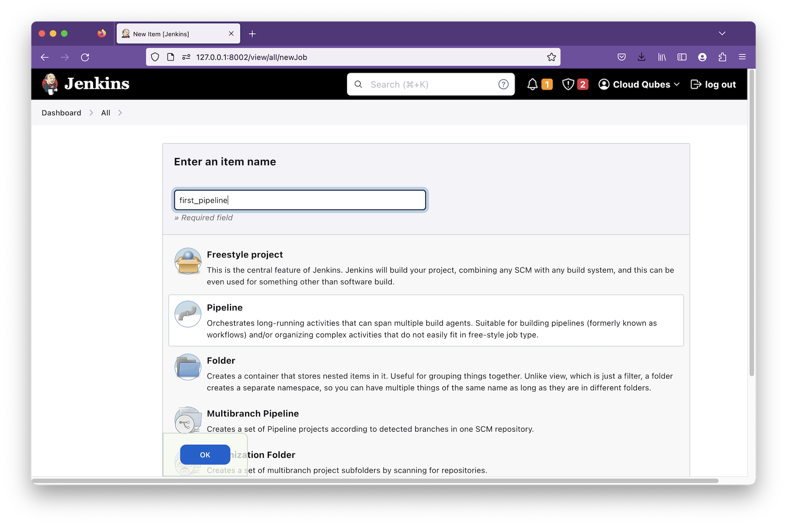
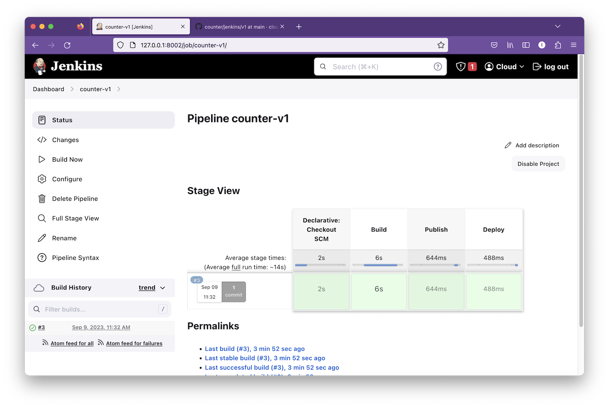

Jenkins is an open-source software widely used in CI/CD.

At its core, Jenkins is an automation server. 

You define certain tasks in a specific order in a `Jenkinsfile` and Jenkins takes care of performing those tasks. If there is a failure at a certain point, Jenkins stops and reports the failure.

Jenkins also has a lot of plugins. These plugins extends the functionality of Jenkins often to interact with other DevOps tools and systems. Git, Jira, Docker, etc are some of the popular plugins in Jenkins.

# Problem with Jenkins

The availability of so many plugins is also a reason for the misuse of Jenkins. There are enough plugins in Jenkins to build an entire CI/CD pipeline. But, using too many plugins is asking for trouble.

There are many plugins that are poorly maintained or not maintained at all. If you are depending on such a plugin, you could run into trouble when you upgrade either Jenkins or any other plugin to a new version. The new version amy have a breacking change with the old version of the unmaintained plugin briging your CI/CD to halt.

Maintaining dependencies between Jenkins plugins is also a nighmare. If you are using plugin A and B that depend on v1 and v2 of plugin C, there's no proper way of amaning these dependecies within Jenkins.

# Why is it still popular

Despite it's hated, Jenkins is wodely used. It's so widely in use that it would ba hard to find a DevOps who has not encountered with Jenkins one way or other.

Jenkins was one of the first open-source tools and was the only tools for a long time in it's category. Therefore many organizations have been using it for such a long time and it has become impossible to replace.

# What is the proper use of Jenkins

Jenkins is a good tool for CI part of the pipeline. But not for the CD. 

Specially if you are deploying to Kubernetes. There are better tools for that.

If you are using Jenkins for CI with a minimum number of plugins, you cound continue to use it without hating.

To demonstrate what Jenkins can do, let's setup Jenkins server and build a pipelines. But, as we said ealier we will not be building complete pipeline, but will be implemeting certain tasks in the CI only.

# Setting up Jenkins

You can setup Jenkins on a bare-metal server, VM, or a Docker container.

For this setup we'll choose to install Jenkins on a virtual machine running Ubuntu 22.04.

## Prerequisites

Install Java
```shell
sudo apt-get install openjdk-11-jre
```

## Install Jenkins

Configure GPG key.

```shell
curl -fsSL https://pkg.jenkins.io/debian-stable/jenkins.io-2023.key | sudo tee /usr/share/keyrings/jenkins-keyring.asc > /dev/null
```

Add Jenkin repos.
```shell
echo deb [signed-by=/usr/share/keyrings/jenkins-keyring.asc] \
    https://pkg.jenkins.io/debian-stable binary/ | sudo tee \
    /etc/apt/sources.list.d/jenkins.list > /dev/null
```

Install packages.
```shell
sudo apt-get update
sudo apt-get install jenkins
```

## Change the default port (Optional)
By default, Jenkins listens on port 8080 on the server. I am using 8080 for another service, so I change the port to 8002.

Jenkins seems to store the configuration files in different locations in different Linux distributions. In Ubuntu there are two places that refer the port number. So, let's update both place.

Update the `HTTP_PORT` parameter in `/etc/default/jenkins`. 
```shell
HTTP_PORT=8002
```

Update the `JENKINS_PORT` in `/usr/lib/systemd/system/jenkins.service`
```shell
Environment="JENKINS_PORT=8002"
```

Since we changed a Systemd config file we nee to reload the Systemd configurations as well.

```shell
sudo systemctl daemon-reload
```

Start Jenkins (or restart if it has laready been running.)
```shell
sudo systemctl start jenkins.service
```

Check that server is listening on port 8002.

```shell
ss -ta
```

```shell
State                Recv-Q               Send-Q                              Local Address:Port                               Peer Address:Port               Process               
LISTEN               0                    4096                                127.0.0.53%lo:domain                                  0.0.0.0:*                                        
LISTEN               0                    128                                       0.0.0.0:ssh                                     0.0.0.0:*                                        
LISTEN               0                    50                                              *:8002                                          *:*                                        
LISTEN               0                    128                                          [::]:ssh                                        [::]:*                                        
```

## Login to Jenkins web UI

At the installation, Jenkins creates the initial password for the admin user.
```shell
sudo cat /var/lib/jenkins/secrets/initialAdminPassword
```
Copy this to clipboard.

Point the browser to `http://172.0.0.1:8002` (use the correct port number for your case) for Jenkins web UI.

Enter the admin password that you copied earlier and click `Continue`.


## Install plugins.

Jenkins has a number of plugins. But, as we already said it's best to limit the number of plogins you use.

Select `Install suggested plugins` so that Jenkins will install a set of selected plugins like `Git`.


## Create the admin user

In the next window, crate an admin user by giving a username and a password.


When the Getting started wizard is over you will get the Jenkins Dashboard.


*Jenkins dashboard*


# Jenkins Pipeline

A CI/CD pipeline is a collection of software components that work to deliver software from the developers' workstations to the end users.


But, the software components is not just enough to make up a CI/CD pipeline. We must instruct the softwaer what to do. 

For Jenkins, these instructions are defined in a JenKinsfile.

A Jenkinsfile defines a series of stages. Each sage include a set of steps. 

Jenkins execute these steps sequentially in the order you have defined.

```shell
// A mock Jenkinsfilw
pipeline {
  agent any

  stages {
    stage('Test') {
      steps {
        echo 'Testing....'
      }
    }

    stage('Build') {
      steps {
        echo 'Building.....'
      }
    }
  }
}
```

A Jenkinsfile can contain Groovy scripts for implementing complex logic.

Let's create a Pipeline using this mock JenkinsFile.

Click on the `New item` in the top left hand corner in the Jenkins dashboard.

Select `Pipeline`, give name as `first_pipelin' and click `OK`.



Scroll to the bottom.  In the `Definition` textarea copy and paste the mock Jenkinsfile above and click  `Save`.


In the Jenkins dashboard click on the pipeline we just created.


Run the Pipeline by clicking on the `Build Now` button on the left pane. 


Our mock Jenkinsfile has two stages; `Test` and `Build`. Both stages aer successfully completed as indicated by green.


You can also see the `Build History` in the lower left panel.

Click an entry in the build histroy and click on the `Console output` in the left panel. This shows the output of each step in the pipeline. This information is invaluable for troubleshooting if a build fails.


# Building something useful

Our first pipeline is working great. But, it's not doing anything useful. So, let's create a new pipeline that builds a docker image of the [counter app][counter-v1].


This is the Jenkinsfile with the steps included for building the Docker image.

```shell
pipeline {
  agent any

  stages {
    stage('Build') {
      steps {
        echo 'Building container images'
        sh """docker build -t counter:1.0.0 ."""
      }
    }
    stage('Publish') {
      steps {
        echo 'Publishing....'
      }
    }
    stage('Deploy') {
      steps {
        echo 'Deploying....'
      }
    }
  }
}
```

When your Jenkinsfile is getting longer and more complex, it's a good idea to put it under version control. So, instead of copy pasting the Jenkinsfile at the pipeline creation time, we store this Jenkins file in the [counter app][counter-app] repository itself.

#continue the chainsaw edit from here

Let's creat the pipeline now.

From Jenkins dashboard click on `New Item`.

Select 'Pipeline', enter name `counter-v1` and click `OK`.


In the Pipeline section select `Pipeline scrip from SCM`.
Select `Git` as the SCM.
Enter `https://github.com/cloudqubes/counter` as the repository URL.


Type in `*/v1` as the branch to build.
Keep the `Jenkinsfile` as the Script path. 

Unselect `Lightweight checkout`. If `Lightweight checkout` is selected, Jenkins will try to download the `Jenkinsfile` without doing a full checkout. But, since we need to build the branch `v1` we need Jenkins to get the Jenkinsfile from the branch v1. So, we must unselect `Lightweight checkout` for Jenkins to checkout the full repo and get the Jenkinsfile from the local repo. 

Click on the `Save` button once everything is configured.


In the Jenkins dashboard, click on the Pipeline we jsut created. Then, click `Build now`.


Jenkins successfully builds the `counter v1` application.



Check the Docker image.
```shell
docker image ls
```

```shell
REPOSITORY   TAG       IMAGE ID       CREATED        SIZE
counter      1.0.0     4e2cdad22116   16 hours ago   323MB
```

## Wrapping up

Jenkins is an automation server widely used and also hated by the DevOps community. But, much of the hate towards Jenkins is caused by misuse.

If you are into DevOps you cannot escape Jenkins. So, you must know how to use it properly.

We used Jenkins to build a Docker image from a GitHub repo. We wil explore more advances use cases in the upcoming posts.

[install-docker]: https://docs.docker.com/engine/install/ubuntu/
[counter-v1]: https://github.com/cloudqubes/counter/


# Creting a CI/CD pipeline

Jenkins has enough plugins so that you can create an entire CI/CD pipeline with Jenkins alone. But, as we emphasized earlier also it's not recommended and not the best way of doing it.

So, we will implement a part of a simple pipeline.


Let's create a simple CI/CD pipeline with our Jenkins server. But, we will not implement a complete CI/CD pipeline but just a a part of the CI/CD that clone a Git repository to the local machine.

So make sure the plugins are installed. In the dash board, click on Manage Jenkins then click on Manage Plugins.


*Jenkins available plugins*

Select and install `Git plugin`, `Pipeline`.

Once plugins are installed, restart Jenkins.
Go to `http://127.0.0.1:8002/restart` and clikc on the `Yes` button.
Within one minute restart will complete and you'll be redirected to the dashboard.

