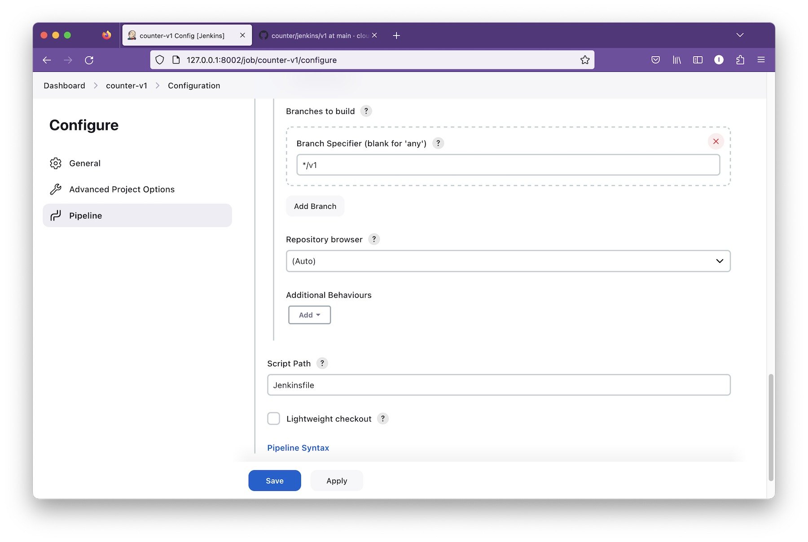

<div class="header-highlight">
  
</div>


Jenkins is a popular open-source automation server.

You define a set of tasks in  a `Jenkinsfile` and Jenkins takes care of performing those tasks in the defined order. If a task fails, Jenkins stops and reports the failure.

Jenkins has a [lot of plugins](https://plugins.jenkins.io/) that extends this core functionality.

[Git](https://plugins.jenkins.io/git/), [Jira](https://plugins.jenkins.io/jira/), and [Docker](https://plugins.jenkins.io/docker-plugin/) are three of the most used plugins.

# Jenkins is widely-used in CI/CD

Jenkins is one of the first open-source CI/CD tools and was the only tool for a long time in its category. So, Jenkins is deeply rooted in CI/CD toolchains in many organizations.

Though it was originally [intended for CI](https://www.cloudbees.com/jenkins/what-is-jenkins) Jenkins can do much more. It's so versatile that you can do anything with Jenkins in any way you want.

But, this versatility has a downside.

# Jenkins is often misused

Jenkins has enough plugins to build an entire CI/CD pipeline. 

But, using too many Jenkins plugins is asking for trouble.

### Sum plugins are poorly maintained

Many Jenkins plugins are poorly maintained or not maintained at all. If you are depending on such a plugin, you could run into compatibility issues whenever you upgrade Jenkins to a new version. If the plugin is not properly maintained, you will be on your own to fix the problem.

### Dependency on Java versions is difficult to manage

Jenkins and its plugins are written in Java. Each version of Jenkins supports a specific Java version. If one of the Jenkins plugins requires a different Java version it would be challenging to get that plugin to work.

### Dependency between plugins is challenging

Maintaining dependencies between Jenkins plugins is complicated. If you are using plugins A and B that depend respectively on v1 and v2 of plugin C, there's no proper way of managing these dependencies within Jenkins.

If you are to ask a few DevOps persons, you will quickly realize that they have a love-and-hate relationship with Jenkins. Their views are formed by what purpose they have been using Jenkins and what plugins they have been using.

# Using Jenkins correctly

If Jenkins is a part of your CI/CD pipeline you can hate Jenkins less by using it for the right purpose in the right way.

### Use Jenkins only for CI

Jenkins is built for CI. Not for CD. 

This is especially true for microservices. If you are deploying hundreds of microservices to Kubernetes there are better tools built for that specific purpose.

### Minimize the use of plugins

The bad experience of Jenkins is mostly a result of using too many plugins.

Carefully select the plugins you want to use and avoid installing new plugins on a need basis.
If you are using more than twenty plugins that could be a sign of misuse.

### Use properly maintained plugins only

A properly maintained plugin is kept up to date by releasing new versions consistently and frequently - such as this [Docker plugin](https://plugins.jenkins.io/docker-plugin/releases/).

If a certain plugin has not released at least a bug fix for the past six months, think twice before using it unless you are ready to take up the maintainance of that plugin.

# Setting up a Jenkins server

To find out what Jenkins can do, let's set up a Jenkins server and build a CI/CD pipeline.

You can install Jenkins in your laptop, a virtual machine, or a Docker container.

We'll choose an Ubuntu 22.04 virtual machine for this setup.

## Install Java

Jenkins is written in Java, so Java is a prerequisite.
```shell
sudo apt-get install openjdk-11-jre
```

## Install Jenkins

Configure GPG key.

```shell
curl -fsSL https://pkg.jenkins.io/debian-stable/jenkins.io-2023.key | sudo tee /usr/share/keyrings/jenkins-keyring.asc > /dev/null
```

Add Jenkin repos.
```shell
echo deb [signed-by=/usr/share/keyrings/jenkins-keyring.asc] \
    https://pkg.jenkins.io/debian-stable binary/ | sudo tee \
    /etc/apt/sources.list.d/jenkins.list > /dev/null
```

Install packages.
```shell
sudo apt-get update
sudo apt-get install jenkins
```

## Change the default port (Optional)

By default, Jenkins listens on port 8080 on the server. I am using 8080 for another service. So, I must configure Jenkins to listen on port 8002.

Jenkins stores the configuration files in different locations in different Linux distributions. In Ubuntu, there are two places that refer the port number. So, let's update both places.

Update the `HTTP_PORT` parameter in `/etc/default/jenkins`. 
```shell
HTTP_PORT=8002
```

Update the `JENKINS_PORT` in `/usr/lib/systemd/system/jenkins.service`
```shell
Environment="JENKINS_PORT=8002"
```

Since we changed a Systemd config file we nee to reload the Systemd configurations as well.

```shell
sudo systemctl daemon-reload
```

Start Jenkins (or restart if it has laready been running.)
```shell
sudo systemctl start jenkins.service
```

Check that server is listening on port 8002.

```shell
ss -ta
```

```shell
ubuntu@testvm:~$ sudo ss -tap
State          Recv-Q         Send-Q    Local Address:Port       Peer Address:Port     Process                                                        
LISTEN         0              4096      127.0.0.53%lo:domain          0.0.0.0:*         users:(("systemd-resolve",pid=3053,fd=14))                    
LISTEN         0              128             0.0.0.0:ssh             0.0.0.0:*         users:(("sshd",pid=732,fd=3))                                 
ESTAB          0              0        10.212.251.186:ssh        10.212.251.1:38914     users:(("sshd",pid=8114,fd=4),("sshd",pid=8036,fd=4))         
ESTAB          0              0        10.212.251.186:ssh        10.212.251.1:34616     users:(("sshd",pid=7264,fd=4),("sshd",pid=7174,fd=4))         
LISTEN         0              50                    *:8002                  *:*         users:(("java",pid=4951,fd=8))                                
LISTEN         0              128                [::]:ssh                [::]:*         users:(("sshd",pid=732,fd=4))                
```

## Login to Jenkins web UI

At the installation, Jenkins creates the initial password for the admin user.

```shell
sudo cat /var/lib/jenkins/secrets/initialAdminPassword
```
Copy the output to the clipboard.

Point the browser to `http://<ip_address>:8002` (use the correct IP address and the port number) for Jenkins web UI.

Enter the admin password that you copied earlier and click `Continue`.


## Install plugins.

Jenkins has many plugins. But, as we already said it's best to limit the number of plugins you use.

Select `Install suggested plugins` so that Jenkins will install a set of selected plugins like `Git`.


## Create the admin user

In the next window, create an admin user by giving a username and a password.


When the Getting Started wizard is over you will get the Jenkins Dashboard.


# Using the Jenkinsfile

A CI/CD pipeline is a collection of software components that work to deliver software from the developers' workstations to the end users.

But, the software components are not just enough to make up a CI/CD pipeline. We must instruct the software what to do. 

For Jenkins, these instructions are defined in a **Jenkinsfile**.

A Jenkinsfile defines a series of stages. Each stage includes a set of steps.

Jenkins executes these steps sequentially in the order you have defined.

```shell
// A mock Jenkinsfile
pipeline {
  agent any

  stages {
    stage('Test') {
      steps {
        echo 'Testing....'
      }
    }

    stage('Build') {
      steps {
        echo 'Building.....'
      }
    }
  }
}
```
# Creating a mock CI/CD Pipeline

Let's create a mock Pipeline using this JenkinsFile.

Click on the `New item` in the top left corner in the Jenkins dashboard.

Select `Pipeline`, give the name as `first_pipeline`, and click `OK`.


Scroll to the bottom.  In the `Definition` text area copy and paste the mock Jenkinsfile above and click  `Save`.


In the Jenkins dashboard click on the pipeline we just created.


Run the Pipeline by clicking on the `Build Now` button on the left pane. 


Our mock Jenkinsfile has two stages; `Test` and `Build`. Both stages are successfully completed as indicated by green.


You can also see the `Build History` in the lower left panel.

Click an entry in the build history and click on the `Console output` in the left panel to see the output of each step in the pipeline. This information is useful for troubleshooting if a build fails.


# Building a Docker image with Jenkins

Our first pipeline is working great. But, it's not doing anything useful. So, let's create a new pipeline that builds a docker image of the [counter app][counter-v1].


This is the Jenkinsfile with the steps included for building the Docker image.

```shell
pipeline {
  agent any

  stages {
    stage('Build') {
      steps {
        echo 'Building container images'
        sh """docker build -t counter:1.0.0 ."""
      }
    }
    stage('Publish') {
      steps {
        echo 'Publishing....'
      }
    }
    stage('Deploy') {
      steps {
        echo 'Deploying....'
      }
    }
  }
}
```

When your Jenkinsfile is getting longer and more complex, it's a good idea to put it under version control. So, instead of copy-pasting this Jenkinsfile at the pipeline creation time, we store it in the [counter app][counter-app] repository with the source code.

Let's create the pipeline now.

From Jenkins dashboard click on `New Item`.

Select 'Pipeline', enter the name `counter-v1` and click `OK`.


In the Pipeline section select `Pipeline scrip from SCM`.
Select `Git` as the SCM.
Enter `https://github.com/cloudqubes/counter` as the repository URL.


Type in `*/v1` as the branch to build.
Keep the `Jenkinsfile` as the Script path. 

Unselect the option **Lightweight checkout**. If **Lightweight checkout** is selected, Jenkins tries to download the `Jenkinsfile` from the repository URL without doing a full checkout. 

But, we are going to build the branch `v1` which is not the default branch of the repository. Since `v1` is not the default branch Jenkins cannot download the `Jenkinsfile` from the repository URL.

So, we unselect **Lightweight checkout** so Jenkins will download the repo and get the Jenkinsfile from the downloaded repo. 

Click on the `Save` button once everything is configured.


In the Jenkins dashboard, click on the Pipeline we jsut created. Then, click `Build now`.


Jenkins successfully builds the `counter v1` application.


Check the Docker image.
```shell
docker image ls
```

```shell
REPOSITORY   TAG       IMAGE ID       CREATED        SIZE
counter      1.0.0     4e2cdad22116   2 hours ago   323MB
```

# Building a production-ready Jenkins Pipeline

Our Jenkins Pipeline is working great. But, it's far from being complete. There's a lot we need to improve before we can call our Jenkins setup **production ready**.

Here are a few things we need to work on.

1. We are still using the Jenkins server itself as the build node. This is not a recommended practice in production. 

2. We have to run the Pipeline manually everytime we commit code to our repo. We can automate this process via webhooks.

3. The Docker image is still on the Jenkins server and we need to push it to an image repository.

We will explore all these in upcoming posts.

Meanwhile, feel free to join our [community](https://cloudqubes.substack.com/) to stay up to date on Cloud computing and DevOps.


[install-docker]: https://docs.docker.com/engine/install/ubuntu/
[counter-v1]: https://github.com/cloudqubes/counter/
[counter-app]: https://github.com/cloudqubes/counter/tree/v1