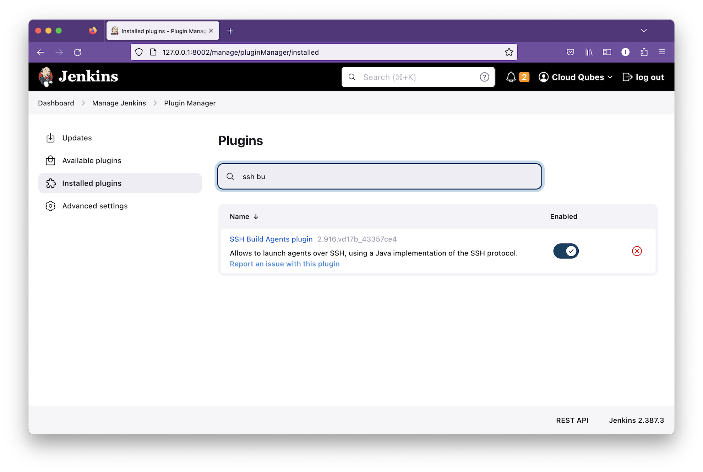
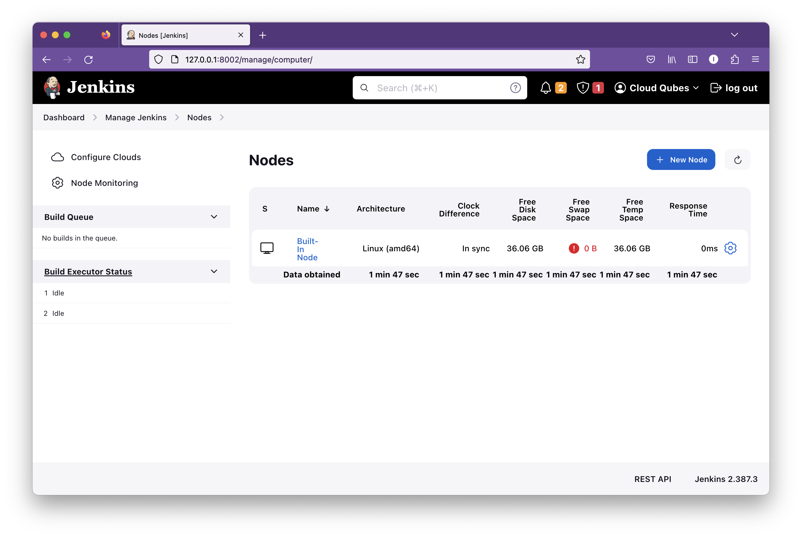
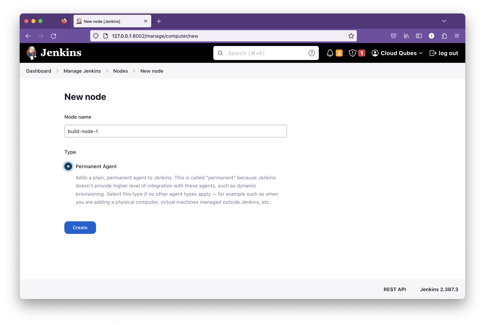
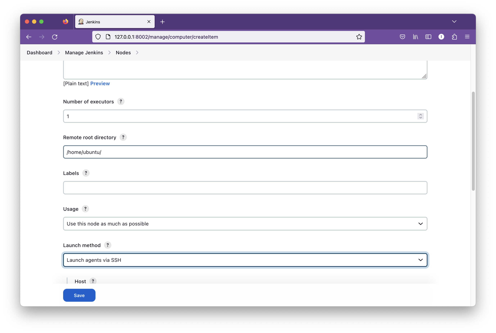
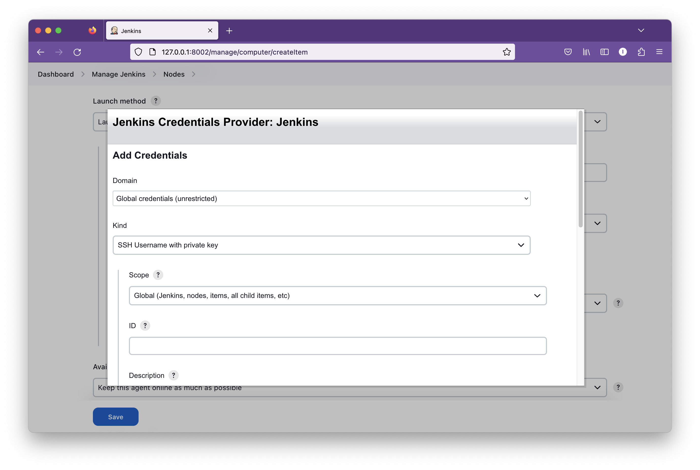
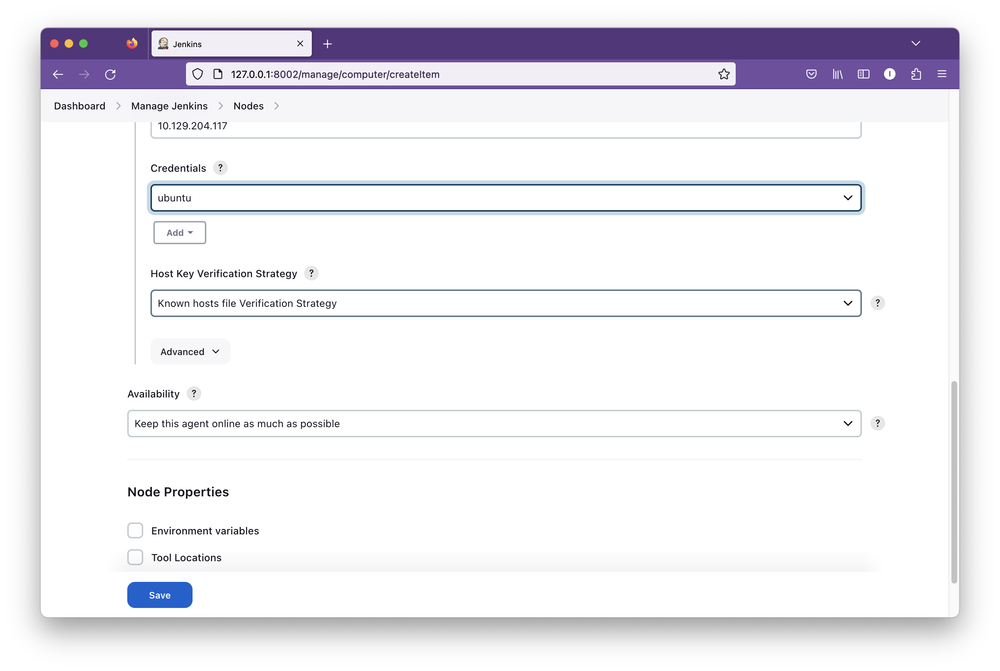

<div class="header-highlight">
A follow-along tutorial on Git branching for beginners.
</div>

A Jenkins controller can run Jenkins as well as the builds. But this configuration is not recommended as well as it's not scalable.
If you have multiple jobs and pipelines running in a single Jenkins controller it will be overloaded. So, to be scalable you must adopt a distributes architecture. 
<picture>

Security issue
Jenkins runs the jobs with `jenkins` user. This user has access to all Jenkind resources in the controller. So running builds on the controller is a security risk. A maliciosu user coud gain access to your resources. So, if you are in a multi-user environment, you must run builds on separate build agents.

Two modes of agents
1. SSH
With the `SSH Build Agent` plugin installed you can configure build agens with SSH. The agent must have SSH server running and the public key of the controller authorized.

2. Inbound
An inbound agnent initiates communication with the Jenkins controller via HTTP. This method is useful when the Jenkins controller and the agent are separted from Internet. Such as the two clouds.

A Jenkins agent can be a physical machine, virtual machine, docker container or a Kubernetes Pod.

# SSH method

To add a node via SSH method, you need to have `SSH Build Agents plugin` installed.

In the Jenkins dashboard, click on `Manage Jenkins` and then click on `Manage plugins`. Under `Installed plugins` check whether `SSH Build agent` is installed. 

If not go to available plugins and install it.



 
## Ubuntu physical or virtual machine

Let's add an Ubunut virtual machine as a build agent. You can follow the same steps for a physical machine too.

Install Java in the agent node.
```shell
sudo apt update
sudo apt install default-jre
```

Install Docker.

Follow the [instruction] (https://docs.docker.com/engine/install/ubuntu/) to install Docker in Ubuntu.

Add the user `ubuntu` to the `docker` group so we can run `docker` commands without `sudo`.
```shell
sudo usermod -aG docker ubuntu
```

In the Jenkins Controller create public key and copy to agent node.
```shell
ssh-keygen -f .ssh/jenkins -t rsa -b 4096 -m PEM
```

The Jenkins SSH Build Agent plugin [does not support][jenkins-ticket] the new OpenSSH key format. So, make sure to use the older format as in the command above.

Copy the SSH Key to build node.
```shell
ssh-copy-id -i ~/.ssh/jenkins ubuntu@10.129.204.117
```

Login to the build node from Jenkins controller via SSH using the newly generated key. We get the following promp.

```shell
The authenticity of host '10.129.204.117 (10.129.204.117)' can't be established.
ED25519 key fingerprint is SHA256:V7j6jbUXNw55dpB49fqGW5PBdXU1h7gNgbZPB4qD7bU.
This key is not known by any other names
Are you sure you want to continue connecting (yes/no/[fingerprint])?
```

Type in `yes` to add the key to the `knwon_hosts` file. 

Open the `.ssh/knwon_hosts` file. 
If you have set `HashKnwonHosts` to `yes` in `ssh_config`, you will not see the plain-text hostneanme in the `.ssh/known_hosts file`.
In that case use below to find the host keys.

```shell
ssh-keygen -H -F 10.129.204.117
```
Copy the output lines.

Jenkins `SSH Build Agent plugin` use a different file to store the SSH host keys. Before adding the agent let's update teh file with the host keys
Open `/var/lib/jenkins/.ssh/known_hosts` and add the copied lines to the end of the file.

Now, go to the Jenkins dashboard and follow the below steps to add the agent node.

In the Jenkins dashboard click on `Manage Jenkins` then `Manage nodes and clouds`.

We still have the built-in node only. Click the `New node` button to add a new build agent.



Type in the node name and select the `Permanent mode` and click on `Create` button.



In the next page, we need to provide some more detail for the new agent we are going to add.


Under `Remote root directory` type in `/home/ubuntu`.



Under `Launch method` select `Launch agent via SSH`. If you have not installed the `SSH Build Agent` plugin, the `Launch agent via SSH` option will not be available.

Enter the IP address of the Ubuntu VM and click the `Add` button under the `Credentials` section.

Select `SSH Username with private key` under `Kind`.
Type in the Username of the agent node.
Under `Private key` select `Enter directly` and copy paste the private key we created earlier.



Select the newly created credentials and click `Save` button.




[jenkins-ticket]: https://issues.jenkins.io/browse/JENKINS-57495


