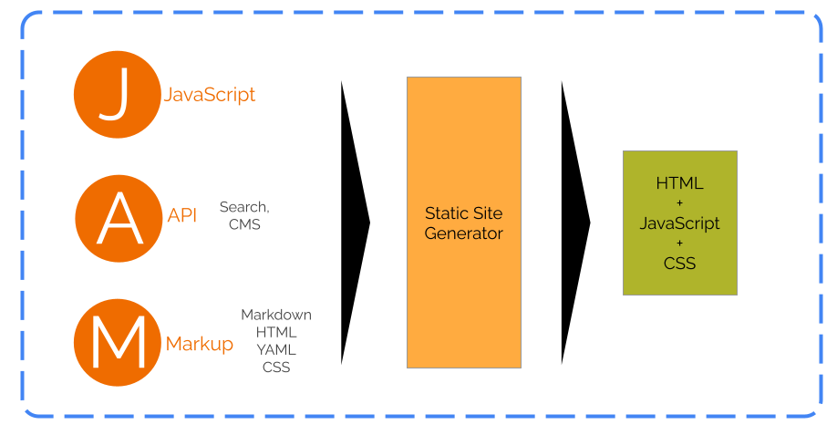
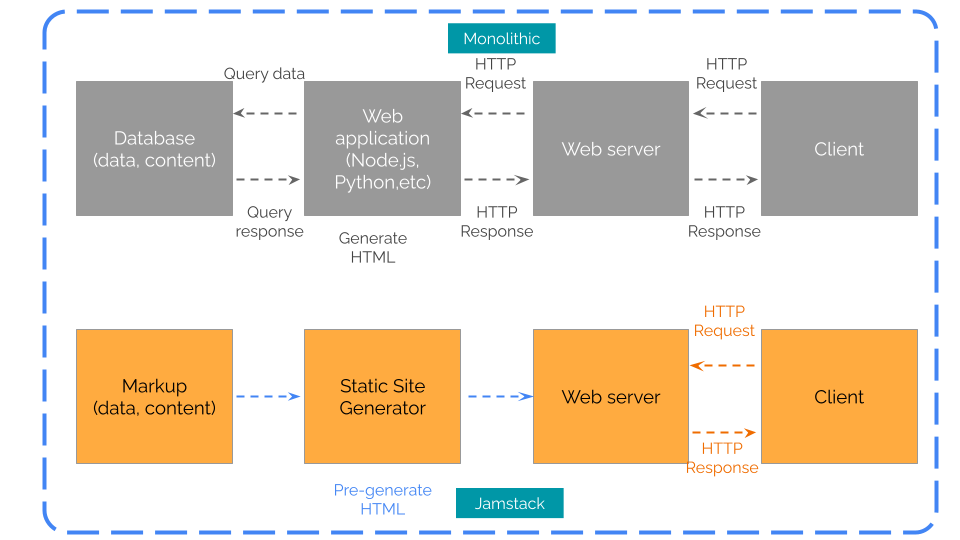

Photo by Pexabay via [Pexels](https://www.pexels.com/@pixabay/)

Jamstack is the concept of building web applications with Markup enhanced by JavaScript and APIs.

The Markup holds the data or the web content. Often, a big part of a Jamstack application is Markup. Markdown is the most popular Markup format but is not the only form used in Jamstack. YAML, JSON, and even HTML can be part of the Markup in Jamstack. 

APIs are optional but increasingly becoming commonplace in Jamstack. WIthout APIs, a Jamstack application is going to be just a static web site. Shopping carts, ecommerce, search, are some common services integrated via APIs in Jamstack.

JavaScript implements the client side interaction as well API integrations in a Jamstack application.

A software known as a static site generator builds a Jamstack application converting the Markup to organized HTML pages, The static HTML pages are served via a web server like Apache or Nginx.

This use of static HTML differentiates Jamstack from a monolithic web application where the server is responsible for rendering HTML for each client request.

Since it’s a collection of static HTML pages, a Jamstack application can be efficiently served via distributed CDNs. A distributed CDN serves a user from the nearest geographic location reducing latency and improving user experience for content-heavy applications such as blogs.

While a Jamstack application is deployed as a static web application, Markup differentiates Jamstack from building a static website with plain HTML. 

Markdown, which is a heavily used Markup format, is particularly suitable for writing long-form content such as blog posts. Long-form writing with HTML would be tremendously cumbersome with all the HTML tags. Markup on the other hand, is almost plain text.

This is a very appealing approach for content-heavy web application like blogs that need to be updated regularly with new content.

# History of Jamstack
Matt Billman, CEO and co-founder of [Netlify](https://www.netlify.com/) coined the term Jamstack in 2015.

But, the concept of building websites using static site generators has been available since 2007 with [Nanoc](https://nanoc.app). [Jekyll](https://jekyllrb.com), released in 2008 is also another pioneering static site generator.

In this era, the web applications were mostly monolithic; running in dedicated virtual machines. 

Jamstack applications on the other hand, could be deployed on shared compute infrastructure. 

This significantly reduced the barriers for hosting web applications so Jamstack quickly gained ground leading to the development of a range of sophisticated Jamstack frameworks.

# Jamstack frameworks
Today, [Jamstack.org](https://jamstack.org/generators/) lists 350+ Jamstack frameworks.

Some of them are pure static site generators. 

But, some like [Next.js](https://nextjs.org) and [Gatsby](http://gatsbyjs.org), etc., are going beyond being just static site generators by implementing Server Side Rendering (SSR).

[!Jamstack application with server side rendering.](./static-vs-server-side-rendering.png)

With Jamstack frameworks supporting SSR you can build composable we applications where a part of the content is served as static HTML and another part as HTML rendered from the server.

# Composable web application architecture

[!Composable web application architecture](./composable-web-application.png)

Unlike a monolithic web application, a composable web application consists of multiple components. This architecture allows you to build a web application by picking and choosing serverless functions, APIs, server side rendering, etc., according to your needs.

The Jamstack fits perfectly into this composable architecture.

With Jamstack evolving beyond being just static web sites, the Jamstack hosting is also evolving.

# Hosting Jamstack.

You can host a Jamstack website in a private data center with any web server.

But, it would limit your application to just a static web site.

There are better and more sophisticated Jamstack hosting solutions.

With the popularity of Jamstack the big cloud service providers have added Jamstack hosting services to their solutions portfolios. [AWS Amplify](https://aws.amazon.com/amplify/), [Azure Static Web apps](https://azure.microsoft.com/en-us/products/app-service/static), [GCP Firebase](https://firebase.google.com) are Jamstack deployment solutions from the big three cloud service providers.

Emerging Jamstack hosting providers like [Netlify](https://www.netlify.com/), [Vercel](https://vercel.com), [Deno Deploy](https://deno.com/deploy) are also offering solutions that natively support Jamstack frameworks. 

Most of these hosting solutions let you run server side code via `serverless functions`. A serverless function runs in a managed compute infrastructure of the cloud provider. A developer can use a serverless function to implement APIs or SSR without bothering about managing the back end compute infrastructure.

# CI/CD for Jamstack

Jamstack deployment is straight forward. Just push your code to GitHub or GitLab and that’s it.

At least, that’s what the cloud providers offering Jamstack hosting claim.

They will further tell you that you can get rid of all DevOps work with Jamstack.

While above statements are not always applicable, they hold true for certain Jamstack use cases.
Cloud providers who offer Jamstack hosting have integrated CI/CD pipelines in their platforms so that you can push a new version of your application to production with just Git push. 

This holds true while your Jamstack application remains a static website. 

Once you start introducing backend functions, these platform-integrated CI/CD pipelines work seamlessly as long as you architect your Jamstack application according to the architectural blueprint recommended by the particular cloud platform provider. But this approach could result in a vendor lock-in.

If you choose to follow a platform independent architectural pattern for your Jamstack application, you need to have your CI/CD pipeline and all the DevOps practices in place to achieve full automation.

# Wrapping up

The concept of Jamstack started as an alternative for monolithic web applications. It was initially intended for content-oriented web applications such as blogs.

But Jamstack quickly evolved as an appealing approach for building fully-fledged web applications.

Some believe that Jamstack will be the future of web applications. Time will tell whether it is.

