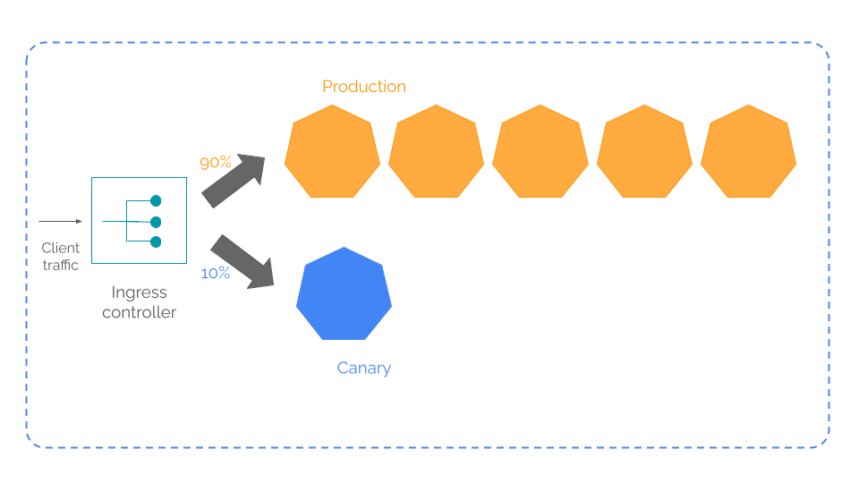
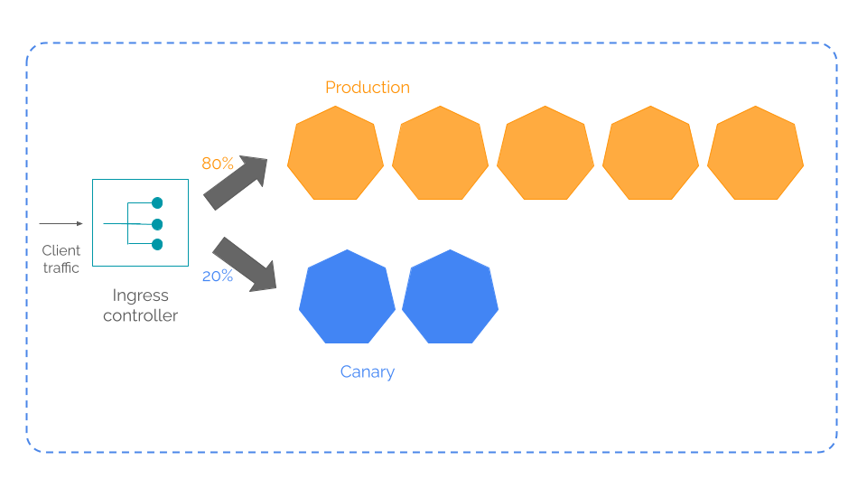
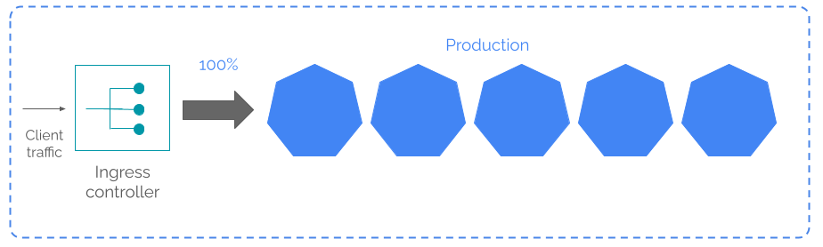

<div class="header-highlight">
  
  <div class="image-credit">Photo by Rodrigo Chaves via [Pexels](https://www.pexels.com/@rodrigosoreschaves/)</div>
</div>

Canary deployment is a strategy to roll out a new version of an application in Kubernetes. 

Following the **canary in the coal mine** principle, the canary deployment strategy minimizes the risk of a new roll out by monitoring the new software version (aka the canary version) under a small percentage of the total traffic load.



After assuring the performance under the initial traffic load, you gradually increase traffic while increasing the number of replicas in the canary version.



Once 100% of traffic is routed, the canary becomes the new production version and you decommission the old version.



The ingress controller plays a key role in the canary deployment by splitting the traffic between the two versions. 

The [Ingress Nginx controller][ingress-nginx] used `annotations` to define this traffic split.

```yaml
  annotations:
    nginx.ingress.kubernetes.io/canary: "true"
    nginx.ingress.kubernetes.io/canary-weight: "50"
```

We are going to put a canary deployment into action in a Minikube cluster with the [Ingress Nginx controller][ingress-nginx]. 

To keep things simple, we do not use a CI/CD pipeline or test tools but use `kubectl` to deploy the workloads to the Kubernetes cluster and `curl` for testing.


# The software application

[number-crunch-2] which is our software application for this work out has two microservices `square-root` and `cube-root`. 

<div class="inline-highlight">
We are going to upgrade square-root microservice from v2 to v3 using the canary deployment strategy.
</div>

The `square-root` microservice calculates and returns a square root of a number. For each request, it creates a log in this format.

```shell
[<pod-name>:<version-string>] Request: /square-root/<input-number>, Response: {"InputNumber":<input-number>,"SquareRoot":<square-root>}
```

Here's a sample request from `curl` and the corresponding log.

```shell
$ curl http://192.168.49.2/square-root/16

```

```shell
[square-root-v2-85c4f48697-d8ms4:20230927115851:square-root v2] Request: /square-root/16, Response: {"InputNumber":16,"SquareRoot":4}
```

This log helps us to test our application.

The container images for both `square-root-v2` and `v3` are already available in [Docker Hub](https://hub.docker.com/r/cloudqubes/square-root) so we need not worry about CI stuff here.

So, let's get started by setting up the production deployment with `square-root-v2`

# The production setup

Create YAML manifest `square-root-v2.yml` for `square-root-v2` Deployment.

```yaml
# square-root-v2.yml
apiVersion: apps/v1
kind: Deployment
metadata:
  name: square-root-v2
spec:
  selector:
    matchLabels:
      app: square-root-v2
  replicas: 3 # tells deployment to run 2 pods matching the template
  template:
    metadata:
      labels:
        app: square-root-v2
    spec:
      containers:
      - name: square-root-v2
        image: cloudqubes/square-root:2.0.1
        # imagePullPolicy: Always
        ports:
        - containerPort: 8080
```

Create `square-root-v2` Deployment.

```shell
kubectl apply -f square-root-deployment-v2.yml 
```

Create YAML manifest for `square-root-v2` Service.

```yaml
# square-root-service-v2.yml
apiVersion: v1
kind: Service
metadata:
  name: square-root-v2
spec:
  selector:
    app: square-root-v2
  ports:
  - name: square-root-v2-port
    protocol: TCP
    port: 8080
    targetPort: 8080
```

Create `square-root-v2` Service.

```shell
kubectl apply -f square-root-service-v2.yml 
```

Creae the YAML manifest for `square-root-v2` Ingress.

```yaml
# square-root-ingress-v2.yml
apiVersion: networking.k8s.io/v1
kind: Ingress
metadata:
  name: square-root-v2
spec:
  ingressClassName: nginx
  rules:
  - http:
      paths:
      - path: /
        pathType: Prefix
        backend:
          service:
            name: square-root-v2
            port:
              number: 8080
```

Create `square-root-v2` Ingress.

```shell
kubectl apply -f square-root-ingress-v2.yml 
```

Check the Pod status.
```shell
kubectl get deployment square-root-v2
```

```shell
NAME             READY   UP-TO-DATE   AVAILABLE   AGE
square-root-v2   3/3     3            3           6m39s
```

Check the Ingress.
```shell
kubectl get ingress square-root-v2
```

```shell
NAME             CLASS   HOSTS   ADDRESS        PORTS   AGE
square-root-v2   nginx   *       192.168.49.2   80      5m55s
```

Create script `test.sh` for testing.
```shell
#!/bin/bash
for i in {1..10}
do
  echo -n $i:
  curl http://192.168.49.2/square-root/4
done
```

Run the test

```shell
./test.sh
```

Test output.
```shell
1:{"InputNumber":4,"SquareRoot":2}
2:{"InputNumber":4,"SquareRoot":2}
3:{"InputNumber":4,"SquareRoot":2}
4:{"InputNumber":4,"SquareRoot":2}
5:{"InputNumber":4,"SquareRoot":2}
6:{"InputNumber":4,"SquareRoot":2}
7:{"InputNumber":4,"SquareRoot":2}
8:{"InputNumber":4,"SquareRoot":2}
9:{"InputNumber":4,"SquareRoot":2}
10:{"InputNumber":4,"SquareRoot":2}
```

Check the Kubernetes logs.

```shell
kubectl logs -l app=square-root-v2 | grep "Number\":4" | wc -l
```

All 10 requests are successfully served by `square-root-v2`

```shell
[square-root-v2-85c4f48697-5vsgh:20230927110123:square-root v2] Request: /square-root/4, Response: {"InputNumber":4,"SquareRoot":2}
[square-root-v2-85c4f48697-5vsgh:20230927110123:square-root v2] Request: /square-root/4, Response: {"InputNumber":4,"SquareRoot":2}
[square-root-v2-85c4f48697-5vsgh:20230927110123:square-root v2] Request: /square-root/4, Response: {"InputNumber":4,"SquareRoot":2}
[square-root-v2-85c4f48697-d6888:20230927110123:square-root v2] Request: /square-root/4, Response: {"InputNumber":4,"SquareRoot":2}
[square-root-v2-85c4f48697-d6888:20230927110123:square-root v2] Request: /square-root/4, Response: {"InputNumber":4,"SquareRoot":2}
[square-root-v2-85c4f48697-d6888:20230927110123:square-root v2] Request: /square-root/4, Response: {"InputNumber":4,"SquareRoot":2}
[square-root-v2-85c4f48697-d6888:20230927110842:square-root v2] Request: /square-root/4, Response: {"InputNumber":4,"SquareRoot":2}
[square-root-v2-85c4f48697-d8ms4:20230927110123:square-root v2] Request: /square-root/4, Response: {"InputNumber":4,"SquareRoot":2}
[square-root-v2-85c4f48697-d8ms4:20230927110123:square-root v2] Request: /square-root/4, Response: {"InputNumber":4,"SquareRoot":2}
[square-root-v2-85c4f48697-d8ms4:20230927110123:square-root v2] Request: /square-root/4, Response: {"InputNumber":4,"SquareRoot":2}
```


# The canary version: square-root-v3

Create the YAML manifest for `square-root-3` Deployment.

```shell
# square-root-deployment-v3
apiVersion: apps/v1
kind: Deployment
metadata:
  name: square-root-v3
spec:
  selector:
    matchLabels:
      app: square-root-v3
  replicas: 1 
  template:
    metadata:
      labels:
        app: square-root-v3
    spec:
      containers:
      - name: square-root-v3
        image: cloudqubes/square-root:3.0.1
        ports:
        - containerPort: 8080
```

Create the `square-root-v3` Deployment.

```shell
kubectl apply -f square-root-deployment-v3.yml 
```

Create YAML manifest for `square-root-v3` Service.

```shell
apiVersion: v1
kind: Service
metadata:
  name: square-root-v3
spec:
  selector:
    app: square-root-v3
  ports:
  - name: square-root-v3-port
    protocol: TCP
    port: 8080
    targetPort: 8080
```

Create `square-root-v3` Service.

```shell
kubectl apply -f square-root-service-v3.yml
```

Create YAML manifest for `square-root-v3` Ingress.

We use annotations to indicate this as a `canary` release.
Without the annotations, we would get an error because the path `/` is already defined in `square-root-v2` ingress. 

```shell
apiVersion: networking.k8s.io/v1
kind: Ingress
metadata:
  name: square-root-v3
  annotations:
    nginx.ingress.kubernetes.io/canary: "true"
    nginx.ingress.kubernetes.io/canary-weight: "50"
spec:
  ingressClassName: nginx
  rules:
  - http:
      paths:
      - path: /
        pathType: Prefix
        backend:
          service:
            name: square-root-v3
            port:
              number: 8080
```

Create the ingress.

```shell
kubectl apply -f square-root-ingress-v3.yml
```

Check the Deployments.
```shell
kubectl get deployments
```

```shell
NAME             READY   UP-TO-DATE   AVAILABLE   AGE
square-root-v2   3/3     3            3           58m
square-root-v3   1/1     1            1           28m
```

Check the ingresses.

```shell
kubectl get ingress
```

```shell
NAME             CLASS   HOSTS   ADDRESS        PORTS   AGE
square-root-v2   nginx   *       192.168.49.2   80      59m
square-root-v3   nginx   *       192.168.49.2   80      103s
```

Test traffic using 16 as the input number, so we can count the number of requests to each deployment.

```shell
#!/bin/bash

for i in {1..10}
do
  echo -n $i: 
  curl http://192.168.49.2/square-root/16
done
```

Run the test.

```shell
./test.sh
```

Check the logs in each version using the `-l` to select the application version.

```shell
$ kubectl logs -l app=square-root-v3 | grep ":16"
[square-root-v3-5cb9d8c4d6-m66pz:20230927115851:square-root v3] Request: /square-root/16, Response: {"InputNumber":16,"SquareRoot":4}
[square-root-v3-5cb9d8c4d6-m66pz:20230927115851:square-root v3] Request: /square-root/16, Response: {"InputNumber":16,"SquareRoot":4}
[square-root-v3-5cb9d8c4d6-m66pz:20230927115851:square-root v3] Request: /square-root/16, Response: {"InputNumber":16,"SquareRoot":4}
[square-root-v3-5cb9d8c4d6-m66pz:20230927115851:square-root v3] Request: /square-root/16, Response: {"InputNumber":16,"SquareRoot":4}
[square-root-v3-5cb9d8c4d6-m66pz:20230927115851:square-root v3] Request: /square-root/16, Response: {"InputNumber":16,"SquareRoot":4}
$ kubectl logs -l app=square-root-v2 | grep ":16"
[square-root-v2-85c4f48697-d8ms4:20230927115851:square-root v2] Request: /square-root/16, Response: {"InputNumber":16,"SquareRoot":4}
[square-root-v2-85c4f48697-d8ms4:20230927115851:square-root v2] Request: /square-root/16, Response: {"InputNumber":16,"SquareRoot":4}
[square-root-v2-85c4f48697-d8ms4:20230927115851:square-root v2] Request: /square-root/16, Response: {"InputNumber":16,"SquareRoot":4}
[square-root-v2-85c4f48697-5vsgh:20230927115851:square-root v2] Request: /square-root/16, Response: {"InputNumber":16,"SquareRoot":4}
[square-root-v2-85c4f48697-d6888:20230927115851:square-root v2] Request: /square-root/16, Response: {"InputNumber":16,"SquareRoot":4}
```

The ingress controller splits traffic 50:50 between the two versions as we have defined in the ingress.

# Canary to deployment

Now that we are assured our new version is working fine, we can route full traffic.

Before routing traffic, let's add more Pods to `square-root-v3`.

Update the number of `replicas` in `square-root-deployment-v3.yml`
```shell
#square-root-deployment-v3.yml
apiVersion: apps/v1
kind: Deployment
metadata:
  name: square-root-v3
spec:
  selector:
    matchLabels:
      app: square-root-v3
  replicas: 3
  template:
    metadata:
      labels:
        app: square-root-v3
    spec:
      containers:
      - name: square-root-v3
        image: cloudqubes/square-root:3.0.1
        # imagePullPolicy: Always
        ports:
        - containerPort: 8080
```

Apply the changes to the Deployment.
```shell
kubectl apply -f square-root-deployment-v3.yml
```

Check the number of Pods.

```shell
kubectl get pods | grep square-root-v3
```

```shell
square-root-v3-5cb9d8c4d6-c9sg8   1/1     Running   0          2m2s
square-root-v3-5cb9d8c4d6-h8qbb   1/1     Running   0          2m2s
square-root-v3-5cb9d8c4d6-m66pz   1/1     Running   0          13h
```

We can see two more Pods have been added so that we have three Pods now.

Update the ingress to route 100% of the traffic to `square-root-v3`.

```shell
# square-root-ingress-v3.yml 
apiVersion: networking.k8s.io/v1
kind: Ingress
metadata:
  name: square-root-v3
  annotations:
    nginx.ingress.kubernetes.io/canary: "true"
    nginx.ingress.kubernetes.io/canary-weight: "100"
spec:
  ingressClassName: nginx
  rules:
  - http:
      paths:
      - path: /
        pathType: Prefix
        backend:
          service:
            name: square-root-v3
            port:
              number: 8080
```

Apply the changes.
```shell
kubectl apply -f square-root-ingress-v3.yml
```

Update the test script `test.sh` with input number as 64.
```shell
#!/bin/bash

for i in {1..10}
do
  echo $i
  curl http://192.168.49.2/square-root/64
done
```

Run test.
```shell
./test.sh
```

Check the logs in `square-root-v2` and `square-root-v3`.

```shell
$ kubectl logs -l app=square-root-v2 | grep ":64"
$ kubectl logs -l app=square-root-v3 | grep ":64"
[square-root-v3-5cb9d8c4d6-c9sg8:20230928013317:square-root v3] Request: /square-root/64, Response: {"InputNumber":64,"SquareRoot":8}
[square-root-v3-5cb9d8c4d6-c9sg8:20230928013317:square-root v3] Request: /square-root/64, Response: {"InputNumber":64,"SquareRoot":8}
[square-root-v3-5cb9d8c4d6-h8qbb:20230928013317:square-root v3] Request: /square-root/64, Response: {"InputNumber":64,"SquareRoot":8}
[square-root-v3-5cb9d8c4d6-h8qbb:20230928013317:square-root v3] Request: /square-root/64, Response: {"InputNumber":64,"SquareRoot":8}
[square-root-v3-5cb9d8c4d6-h8qbb:20230928013317:square-root v3] Request: /square-root/64, Response: {"InputNumber":64,"SquareRoot":8}
[square-root-v3-5cb9d8c4d6-h8qbb:20230928013317:square-root v3] Request: /square-root/64, Response: {"InputNumber":64,"SquareRoot":8}
[square-root-v3-5cb9d8c4d6-h8qbb:20230928013317:square-root v3] Request: /square-root/64, Response: {"InputNumber":64,"SquareRoot":8}
[square-root-v3-5cb9d8c4d6-m66pz:20230928013317:square-root v3] Request: /square-root/64, Response: {"InputNumber":64,"SquareRoot":8}
[square-root-v3-5cb9d8c4d6-m66pz:20230928013317:square-root v3] Request: /square-root/64, Response: {"InputNumber":64,"SquareRoot":8}
[square-root-v3-5cb9d8c4d6-m66pz:20230928013317:square-root v3] Request: /square-root/64, Response: {"InputNumber":64,"SquareRoot":8}
```

Now, the ingress controller routes totatl traffic to `square-root-v3`.


Decommission `square-root-v2`.

```shell
kubectl delete ingress square-root-v2
kubectl delete service square-root-v2
kubectl delete deployment square-root-v2
```

Remove the ingress annotations in `square-root-v3`.

```yaml
apiVersion: networking.k8s.io/v1
kind: Ingress
metadata:
  name: square-root-v3
  # annotations:
  #   nginx.ingress.kubernetes.io/canary: "true"
  #   nginx.ingress.kubernetes.io/canary-weight: "100"
spec:
  ingressClassName: nginx
  rules:
  - http:
      paths:
      - path: /
        pathType: Prefix
        backend:
          service:
            name: square-root-v3
            port:
              number: 8080
```

```shell
kubectl apply -f square-root-ingress-v3.yml 
```

Now `square-root-v3` is the production version. 

If we are to release `square-root-v4` tomorrow, we can repeat the same steps to roll out the new version.

# Wrapping up

We have completed our canary deployment workout.

The key here is using the ingress controller to split the traffic between the two versions. 

The [Ingress Nginx controller][ingress-nginx] uses `annotations` to define this traffic split. 

Other ingress controllers may use different parameters but the underlying principles of canary release remains the same.

In a real-world setup we will not be using `kubectl` to roll out a new version as it involves too much manual work. That's the job of the CI/CD pipeline.

Setting up a fully-fledged CI/CD pipeline is a bit of a job. So, let's wind up for today reserving that for an upcoming post.


[ingress-nginx]: https://kubernetes.github.io/ingress-nginx/deploy/
[number-crunch-2]: https://github.com/cloudqubes/number-crunch-2