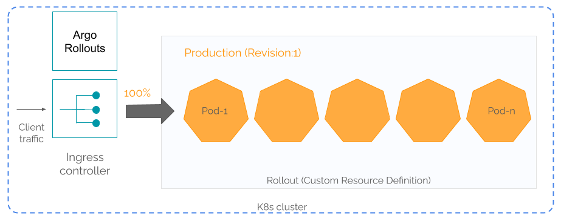
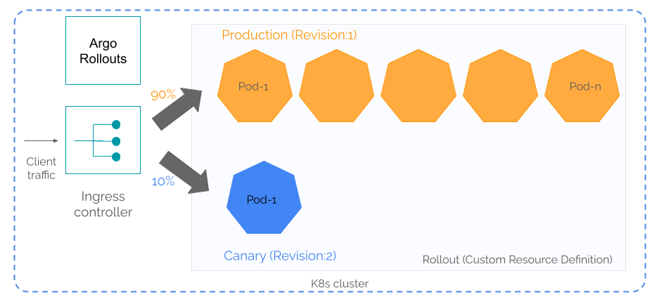
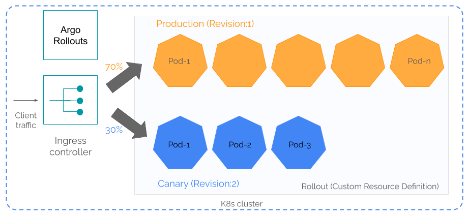
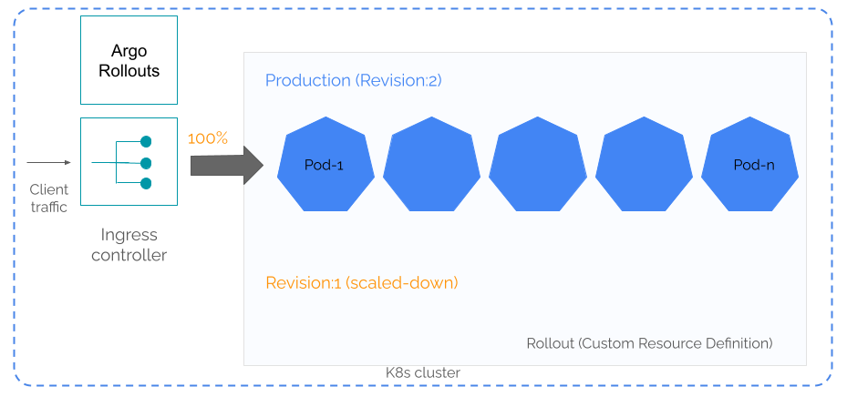

<div class="header-highlight">
  
</div>

The canary deployment strategy gradually rolls out a new software version on Kubernetes by splitting up the traffic between the new version and the stable version already in production.

With the help of an ingress controller, we can [manually do a canary deployment](https://cloudqubes.com/blog/canary-deployments-with-ingress-nginx/) in three steps.

1. Create a Kubernetes Deployment, Service, and an Ingress to route traffic to the Deployment.
2. Create a new Deployment (scaled-down) with the new version and create the canary Ingress that defines the traffic split.
4. Gradually increase the traffic percentage to the new Deployment while scaling the new Deployment to match the traffic.

This is a bit of manual work. Not practical in a production setup that rolls out changes multiple times a day.
 
For such production use cases we can use Argo Rollouts to automate canary deployments.

# What is Argo Rollouts

[Argo Rollouts](https://argoproj.github.io/rollouts) is an open-source Kubernetes controller that automates Kubernetes progressive delivery strategies such as canary and blue-green deployments.

Argo Rollouts is a part of the [Argo Project](https://argoproj.github.io) - a [CNCF graduated project](https://www.cncf.io/projects/argo/) that develops four premier cloud-native tools including Argo Rollouts.


# How Argo Rollout works

Argo Rollout implements **Rollouts** - a Custom Resource Definition which substitutes the `Deployment` object in a canary deployment strategy.

A Rollout object can hold one or more revisions.



A revision is a ReplicaSet. 

When creating a new Rollout object, Argo creates `revsion:1` which is the production ReplicaSet.

To roll out the a new version, Argo Rollouts creates a new revision (canary ReplicaSet) and uses the ingress controller to route a percentage of the traffic to the canary.



The Rollout object defines several steps that gradually increase the traffic portion to the canary.



Following the steps Argo Rollouts complete the canary deployment by migrating 100% of the traffic to the new version. At this point, Argo Rollouts scales down the `revsion:1` ReplicaSet to zero Pods.





# Installing Argo Rollouts

You can easily install Argo Rollouts in your Kubernetes cluster by using the manifest from [Argo](https://github.com/argoproj/argo-rollouts/releases). As a best practice, install Argo Rollouts in a dedicated namespace `argo-rollouts`.

```shell
kubectl create namespace argo-rollouts
kubectl apply -n argo-rollouts -f https://github.com/argoproj/argo-rollouts/releases/latest/download/install.yaml
```

We also need the Argo Rollouts kubectl plugin.

```shell
curl -LO https://github.com/argoproj/argo-rollouts/releases/latest/download/kubectl-argo-rollouts-linux-amd64
chmod +x ./kubectl-argo-rollouts-linux-amd64
sudo mv ./kubectl-argo-rollouts-linux-amd64 /usr/local/bin/kubectl-argo-rollouts
```

Verify the plugin installation.
```shell
kubectl argo rollouts version
```

```shell
kubectl-argo-rollouts: v1.6.0+7eae71e
  BuildDate: 2023-09-06T18:36:42Z
  GitCommit: 7eae71ed89f1a3769864435bddebe3ca05384df3
  GitTreeState: clean
  GoVersion: go1.20.7
  Compiler: gc
  Platform: linux/amd64
```

# Installing an Ingress Controller

Argo Rollouts depends on the ingress controller for traffic splitting between the canary and the stable. So, you need an ingress controller that can interwork with Argo Rollouts. 

We are using [Ingress Ngingx controller](https://kubernetes.github.io/ingress-nginx/deploy/) in our setup. 

You can also use other [supported ingress controllers](https://argo-rollouts.readthedocs.io/en/stable/features/traffic-management/) like [Ambassador](https://www.getambassador.io/products/edge-stack/), [Istio](https://istio.io/), etc.

Please refer the documentation of your ingress controller on how to set it up.

# Deploying the application

`cube-root`, a microservice in [number-crunch](https://github.com/cloudqubes/number-crunch-2) calculates the cubic root of a number.

We are going to upgrade `cube-root` from version `2.0.1` to `3.0.1` with Argo Rollouts using canary deployment. 

Create the `cube-root-rollout.yml` - the Kubernetes manifest for creating the Rollout object for `cube-root`.

```yaml
# cube-root-rollout.yml

apiVersion: argoproj.io/v1alpha1
kind: Rollout
metadata:
  name: cube-root
spec:
  replicas: 10
  strategy:
    canary:
      canaryService: cube-root-canary
      stableService: cube-root-stable
      trafficRouting:
        nginx:
          stableIngress: cube-root
      steps:
      - setWeight: 10
      - pause: {}
      - setWeight: 20
      - pause: {duration: 60}
      - setWeight: 40
      - pause: {duration: 60}
      - setWeight: 80
      - pause: {duration: 60}
  revisionHistoryLimit: 2
  selector:
    matchLabels:
      app: cube-root
  template:
    metadata:
      labels:
        app: cube-root
    spec:
      containers:
      - name: cube-root
        image: cloudqubes/cube-root:2.0.1
        ports:
        - name: http
          containerPort: 8080
          protocol: TCP
```

We are using version `2.0.1` of `cube-root` in this Rollout.

Under the `trafficRouting` directive we specify `nginx` as our Ingress Controller. If you are using a different Ingress Controller make sure to substitute the appropriate value here.

`Steps` define the series of steps for performing this canary deployment.

In the first step, we route 10% of the traffic to the canary. Then `pause: {}` instructs Argo Rollouts to pause the rollout until further input.

We incrementally increase the traffic percentage to the canary in the subsequent steps. At each step, we pause the rollout for 60 seconds as indicated by `pause: {duration: 60}`. We can use this time to monitor the performance of the new version and roll back if there is a problem.

The `canaryService` and `stableService` directives refer to two Kubernetes Services that route traffic to the canary and stable ReplicaSets respectively. 


Let's create the rollout.
```shell
kubectl apply -f cube-root-rollout.yaml 
```

Check the status of the rollout.
```shell
kubectl argo rollouts get rollout cube-root
```

```shell
Name:            cube-root
Namespace:       default
Status:          ✖ Degraded
Message:         InvalidSpec: The Rollout "cube-root" is invalid: spec.strategy.canary.stableService: Invalid value: "cube-root-stable": service "cube-root-stable" not found
Strategy:        Canary
  Step:          
  SetWeight:     10
  ActualWeight:  0
Replicas:
  Desired:       10
  Current:       0
  Updated:       0
  Ready:         0
  Available:     0

NAME         KIND     STATUS      AGE  INFO
⟳ cube-root  Rollout  ✖ Degraded  42s  
```
The Rollout is in `Degraded` state because the Services `cube-root-stable` and `cube-root-canary` are not created yet.

## Creating the Kubernetes Services

Create the manifest `cube-root-service.yml` for the two Services.
```yaml
# cube-root-service.yml
apiVersion: v1
kind: Service
metadata:
  name: cube-root-stable
spec:
  selector:
    app: cube-root
  ports:
  - name: cube-root-port
    protocol: TCP
    port: 8080
    targetPort: 8080

---

apiVersion: v1
kind: Service
metadata:
  name: cube-root-canary
spec:
  selector:
    app: cube-root
  ports:
  - name: cube-root-port
    protocol: TCP
    port: 8080
    targetPort: 8080
```

We use the same selector `app: cube-root` in both Services. Later, we'll see how Argo Rollouts add another selector to the Services for routing traffic to the canary ReplicaSet.

Create the Services.
```shell
kubectl apply -f cube-root-service.yml
```

Check the Services.
```shell
kubectl get services -o wide
```

```shell
NAME               TYPE        CLUSTER-IP      EXTERNAL-IP   PORT(S)    AGE   SELECTOR
cube-root-canary   ClusterIP   10.99.114.119   <none>        8080/TCP   33s   app=cube-root
cube-root-stable   ClusterIP   10.96.61.88     <none>        8080/TCP   33s   app=cube-root
```

Check the status of the Rollout.

```shell
kubectl argo rollouts get rollout cube-root
```

```shell
Name:            cube-root
Namespace:       default
Status:          ✖ Degraded
Message:         InvalidSpec: The Rollout "cube-root" is invalid: spec.strategy.canary.trafficRouting.nginx.stableIngress: Invalid value: "cube-root": ingress.networking.k8s.io "cube-root" not found
Strategy:        Canary
  Step:          
  SetWeight:     10
  ActualWeight:  0
Replicas:
  Desired:       10
  Current:       0
  Updated:       0
  Ready:         0
  Available:     0

NAME         KIND     STATUS      AGE    INFO
⟳ cube-root  Rollout  ✖ Degraded  5m23s  
```

Still, the Rollout is in `Degraded` state because the ingress `cube-root` is not yet available.

## Creating the Ingress
Create the manifest for `cube-root` Ingress.

```shell
# cube-root-ingress.yml

apiVersion: networking.k8s.io/v1
kind: Ingress
metadata:
  name: cube-root
spec:
  ingressClassName: nginx
  rules:
  - http:
      paths:
      - path: /
        pathType: Prefix
        backend:
          service:
            name: cube-root-stable
            port:
              number: 8080
```

This ingress routes traffic to the `cube-root-stable` Service.

Argo will take care of creating a corresponding Ingress resource for routing traffic to the `cube-root-canary` Service.

Create `cube-root` Ingress.
```shell
kubectl apply -f cube-root-ingress.yml
```

Check Ingress resources.

```shell
kubectl get ingress
```

```shell
NAME                         CLASS   HOSTS   ADDRESS   PORTS   AGE
cube-root                    nginx   *                 80      6s
cube-root-cube-root-canary   nginx   *                 80      6s
```

The first Ingress, `cube-root` is what we created with the manifetst `cube-root-ingress.yml`. 

Argo Rollouts has created the second Ingress `cube-root-cube-root-canary`. Let's check its details.

```shell
kubectl describe ingress cube-root-cube-root-canary
```

```shell
Name:             cube-root-cube-root-canary
Labels:           <none>
Namespace:        default
Address:          192.168.49.2
Ingress Class:    nginx
Default backend:  <default>
Rules:
  Host        Path  Backends
  ----        ----  --------
  *           
              /   cube-root-canary:8080 (10.244.0.173:8080,10.244.0.174:8080,10.244.0.175:8080 + 7 more...)
Annotations:  nginx.ingress.kubernetes.io/canary: true
              nginx.ingress.kubernetes.io/canary-weight: 0
Events:
  Type    Reason  Age                From                      Message
  ----    ------  ----               ----                      -------
  Normal  Sync    93m (x2 over 93m)  nginx-ingress-controller  Scheduled for sync
```
This Ingress uses `cube-root-canary` Service as the backend. But, the `canary-weight` is set to zero indicating that no traffic is routed to the canary Service yet.

Check the status of the Rollout.

```shell
kubectl argo rollouts get rollout cube-root
```

```shell
Name:            cube-root
Namespace:       default
Status:          ✔ Healthy
Strategy:        Canary
  Step:          8/8
  SetWeight:     100
  ActualWeight:  100
Images:          cloudqubes/cube-root:2.0.1 (stable)
Replicas:
  Desired:       10
  Current:       10
  Updated:       10
  Ready:         10
  Available:     10

NAME                                  KIND        STATUS     AGE  INFO
⟳ cube-root                           Rollout     ✔ Healthy  89s  
└──# revision:1                                                   
   └──⧉ cube-root-7dd6c8d59           ReplicaSet  ✔ Healthy  89s  stable
      ├──□ cube-root-7dd6c8d59-2v6jg  Pod         ✔ Running  89s  ready:1/1
      ├──□ cube-root-7dd6c8d59-68dh7  Pod         ✔ Running  89s  ready:1/1
      ├──□ cube-root-7dd6c8d59-96r8b  Pod         ✔ Running  89s  ready:1/1
      ├──□ cube-root-7dd6c8d59-7pqlv  Pod         ✔ Running  88s  ready:1/1
      ├──□ cube-root-7dd6c8d59-9tdr4  Pod         ✔ Running  88s  ready:1/1
      ├──□ cube-root-7dd6c8d59-b4jqt  Pod         ✔ Running  88s  ready:1/1
      ├──□ cube-root-7dd6c8d59-g9mnl  Pod         ✔ Running  88s  ready:1/1
      ├──□ cube-root-7dd6c8d59-pqmmq  Pod         ✔ Running  88s  ready:1/1
      ├──□ cube-root-7dd6c8d59-qbb8s  Pod         ✔ Running  88s  ready:1/1
      └──□ cube-root-7dd6c8d59-rq9gf  Pod         ✔ Running  88s  ready:1/1
```

We have 10 Pods running with image `cloudqubes/cube-root:2.0.1`.

Argo has also created the corresponding ReplicaSet for `revision:1`.

```shell
kubectl get replicasets
```

```shell
NAME                  DESIRED   CURRENT   READY   AGE
cube-root-7dd6c8d59   10        10        0       23s
```


## Testing cube-root application

Create the `test.sh` file with this script for testing `cube-root`. Use the correct IP address for your Ingress resource.
```shell
#!/bin/bash

for i in {1..20}
do
  echo -n $i: 
  curl http://192.168.49.2/cube-root/8
done
```

Run the test.
```shell
./test.sh
```

```shell
1:{"Version":"v2","InputNumber":8,"CubeRoot":2}
2:{"Version":"v2","InputNumber":8,"CubeRoot":2}
3:{"Version":"v2","InputNumber":8,"CubeRoot":2}
4:{"Version":"v2","InputNumber":8,"CubeRoot":2}
5:{"Version":"v2","InputNumber":8,"CubeRoot":2}
6:{"Version":"v2","InputNumber":8,"CubeRoot":2}
7:{"Version":"v2","InputNumber":8,"CubeRoot":2}
8:{"Version":"v2","InputNumber":8,"CubeRoot":2}
9:{"Version":"v2","InputNumber":8,"CubeRoot":2}
10:{"Version":"v2","InputNumber":8,"CubeRoot":2}
11:{"Version":"v2","InputNumber":8,"CubeRoot":2}
12:{"Version":"v2","InputNumber":8,"CubeRoot":2}
13:{"Version":"v2","InputNumber":8,"CubeRoot":2}
14:{"Version":"v2","InputNumber":8,"CubeRoot":2}
15:{"Version":"v2","InputNumber":8,"CubeRoot":2}
16:{"Version":"v2","InputNumber":8,"CubeRoot":2}
17:{"Version":"v2","InputNumber":8,"CubeRoot":2}
18:{"Version":"v2","InputNumber":8,"CubeRoot":2}
19:{"Version":"v2","InputNumber":8,"CubeRoot":2}
20:{"Version":"v2","InputNumber":8,"CubeRoot":2}
```

We get 20 responses from the `v2` version of `cube-root`

# Rolling out the new version

In the `cube-root-rollout.yml` update the image to `3.0.1`.

```shell
        image: cloudqubes/cube-root:3.0.1
```

Apply the changes and check the status of the Rollout.

```shell
kubectl apply -f cube-root-rollout.yml
```

```shell
kubectl argo rollouts get rollout cube-root
```

```shell
Name:            cube-root
Namespace:       default
Status:          ॥ Paused
Message:         CanaryPauseStep
Strategy:        Canary
  Step:          1/8
  SetWeight:     10
  ActualWeight:  10
Images:          cloudqubes/cube-root:2.0.1 (stable)
                 cloudqubes/cube-root:3.0.1 (canary)
Replicas:
  Desired:       10
  Current:       11
  Updated:       1
  Ready:         11
  Available:     11

NAME                                   KIND        STATUS     AGE    INFO
⟳ cube-root                            Rollout     ॥ Paused   4h48m  
├──# revision:2                                                      
│  └──⧉ cube-root-6645bd7bb4           ReplicaSet  ✔ Healthy  3m26s  canary
│     └──□ cube-root-6645bd7bb4-9v7gn  Pod         ✔ Running  3m26s  ready:1/1
└──# revision:1                                                      
   └──⧉ cube-root-7dd6c8d59            ReplicaSet  ✔ Healthy  4h48m  stable
      ├──□ cube-root-7dd6c8d59-2v6jg   Pod         ✔ Running  4h48m  ready:1/1
      ├──□ cube-root-7dd6c8d59-68dh7   Pod         ✔ Running  4h48m  ready:1/1
      ├──□ cube-root-7dd6c8d59-96r8b   Pod         ✔ Running  4h48m  ready:1/1
      ├──□ cube-root-7dd6c8d59-7pqlv   Pod         ✔ Running  4h48m  ready:1/1
      ├──□ cube-root-7dd6c8d59-9tdr4   Pod         ✔ Running  4h48m  ready:1/1
      ├──□ cube-root-7dd6c8d59-b4jqt   Pod         ✔ Running  4h48m  ready:1/1
      ├──□ cube-root-7dd6c8d59-g9mnl   Pod         ✔ Running  4h48m  ready:1/1
      ├──□ cube-root-7dd6c8d59-pqmmq   Pod         ✔ Running  4h48m  ready:1/1
      ├──□ cube-root-7dd6c8d59-qbb8s   Pod         ✔ Running  4h48m  ready:1/1
      └──□ cube-root-7dd6c8d59-rq9gf   Pod         ✔ Running  4h48m  ready:1/1
```

`revision:2` is created with one Pod.

The upgrade status is `Paused` since we defined the first step to `pause` in the `cube-root-rollout.yml` manifest.

Check the Services.
```shell
kubectl get services -o wide
```

```shell
NAME               TYPE        CLUSTER-IP       EXTERNAL-IP   PORT(S)    AGE   SELECTOR
cube-root-canary   ClusterIP   10.110.203.133   <none>        8080/TCP   4h52m app=cube-root,rollouts-pod-template-hash=6645bd7bb4
cube-root-stable   ClusterIP   10.97.72.112     <none>        8080/TCP   4h52m app=cube-root,rollouts-pod-template-hash=7dd6c8d59
```

Argo has added a new selector `rollouts-pod-template-hash` to each Service for routing traffic to the canary and the stable versions. Also, Argo has created a new ReplicaSet for the canary.

```shell
kubectl get replicasets -o wide
```

```shell
NAME                   DESIRED   CURRENT   READY   AGE     CONTAINERS   IMAGES                       SELECTOR
cube-root-6645bd7bb4   1         1         1       46s     cube-root    cloudqubes/cube-root:3.0.1   app=cube-root,rollouts-pod-template-hash=6645bd7bb4
cube-root-7dd6c8d59    10        10        10      4h52m   cube-root    cloudqubes/cube-root:2.0.1   app=cube-root,rollouts-pod-template-hash=7dd6c8d59
```

Check the canary ingress.

```shell
kubectl describe ingress cube-root-cube-root-canary
```

```shell
Name:             cube-root-cube-root-canary
Labels:           <none>
Namespace:        default
Address:          192.168.49.2
Ingress Class:    nginx
Default backend:  <default>
Rules:
  Host        Path  Backends
  ----        ----  --------
  *           
              /   cube-root-canary:8080 (10.244.0.193:8080)
Annotations:  nginx.ingress.kubernetes.io/canary: true
              nginx.ingress.kubernetes.io/canary-weight: 10
Events:
  Type    Reason  Age                   From                      Message
  ----    ------  ----                  ----                      -------
  Normal  Sync    7m1s (x3 over 4h52m)  nginx-ingress-controller  Scheduled for sync
```

Argo has updated the canary ingress to send 10% of the traffic to the canary version.

Test the application with the test script.

```shell
./test.sh 
```

```shell
1:{"Version":"v2","InputNumber":8,"CubeRoot":2}
2:{"Version":"v3","InputNumber":8,"CubeRoot":2}
3:{"Version":"v2","InputNumber":8,"CubeRoot":2}
4:{"Version":"v2","InputNumber":8,"CubeRoot":2}
5:{"Version":"v2","InputNumber":8,"CubeRoot":2}
6:{"Version":"v2","InputNumber":8,"CubeRoot":2}
7:{"Version":"v2","InputNumber":8,"CubeRoot":2}
8:{"Version":"v2","InputNumber":8,"CubeRoot":2}
9:{"Version":"v2","InputNumber":8,"CubeRoot":2}
10:{"Version":"v3","InputNumber":8,"CubeRoot":2}
11:{"Version":"v2","InputNumber":8,"CubeRoot":2}
12:{"Version":"v2","InputNumber":8,"CubeRoot":2}
13:{"Version":"v2","InputNumber":8,"CubeRoot":2}
14:{"Version":"v2","InputNumber":8,"CubeRoot":2}
15:{"Version":"v2","InputNumber":8,"CubeRoot":2}
16:{"Version":"v2","InputNumber":8,"CubeRoot":2}
17:{"Version":"v2","InputNumber":8,"CubeRoot":2}
18:{"Version":"v3","InputNumber":8,"CubeRoot":2}
19:{"Version":"v2","InputNumber":8,"CubeRoot":2}
20:{"Version":"v2","InputNumber":8,"CubeRoot":2}
```

Three responses are from the new version `v3`. 

Since `v3` is working fine, we can proceed to the next step.

# Promote the rollout

The `cube-root` Rollout is now in paused status. We must `promote` it for the progressive delivery to continue.

```shell
kubectl argo rollouts promote cube-root
```

Now the delivery will continue as we have defined under the `steps` directive in the `cube-root-rollout.yml`

```shell
#steps in cube-root-rollout.yml
      steps:
      - setWeight: 10
      - pause: {}
      - setWeight: 20
      - pause: {duration: 60}
      - setWeight: 40
      - pause: {duration: 60}
      - setWeight: 80
      - pause: {duration: 60}
```

The Rollout is now in `paused` state in the 3rd step.

```shell
kubectl argo rollouts get rollout cube-root
```

```shell
Name:            cube-root
Namespace:       default
Status:          ॥ Paused
Message:         CanaryPauseStep
Strategy:        Canary
  Step:          3/8
  SetWeight:     20
  ActualWeight:  20
Images:          cloudqubes/cube-root:2.0.1 (stable)
                 cloudqubes/cube-root:3.0.1 (canary)
Replicas:
  Desired:       10
  Current:       12
  Updated:       2
  Ready:         12
  Available:     12

NAME                                   KIND        STATUS     AGE    INFO
⟳ cube-root                            Rollout     ॥ Paused   4h57m  
├──# revision:2                                                      
│  └──⧉ cube-root-6645bd7bb4           ReplicaSet  ✔ Healthy  12m    canary
│     ├──□ cube-root-6645bd7bb4-9v7gn  Pod         ✔ Running  12m    ready:1/1
│     └──□ cube-root-6645bd7bb4-grx6k  Pod         ✔ Running  9s     ready:1/1
└──# revision:1                                                      
   └──⧉ cube-root-7dd6c8d59            ReplicaSet  ✔ Healthy  4h57m  stable
      ├──□ cube-root-7dd6c8d59-2v6jg   Pod         ✔ Running  4h57m  ready:1/1
      ├──□ cube-root-7dd6c8d59-68dh7   Pod         ✔ Running  4h57m  ready:1/1
      ├──□ cube-root-7dd6c8d59-96r8b   Pod         ✔ Running  4h57m  ready:1/1
      ├──□ cube-root-7dd6c8d59-7pqlv   Pod         ✔ Running  4h57m  ready:1/1
      ├──□ cube-root-7dd6c8d59-9tdr4   Pod         ✔ Running  4h57m  ready:1/1
      ├──□ cube-root-7dd6c8d59-b4jqt   Pod         ✔ Running  4h57m  ready:1/1
      ├──□ cube-root-7dd6c8d59-g9mnl   Pod         ✔ Running  4h57m  ready:1/1
      ├──□ cube-root-7dd6c8d59-pqmmq   Pod         ✔ Running  4h57m  ready:1/1
      ├──□ cube-root-7dd6c8d59-qbb8s   Pod         ✔ Running  4h57m  ready:1/1
      └──□ cube-root-7dd6c8d59-rq9gf   Pod         ✔ Running  4h57m  ready:1/1
```

Rollout will continue to scale the `revision:2`.

Check the Rollout status again after a few minutes.

```shell
kubectl argo rollouts get rollout cube-root
```

```shell
Name:            cube-root
Namespace:       default
Status:          ॥ Paused
Message:         CanaryPauseStep
Strategy:        Canary
  Step:          7/8
  SetWeight:     80
  ActualWeight:  80
Images:          cloudqubes/cube-root:2.0.1 (stable)
                 cloudqubes/cube-root:3.0.1 (canary)
Replicas:
  Desired:       10
  Current:       18
  Updated:       8
  Ready:         18
  Available:     18

NAME                                   KIND        STATUS     AGE    INFO
⟳ cube-root                            Rollout     ॥ Paused   4h59m  
├──# revision:2                                                      
│  └──⧉ cube-root-6645bd7bb4           ReplicaSet  ✔ Healthy  14m    canary
│     ├──□ cube-root-6645bd7bb4-9v7gn  Pod         ✔ Running  14m    ready:1/1
│     ├──□ cube-root-6645bd7bb4-grx6k  Pod         ✔ Running  2m15s  ready:1/1
│     ├──□ cube-root-6645bd7bb4-cf88n  Pod         ✔ Running  72s    ready:1/1
│     ├──□ cube-root-6645bd7bb4-cf9dn  Pod         ✔ Running  72s    ready:1/1
│     ├──□ cube-root-6645bd7bb4-4zd8l  Pod         ✔ Running  9s     ready:1/1
│     ├──□ cube-root-6645bd7bb4-5cgzb  Pod         ✔ Running  9s     ready:1/1
│     ├──□ cube-root-6645bd7bb4-msp7d  Pod         ✔ Running  9s     ready:1/1
│     └──□ cube-root-6645bd7bb4-vdrpj  Pod         ✔ Running  9s     ready:1/1
└──# revision:1                                                      
   └──⧉ cube-root-7dd6c8d59            ReplicaSet  ✔ Healthy  4h59m  stable
      ├──□ cube-root-7dd6c8d59-2v6jg   Pod         ✔ Running  4h59m  ready:1/1
      ├──□ cube-root-7dd6c8d59-68dh7   Pod         ✔ Running  4h59m  ready:1/1
      ├──□ cube-root-7dd6c8d59-96r8b   Pod         ✔ Running  4h59m  ready:1/1
      ├──□ cube-root-7dd6c8d59-7pqlv   Pod         ✔ Running  4h59m  ready:1/1
      ├──□ cube-root-7dd6c8d59-9tdr4   Pod         ✔ Running  4h59m  ready:1/1
      ├──□ cube-root-7dd6c8d59-b4jqt   Pod         ✔ Running  4h59m  ready:1/1
      ├──□ cube-root-7dd6c8d59-g9mnl   Pod         ✔ Running  4h59m  ready:1/1
      ├──□ cube-root-7dd6c8d59-pqmmq   Pod         ✔ Running  4h59m  ready:1/1
      ├──□ cube-root-7dd6c8d59-qbb8s   Pod         ✔ Running  4h59m  ready:1/1
      └──□ cube-root-7dd6c8d59-rq9gf   Pod         ✔ Running  4h59m  ready:1/1
```
Now we have a total of 18 Pods with 8 Pods in `revision:2`.

Test the application.

```shell
./test.sh
```

```shell
1:{"Version":"v2","InputNumber":8,"CubeRoot":2}
2:{"Version":"v3","InputNumber":8,"CubeRoot":2}
3:{"Version":"v3","InputNumber":8,"CubeRoot":2}
4:{"Version":"v3","InputNumber":8,"CubeRoot":2}
5:{"Version":"v2","InputNumber":8,"CubeRoot":2}
6:{"Version":"v3","InputNumber":8,"CubeRoot":2}
7:{"Version":"v3","InputNumber":8,"CubeRoot":2}
8:{"Version":"v3","InputNumber":8,"CubeRoot":2}
9:{"Version":"v3","InputNumber":8,"CubeRoot":2}
10:{"Version":"v3","InputNumber":8,"CubeRoot":2}
11:{"Version":"v3","InputNumber":8,"CubeRoot":2}
12:{"Version":"v3","InputNumber":8,"CubeRoot":2}
13:{"Version":"v3","InputNumber":8,"CubeRoot":2}
14:{"Version":"v3","InputNumber":8,"CubeRoot":2}
15:{"Version":"v3","InputNumber":8,"CubeRoot":2}
16:{"Version":"v3","InputNumber":8,"CubeRoot":2}
17:{"Version":"v3","InputNumber":8,"CubeRoot":2}
18:{"Version":"v3","InputNumber":8,"CubeRoot":2}
19:{"Version":"v3","InputNumber":8,"CubeRoot":2}
20:{"Version":"v2","InputNumber":8,"CubeRoot":2}
```

`v3` serves most of our requests now. Since `v3` is working fine we do not have to roll back but can continue the rollout.

Check the status after the rollout completion.

```shell
kubectl argo rollouts get rollout cube-root
```

```shell
Name:            cube-root
Namespace:       default
Status:          ✔ Healthy
Strategy:        Canary
  Step:          8/8
  SetWeight:     100
  ActualWeight:  100
Images:          cloudqubes/cube-root:3.0.1 (stable)
Replicas:
  Desired:       10
  Current:       10
  Updated:       10
  Ready:         10
  Available:     10

NAME                                   KIND        STATUS        AGE    INFO
⟳ cube-root                            Rollout     ✔ Healthy     5h4m   
├──# revision:2                                                         
│  └──⧉ cube-root-6645bd7bb4           ReplicaSet  ✔ Healthy     18m    stable
│     ├──□ cube-root-6645bd7bb4-9v7gn  Pod         ✔ Running     18m    ready:1/1
│     ├──□ cube-root-6645bd7bb4-grx6k  Pod         ✔ Running     6m22s  ready:1/1
│     ├──□ cube-root-6645bd7bb4-cf88n  Pod         ✔ Running     5m19s  ready:1/1
│     ├──□ cube-root-6645bd7bb4-cf9dn  Pod         ✔ Running     5m19s  ready:1/1
│     ├──□ cube-root-6645bd7bb4-4zd8l  Pod         ✔ Running     4m16s  ready:1/1
│     ├──□ cube-root-6645bd7bb4-5cgzb  Pod         ✔ Running     4m16s  ready:1/1
│     ├──□ cube-root-6645bd7bb4-msp7d  Pod         ✔ Running     4m16s  ready:1/1
│     ├──□ cube-root-6645bd7bb4-vdrpj  Pod         ✔ Running     4m16s  ready:1/1
│     ├──□ cube-root-6645bd7bb4-585vp  Pod         ✔ Running     3m11s  ready:1/1
│     └──□ cube-root-6645bd7bb4-7gkgf  Pod         ✔ Running     3m11s  ready:1/1
└──# revision:1                                                         
   └──⧉ cube-root-7dd6c8d59            ReplicaSet  • ScaledDown  5h4m   

```

The new version has become the stable.
And we are ready to roll out the next release.

# Wrapping up

Earlier, we did a [canary deployment manually](https://cloudqubes.com/blog/canary-deployments-with-ingress-nginx/). 

Now, we automated a major part of it with Argo Rollouts.

But we still have some manual work - monitoring - which we did with `curl`. We can automate this part using Prometheus which we will soon do.

Argo Rollouts also supports blue-green deployment which is another popular progressive delivery strategy. Let's get into that next.

