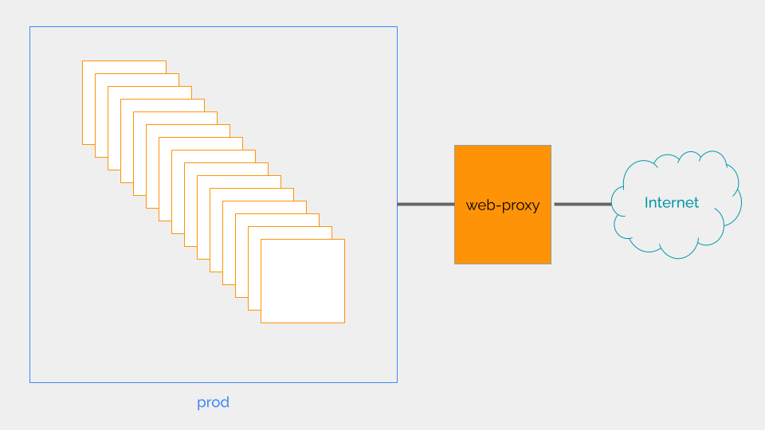

<div class="header-highlight">
  
</div>

My servers in `prod` are not directly exposed to the Internet.

I use a web proxy for downloading files and software into these servers. All I need to do is to set `http_proxy` environment variable from the shell.

But `systemd` services like `containerd` do not read the environment variables configured from the shell. 

So, here's how to set environment variables for `containerd` to download container images via the web proxy.


# #1: Configure `/etc/environment`

Update the proxy environment variables in `/etc/environment`.

```shell
PATH="/usr/local/sbin:/usr/local/bin:/usr/sbin:/usr/bin:/sbin:/bin:/usr/games:/usr/local/games:/snap/bin"
HTTPS_PROXY=http://10.106.20.10:8001
HTTP_PROXY=http://10.106.20.10:8001
NO_PROXY=127.0.0.1,172.16.0.0/16
https_proxy=http://10.106.20.10:8001
http_proxy=http://10.106.20.10:8001
no_proxy=127.0.0.1,172.16.0.0/16
```

# #2 Create config file for containerd service

Create directory.

```shell
sudo mkdir -p /etc/systemd/system/containerd.service.d/
```

Create `proxy.conf` file and open in vim.
```shell
sudo vim /etc/systemd/system/containerd.service.d/proxy.conf
```

Insert these two lines, save and close.
```shell
[Service]
EnvironmentFile=/etc/environment
```

# #3 Restart the containerd service
```shell
sudo systemctl daemon-reload
sudo systemctl restart containerd.service
```

Now, `containerd` service can download container images via the proxy server.

This method works for other `systemd` services like `docker` as well.


