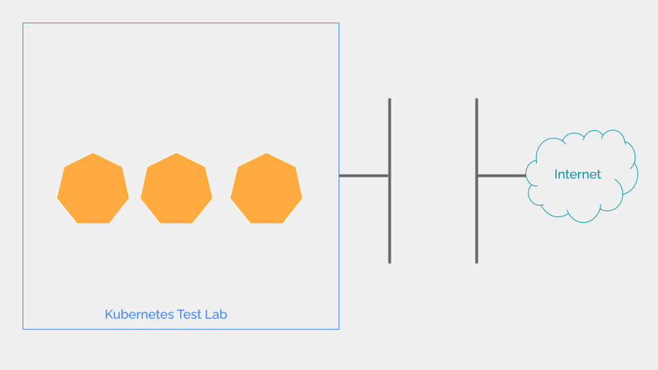

<div class="header-highlight">
  
</div>

In an offline (aka air-gapped) Kubernetes cluster, you don't have the convenience of using [Docker Hub](https://hub.docker.com/) as the container registry. 

A private container registry can help, but it demands computing resources which are scarce in a lab.

As a workaround, we can use the built-in image management function of [Containerd](https://containerd.io/) to serve container images to Kubernetes.

But we must first understand how Kubernetes uses namespaces in Containerd.

# Namespaces in Containerd

The namespaces in Containerd are different from the namespaces in Kubernetes but serve a similar purpose. 

Kubernetes namespaces logically isolate the users sharing the same cluster.

Containerd namespaces logically isolate consumers of the Containerd service. And Kubernetes is one consumer of Containerd.

Log in to one of the worker nodes in your cluster and check the namespaces in Containerd.

```shell
sudo ctr namespaces list       
```

```shell
NAME    LABELS 
default        
k8s.io         
```

From these two namespaces, Kubernetes uses the namespace `k8s.io`.

To confirm that list the containers running in the `k8s.io` namespace.

```shell
sudo ctr -n k8s.io containers ls
```

```shell
CONTAINER                                                           IMAGE                                             RUNTIME                  
1e2f4cfa8f1ea9552ff9908fd14bd6a1da0fff86f4ce91c7c16fa52308befc1e    docker.io/calico/cni:v3.26.3                      io.containerd.runc.v2    
2ef0f06a2491105b09e1d738ee26a2c4ce04f21ef00ec5d174bede8522567758    docker.io/calico/pod2daemon-flexvol:v3.26.3       io.containerd.runc.v2    
31d66e0d8a163bca37a990c42abe4ac1d5821c2094908015d4fec0107213ac9d    docker.io/calico/node-driver-registrar:v3.26.3    io.containerd.runc.v2    
3235be62928a582be81ab7259e29530d2572917f1afed1f8f9c787e50dfa0dc9    docker.io/calico/typha:v3.26.3                    io.containerd.runc.v2    
382db30fdb51d893ec71c607d53bfb2cf5f0e7c449e3085b15c39551927c6010    registry.k8s.io/pause:3.8                         io.containerd.runc.v2    
6cf303b8337bbcbde85978f3cfcfc39ac15e62a2750ba289025c663f6418af03    registry.k8s.io/pause:3.8                         io.containerd.runc.v2    
7c31edf7e9960a330d76435e524441e909290206bdf6a7f2b8c49c2cbafd4f5a    registry.k8s.io/pause:3.8                         io.containerd.runc.v2    
7d37508be3220b13b73b1aa1cf4ff41e3ee186830b993d709d436c63ba478c8b    docker.io/calico/node:v3.26.3                     io.containerd.runc.v2    
83b127ecdf5c0dd74180b25b5f1a591749e769c9fe0427cab811292d79d511af    docker.io/calico/csi:v3.26.3                      io.containerd.runc.v2    
abbfc6623fe4f6fa4017f68852c779b8281038f250052e3f50ece1efda56e6bc    registry.k8s.io/kube-proxy:v1.26.0                io.containerd.runc.v2    
b05b9ccbda5af5a7823d16d8afb153d52287f5a58d5f0babdf9a4c70fffc14c3    registry.k8s.io/pause:3.8                         io.containerd.runc.v2    
```
Your output will be different. But, you can match your output with the results of `kubectl get pods -A` in your Kubernetes cluster.

The default namespace in Containerd will not have any running containers unless you have created any before. You can verify by running `ctr` without specifying the namespace.

```shell
sudo ctr  containers ls   
```

For Kubernetes to use the images saved in Containerd, we must import the images to the `k8s.io` namespace in Containerd.

We can do it in three steps.

# #1 Download image

We are using the image Redis as an example. But you can do this for any container image.

From a computer with Docker installed and connected to the Internet download `redis` image.

```shell
docker pull redis:7.2.3
```
Use a specific version of the image as `redis:x.y.z`. Don't use `redis:latest` as it will try to download the latest version everytime you create a Pod.


# #2 Export image

Export image to a `tar` archive.
```shell
docker save redis:7.2.3 > redis.7.2.3.tar
```

# #3 Import image

Copy the image to one worker node in the cluster.
Log in to the worker node and import the image to `k8s.io` namespace in Containerd.

```shell
sudo ctr -n k8s.io image import --base-name redis:7.2.3 redis.7.2.3.tar 
```

Check the imported image.
```shell
$ sudo ctr -n k8s.io image ls | grep redis
docker.io/library/redis:7.2.3                                                                                  application/vnd.docker.distribution.manifest.v2+json      sha256:0485d0da1d4a237267765b37182ea43d41c5b51f796da4b8eec109869c2d4754 135.6 MiB linux/amd64                                                                  io.cri-containerd.image=managed    
```

Repeat #3 for all worker nodes in the cluster.

# Run a Pod

Use the imported image to create a Pod.
```shell
kubectl run redis --image=redis:7.2.3 --port=6379
```

Check the status of the container.
```shell
$ k get pods
NAME    READY   STATUS    RESTARTS   AGE
redis   1/1     Running   0          3s
```

The `redis` Pod is successfully created. 

This method is very effective for air-gapped Kubernetes labs.

But it's not suitable for a production setup with many nodes as it will be impractical to manange conatiner images in all nodes like this. If you want to air-gap a production cluster, a private container registry is the only viable option.

