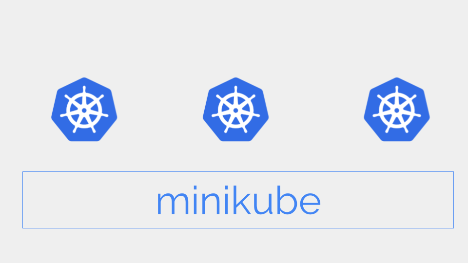

<div class="header-highlight">
  
</div>

[Minikube](https://minikube.sigs.k8s.io/docs/) is one of the easiest options to run a Kubernetes cluster on your laptop.

But, often one Kubernetes cluster is not enough for DevOps engineers.

To test an application in different Kubernetes versions or to test different Kubernetes configurations we need to run multiple Kubernetes clusters.

Minikube can do that. You just need a laptop (Linux, Mac, or Windows) with at least 6GB of memory.

# Install Minikube

Install Minikube by following the [instructions](https://minikube.sigs.k8s.io/docs/start/) for your platform.

# Start the first cluster

Start the first Kubernetes cluster, which will be named `minikube`.

```shell{outputLines: 2}
minikube start
```
List the created cluster.
```shell{outputLines: 2-6}
minikube profile list
|----------|-----------|---------|--------------|------|---------|---------|-------|--------|
| Profile  | VM Driver | Runtime |      IP      | Port | Version | Status  | Nodes | Active |
|----------|-----------|---------|--------------|------|---------|---------|-------|--------|
| minikube | docker    | docker  | 192.168.76.2 | 8443 | v1.28.3 | Running |     1 | *      |
|----------|-----------|---------|--------------|------|---------|---------|-------|--------|
```

A `profile` in Minikube is equivalent to a Kubernetes cluster.

# Start the second cluster

Create a new cluster. Use `-p` option to create a new profile (cluster).

```shell{outputLines: 2}
minikube start -p k8s-10
```

List the clusters.
```shell{outputLines: 2-7}
minikube profile list
|----------|-----------|---------|--------------|------|---------|---------|-------|--------|
| Profile  | VM Driver | Runtime |      IP      | Port | Version | Status  | Nodes | Active |
|----------|-----------|---------|--------------|------|---------|---------|-------|--------|
| k8s-10   | docker    | docker  | 192.168.49.2 | 8443 | v1.28.3 | Running |     1 |        |
| minikube | docker    | docker  | 192.168.76.2 | 8443 | v1.28.3 | Running |     1 | *      |
|----------|-----------|---------|--------------|------|---------|---------|-------|--------|
```

Now, we have two Kubernetes clusters running. 

# Selecting clusters

Minikube includes `kubectl` which you can use as `minikube kubectl --`.

The commands issued using `minikube kubectl --` will be received by the `Active` cluster indicated by a `*` in the `Active` column in the table above.

List the nodes in the cluster.
```shell{outputLines: 2-7}
minikube kubectl -- get nodes
NAME       STATUS   ROLES           AGE     VERSION
minikube   Ready    control-plane   3h48m   v1.28.3
```
This command lists the nodes in the `minikube` cluster as it is the currently `Active` cluster.

Select the other cluster.
```shell{outputLines: 2-7}
minikube profile k8s-10
✅  minikube profile was successfully set to k8s-10
```

List the clusters.
```shell{outputLines: 2-7}
minikube profile list
|----------|-----------|---------|--------------|------|---------|---------|-------|--------|
| Profile  | VM Driver | Runtime |      IP      | Port | Version | Status  | Nodes | Active |
|----------|-----------|---------|--------------|------|---------|---------|-------|--------|
| k8s-10   | docker    | docker  | 192.168.49.2 | 8443 | v1.28.3 | Running |     1 | *      |
| minikube | docker    | docker  | 192.168.76.2 | 8443 | v1.28.3 | Running |     1 |        |
|----------|-----------|---------|--------------|------|---------|---------|-------|--------|
```
Now, the `k8s-10` cluster is selected so the commands will be received by the `k8s-10` cluster.

List the nodes in `k8s-10` cluster.
```shell{outputLines: 2-7}
minikube kubectl -- get nodes
NAME     STATUS   ROLES           AGE     VERSION
k8s-10   Ready    control-plane   7m14s   v1.28.3
```

# Stop a Kubernetes cluster

To stop a cluster, we must select the cluster (profile) first.

Let's stop the `minikube` cluster.

```shell{outputLines: 2-3, 5-9}
minikube profile minikube
✅  minikube profile was successfully set to minikube

minikube stop
✋  Stopping node "minikube"  ...
🛑  Powering off "minikube" via SSH ...
🛑  1 node stopped.
```

List the clusters.

```shell{outputLines: 2-7}
minikube profile list
|----------|-----------|---------|--------------|------|---------|---------|-------|--------|
| Profile  | VM Driver | Runtime |      IP      | Port | Version | Status  | Nodes | Active |
|----------|-----------|---------|--------------|------|---------|---------|-------|--------|
| k8s-10   | docker    | docker  | 192.168.49.2 | 8443 | v1.28.3 | Running |     1 |        |
| minikube | docker    | docker  | 192.168.76.2 | 8443 | v1.28.3 | Stopped |     1 | *      |
|----------|-----------|---------|--------------|------|---------|---------|-------|--------|
```

The cluster `minikube` is stopped but `k8s-10` is still running.

# Create more clusters

Minikube is not limited to single-node clusters.

Create a new Kubernetes cluster with two nodes.

```shell{outputLines: 2-7}
minikube start -n=2 -p k8s-20
```

List the clusters
```shell{outputLines: 2-8}
minikube profile list
|----------|-----------|---------|--------------|------|---------|---------|-------|--------|
| Profile  | VM Driver | Runtime |      IP      | Port | Version | Status  | Nodes | Active |
|----------|-----------|---------|--------------|------|---------|---------|-------|--------|
| k8s-10   | docker    | docker  | 192.168.49.2 | 8443 | v1.28.3 | Running |     1 |        |
| k8s-20   | docker    | docker  | 192.168.67.2 | 8443 | v1.28.3 | Running |     2 |        |
| minikube | docker    | docker  | 192.168.76.2 | 8443 | v1.28.3 | Stopped |     1 | *      |
|----------|-----------|---------|--------------|------|---------|---------|-------|--------|
```
We have two running clusters - `k8s-10` with one node and `k8s-20` with two nodes.

# Delete clusters

Let's delete the cluster `k8s-10` as we no longer need it.

To delete a cluster, we must first select the profile.

```shell{outputLines: 2-7}
minikube profile k8s-10
```

Stop the cluster.
```shell{outputLines: 2-7}
minikube stop
```

Delete the cluster.
```shell{outputLines: 2-7}
minikube delete
```

List the clusters.
```shell{outputLines: 2-7}
minikube profile list
|----------|-----------|---------|--------------|------|---------|---------|-------|--------|
| Profile  | VM Driver | Runtime |      IP      | Port | Version | Status  | Nodes | Active |
|----------|-----------|---------|--------------|------|---------|---------|-------|--------|
| k8s-20    | docker    | docker  | 192.168.67.2 | 8443 | v1.28.3 | Running |     2 |        |
| minikube | docker    | docker  | 192.168.76.2 | 8443 | v1.28.3 | Stopped |     1 | *      |
|----------|-----------|---------|--------------|------|---------|---------|-------|--------|
```

The cluster `k8s-10` is deleted.

# Create a cluster with a specific Kubernetes version

By default, Minikube creates the cluster with the latest Kubernetes version. We can create a cluster with a specific version by using `--kubernetes-version` option in `minikube start`.

Create a cluster with Kubernetes `1.27.1`.

```shell{outputLines: 2-7}
minikube start -p k8s-30 --kubernetes-version='1.27.1'
```

List the clusters.
```shell{outputLines: 2-8}
minikube profile list
|----------|-----------|---------|--------------|------|---------|---------|-------|--------|
| Profile  | VM Driver | Runtime |      IP      | Port | Version | Status  | Nodes | Active |
|----------|-----------|---------|--------------|------|---------|---------|-------|--------|
| k8s-30   | docker    | docker  | 192.168.49.2 | 8443 | v1.27.1 | Running |     1 |        |
| k8s20    | docker    | docker  | 192.168.67.2 | 8443 | v1.28.3 | Running |     2 | *      |
| minikube | docker    | docker  | 192.168.76.2 | 8443 | v1.28.3 | Stopped |     1 |        |
|----------|-----------|---------|--------------|------|---------|---------|-------|--------|
```

# Wrapping up

Minikube is easy to get started and is also lenient on computing resource. But, it's a powerful tool for running Kubernetes in your laptop.

You can easily run 3 single-node clusters in a laptop with 6GB of memory and 4 CPU cores.

With more memory and CPU cores you can create sophisticated Kubernetes test labs right on your laptop.
