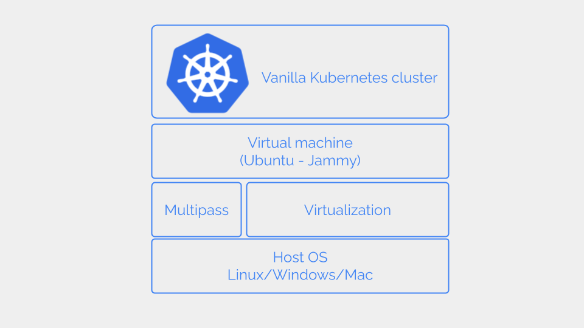

In this tutorial, we are going to deploy a single-node vanilla Kubernetes cluster on a virtual machine on your laptop. 



To create the virtual machine we use [Multipass](https://multipass.run/). Since Multipass works on Linux, Mac (both Intel and Apple Silicon), and Windows you can use any of those platforms for this tutorial. 

To install Kubernetes, the virtual machine must have at least 2GB of memory. So your laptop must have at least 6GB of memory.


# Outline of steps

1. [Install Multipass](#install-multipass)
2. [Create a virtual machine with Multipass](#create-a-virtual-machine-with-multipass)
3. [Install container runtime](#install-container-runtime)
4. [Install Kubernetes](#install-kubernetes)
5. [Install CNI plugin](#install-cni-plugin)

# Why vanilla Kubernetes

This section introduces what is vanilla Kubernetes and why we want to install it instead of other Kubernetes distributions like [Minikube](https://minikube.sigs.k8s.io/docs/start/) or [MicroK8s](https://microk8s.io/) which are meant for development and testing purposes.

Feel free to [skip and go to the steps](#install-multipass) if you want to start

Vanilla Kubernetes is what you get as a binary release from the open-source Kubernetes project.

There are several resource-optimized Kubernetes distributions intended to be installed on laptops. But they may slightly deviate from the [Kubernetes conformance tests](https://kubernetes.io/blog/2017/10/software-conformance-certification/).

By installing vanilla Kubernetes we get a Kubernetes cluster that complies 100% with these [confirmance tests](https://kubernetes.io/blog/2017/10/software-conformance-certification/). 

If you are installing vanilla Kubernetes on your laptop, you should always install it on a virtual machine. Installing directly on the host OS in your laptop is discouraged because vanilla Kubernetes requires system-level changes like enabling IP forwarding, which could make your laptop vulnerable to security threats.

Also, running Kubernetes on a virtual machine has several advantages.

* If something goes wrong, you can easily delete the virtual machine and start from the beginning.
* You can run multiple versions of Kubernetes in different virtual machines.
* You can easily stop the virtual machine to release the resources occupied by Kubernetes.

## <a name="install-multipass"></a> #1 Install Multipass

[Multipass](https://multipass.run/) is a handy tool for running Ubuntu virtual machines on Linux, Mac, or Windows. Install Multipass following the [installation instructions](https://multipass.run/install) for your platform. 

## <a name="create-a-virtual-machine-with-multipass"></a>  #2 Create a virtual machine with Multipass

Launch a virtual machine using the Ubuntu LTS version 22.04.

```shell{outputLines: 2}
multipass launch -d 8G -m 2G -c 2 -n k8s30 22.04
```

We use below parameters to set the specs for the virtual machine.

* **-d** - Disk size in GB.
* **-m** - Memory size in GB
* **-c** - Number of virtual CPU cores to be assigned to the virtual machine
* **-n** - Name of the virtual machine

Log in to the virtual machine.

```shell{outputLines: 2}
multipass shell k8s30
```
This will open a bash shell to the newly created virtual machine.

This virtual machine is our host for the Kubernetes cluster. We do the rest of the steps on this host.

## <a name="install-container-runtime"></a> #3 Install container runtime

We are using [Containerd](https://containerd.io/) as the container runtime in our Kubernetes cluster. 

### Prepare the host

Container runtime is responsible for running the Pods. A Pod gets assigned an IP address that is different from the host IP address. To support IP routing to a Pod, the host must satisfy two requirements.

1. Allow IPv4 forwarding.
2. Let iptables see bridged traffic

So we must load the kernel modules `br_netfilter` and `overlay`.

```shell{outputLines: 2-5}
sudo tee -a /etc/modules-load.d/k8s.conf > /dev/null <<EOT
overlay
br_netfilter
EOT
```

Load the modules.

```shell{outputLines: 5}
sudo modprobe overlay
sudo modprobe br_netfilter
```

Verify the modules are loaded.

```shell{outputLines: 2, 4-5}
lsmod | grep overlay
overlay               155648  0
lsmod | grep br_netfilter
br_netfilter           32768  0
bridge                352256  1 br_netfilter
```


Configure the `sysctl` parameters.

```shell{outputLines: 2-5}
sudo tee /etc/sysctl.d/k8s.conf > /dev/null <<EOT
net.bridge.bridge-nf-call-iptables  = 1
net.bridge.bridge-nf-call-ip6tables = 1
net.ipv4.ip_forward                 = 1
EOT
```

Apply the sysctl configurations.

```shell{outputLines: 2}
sudo sysctl --system
```

### Install containerd

The containerd project [releases]((https://github.com/containerd/containerd/releases)) binaries for both x86 and ARM architectures.

Download the latest containerd version. (`1.7.11` at the time of this writing). Replace the `<arch>` with `arm64` or `amd64` depending on the CPU architecture of your laptop.

```shell{outputLines: 2}
wget https://github.com/containerd/containerd/releases/download/v1.7.11/containerd-1.7.11-linux-<arch>.tar.gz
```

Extract and copy the downloaded binary to `/usr/local`.

```shell{outputLines: 2}
sudo tar Cxzvf /usr/local containerd-1.7.11-linux-<arch>.tar.gz
```

Run containerd as a service.

```shell{outputLines: 6}
wget https://raw.githubusercontent.com/containerd/containerd/main/containerd.service
sudo mkdir -p /usr/local/lib/systemd/system
sudo cp containerd.service /usr/local/lib/systemd/system
sudo systemctl daemon-reload
sudo systemctl enable --now containerd
```

Check the status of `containerd` service.

```shell{outputLines: 2}
sudo systemctl status containerd
```
The `containerd` service must be in `active` state.

### Install runc

containerd depends on runc for spawning containers. Let's install runc now. 

The runc project binaries are available at [GitHub runc releases page](https://github.com/opencontainers/runc/releases).

Install the corresponding binary by replacing `<arch>` with `amd64` or `arm64` according to your CPU architecture.

```shell{outputLines: 3}
wget https://github.com/opencontainers/runc/releases/download/v1.1.9/runc.<arch>
sudo install -m 755 runc.<arch> /usr/local/sbin/runc
```

### Configure cgroups

When multiple containers are running on the same host, the container runtime must limit the amount of CPU and memory consumed by individual containers. Without such control, one container can drain all the computing resources on the host. 

containerd uses Linux control groups or cgrups to impose this control. containerd interfaces with cgroups via a driver. Since we are using `systemd` as the init system in our host, we must configure containerd to use systemd cgroup driver.

We can configure `containerd` via `/etc/containerd/config.toml` file. This file is not created by default. So, let's create it.

```shell{outputLines: 3}
sudo mkdir /etc/containerd
containerd config default | sudo tee /etc/containerd/config.toml > /dev/null
```
In the `config.toml`, change `SystemdCgroup = false` to `SystemdCgroup = true`.

```shell{outputLines: 2}
sudo sed -i 's/SystemdCgroup = false/SystemdCgroup = true/g' /etc/containerd/config.toml 
```

Restart `containerd` for the configuration to take effect.

```shell{outputLines: 2}
sudo systemctl restart containerd.service
```

## <a name="install-kubernetes"></a> #4 Install Kubernetes

Install `kubeadm`, `kubelet`, and `kubectl` on the host.

* **kubeadm** - A tool for installing and managing a Kubernetes cluster. 

* **kubelet** - An agent that runs on each node in the Kubernetes cluster.

* **kubectl** - A CLI tool for interacting with a Kubernetes cluster. We do not have to install `kubectl` on the same host that we install Kubernetes. But for this test lab let's install `kubectl` also on the same host.

The version of these three software must match the Kubernetes version. We choose `1.29` which is the latest version of Kubernetes at this time.

```shell{outputLines: 10}
sudo apt-get update
sudo apt-get install -y apt-transport-https ca-certificates curl gpg
curl -fsSL https://pkgs.k8s.io/core:/stable:/v1.29/deb/Release.key | sudo gpg --dearmor -o /etc/apt/keyrings/kubernetes-apt-keyring.gpg
echo 'deb [signed-by=/etc/apt/keyrings/kubernetes-apt-keyring.gpg] https://pkgs.k8s.io/core:/stable:/v1.29/deb/ /' | sudo tee /etc/apt/sources.list.d/kubernetes.list
sudo apt-get update
sudo apt-get install -y kubelet kubeadm kubectl
sudo apt-mark hold kubelet kubeadm kubectl
```

Create `kubeadm-init.yml`.

```shell{outputLines: 15}
tee kubeadm-init.yml > /dev/null <<EOT
kind: ClusterConfiguration
apiVersion: kubeadm.k8s.io/v1beta3
kubernetesVersion: v1.29.0
networking:
  serviceSubnet: "10.96.0.0/16"
  podSubnet: "192.168.0.0/16"
  dnsDomain: "cluster.local"
---
kind: KubeletConfiguration
apiVersion: kubelet.config.k8s.io/v1beta1
cgroupDriver: systemd
EOT
```

The `kubeadm-init.yml` set the following key parameters in the cluster.

* **serviceSubnet** - The subnet used for assigning IP addresses to Kubernetes Services.
* **podSubnet** - The subnet for assigning IP addresses to the Pods. These two subnets must not conflict with the host IP address.
* **cgroupDriver** - As we configured cgroup driver for `containerd` we must also configure `kubelet` to use the `systemd` cgroup driver.

Initialize cluster with `kubeadm` using the `kubeadm-config.yml`.

```shell{outputLines: 2}
sudo kubeadm init --config kubeadm-init.yml
```

It will take a few minutes for `kubeadm` to download and run the container images from the Internet.

### Interacting with the cluster vis kubectl

`kubectl` is the CLI tool for interacting with the cluster. 

`kubectl` refers to the config file in `$HOME/.kube` for parameters to connect and authenticate with the cluster. At the time of installing the cluster, `kubeadm` creates `/etc/kubernetes/admin.conf` with these parameters. 

So, let's copy `admin.conf` to `$HOME/.kube`.

```shell{outputLines: 4}
mkdir -p $HOME/.kube
sudo cp -i /etc/kubernetes/admin.conf $HOME/.kube/config
```

Update the permission so we can read the file without `sudo`.

```shell{outputLines: 2}
sudo chown $(id -u):$(id -g) $HOME/.kube/config
```

List the Pods running in the cluster with `kubectl`.

```shell{outputLines: 2-10}
kubectl get pods -A
NAMESPACE     NAME                            READY   STATUS    RESTARTS   AGE
kube-system   coredns-76f75df574-n9zr5        0/1     Pending   0          5m25s
kube-system   coredns-76f75df574-ssqv4        0/1     Pending   0          5m25s
kube-system   etcd-k8s30                      1/1     Running   1          5m40s
kube-system   kube-apiserver-k8s30            1/1     Running   0          5m40s
kube-system   kube-controller-manager-k8s30   1/1     Running   0          5m40s
kube-system   kube-proxy-2ttxz                1/1     Running   0          5m25s
kube-system   kube-scheduler-k8s30            1/1     Running   1          5m40s
```

We have two `core-dns` Pods in pending status. Let's print the Pod Events to see why they are pending.

```shell{outputLines: 2-60}
kubectl describe pods coredns-76f75df574-gpl5f -n kube-system | grep Event -A 10
Events:
  Type     Reason            Age   From               Message
  ----     ------            ----  ----               -------
  Warning  FailedScheduling  51s   default-scheduler  0/1 nodes are available: 1 node(s) had untolerated taint {node.kubernetes.io/not-ready: }. preemption: 0/1 nodes are available: 1 Preemption is not helpful for scheduling.
```

From the `Events` we can see that the Pods fail to get scheduled due to untolerated taints. 

Check the node parameters
```shell{outputLines: 2-60}
kubectl get nodes k8s30 -o yaml | grep taints -A 8
  taints:
  - effect: NoSchedule
    key: node-role.kubernetes.io/control-plane
  - effect: NoSchedule
    key: node.kubernetes.io/not-ready
status:
  addresses:
  - address: 192.168.64.27
    type: InternalIP
```

Remove taints.

```shell{outputLines: 4}
kubectl taint node k8s30 node-role.kubernetes.io/control-plane:NoSchedule-
kubectl taint node k8s30 node.kubernetes.io/not-ready:NoSchedule-
```

Check the Pod status.
```shell{outputLines: 2-60}
kubectl get pods -A
NAMESPACE     NAME                            READY   STATUS              RESTARTS   AGE
kube-system   coredns-76f75df574-gpl5f        0/1     ContainerCreating   0          17m
kube-system   coredns-76f75df574-nd4gp        0/1     ContainerCreating   0          17m
kube-system   etcd-k8s30                      1/1     Running             0          17m
kube-system   kube-apiserver-k8s30            1/1     Running             0          17m
kube-system   kube-controller-manager-k8s30   1/1     Running             0          17m
kube-system   kube-proxy-v4ffg                1/1     Running             0          17m
kube-system   kube-scheduler-k8s30            1/1     Running             0          17m
```

The`coredns` Pods are still not running so let's check the details again.

```shell{outputLines: 2-60}
kubectl describe pod coredns-76f75df574-gpl5f -n kube-system | grep Event -A 10
Events:
  Type     Reason            Age                    From               Message
  ----     ------            ----                   ----               -------
  Warning  FailedScheduling  4m52s (x4 over 20m)    default-scheduler  0/1 nodes are available: 1 node(s) had untolerated taint {node.kubernetes.io/not-ready: }. preemption: 0/1 nodes are available: 1 Preemption is not helpful for scheduling.
  Normal   Scheduled         3m7s                   default-scheduler  Successfully assigned kube-system/coredns-76f75df574-gpl5f to k8s30
  Warning  FailedMount       2m35s (x7 over 3m7s)   kubelet            MountVolume.SetUp failed for volume "config-volume" : object "kube-system"/"coredns" not registered
  Warning  NetworkNotReady   2m33s (x18 over 3m7s)  kubelet            network is not ready: container runtime network not ready: NetworkReady=false reason:NetworkPluginNotReady message:Network plugin returns error: cni plugin not initialized
```

`core-dns` is expecting for a CNI plugin to be available. So let's continue to install an CNI plugin.

## <a name="install-cni-plugin"></a> #5 Install CNI plugin

Kubernetes depends on CNI plugins to implement network connectivity between Pods. There are several open-source network plugins but we'll use [Calico](https://www.tigera.io/project-calico/).

Calico project provides manifests for installing Calico CNI on Kubernetes.

Install the Tigera Calico operator.

```shell{outputLines: 2-60}
kubectl create -f https://raw.githubusercontent.com/projectcalico/calico/v3.26.4/manifests/tigera-operator.yaml
```

Install Calico.

```shell{outputLines: 2-60}
kubectl create -f https://raw.githubusercontent.com/projectcalico/calico/v3.27.0/manifests/custom-resources.yaml
```

Wait few minutes for the containers to run and check the Pod status.

```shell{outputLines: 2-60}
kubectl get pods -A
NAMESPACE          NAME                                       READY   STATUS    RESTARTS   AGE
calico-apiserver   calico-apiserver-7bff98dfc7-lwzhv          1/1     Running   0          15m
calico-apiserver   calico-apiserver-7bff98dfc7-s7sss          1/1     Running   0          15m
calico-system      calico-kube-controllers-6f8988b47c-7sp45   1/1     Running   0          18m
calico-system      calico-node-6q8t2                          1/1     Running   0          18m
calico-system      calico-typha-6fcfcb6b56-q4m9p              1/1     Running   0          18m
calico-system      csi-node-driver-ttgjt                      2/2     Running   0          18m
kube-system        coredns-76f75df574-gpl5f                   1/1     Running   0          68m
kube-system        coredns-76f75df574-nd4gp                   1/1     Running   0          68m
kube-system        etcd-k8s30                                 1/1     Running   0          68m
kube-system        kube-apiserver-k8s30                       1/1     Running   0          68m
kube-system        kube-controller-manager-k8s30              1/1     Running   0          68m
kube-system        kube-proxy-v4ffg                           1/1     Running   0          68m
kube-system        kube-scheduler-k8s30                       1/1     Running   0          68m
tigera-operator    tigera-operator-7f8cd97876-gkdkr           1/1     Running   0          19m
```

All Pods are running now.

# Kubernetes test labs

Test labs are great for learning Kubernetes. 

You don't need expensive hardware to build a test lab. This single-node Kubernetes cluster we can deploy in any mid-range laptop. If you have more memory and CPU resources, you can even run a multi-node Kubernetes cluster on your laptop. 

If you feel that installing vanilla Kubernetes is too much work, you can quickly install a Kubernetes cluster on your laptop with [Minikube](https://minikube.sigs.k8s.io/docs/start/). 

Minikube installs a minified version of Kubernetes on a Docker container. But Minikube is an advanced tool that can even run [multiple Kubernetes clusters on your laptop](/blog/multiple-kubernetes-clusters-with-minikube/).