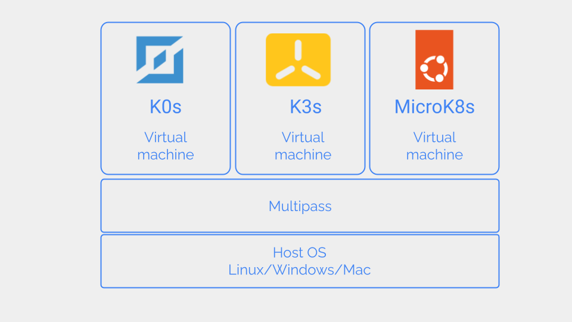
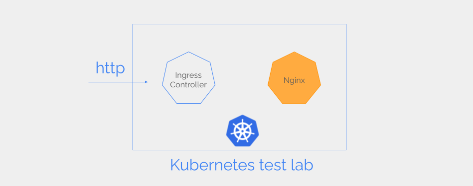

In this tutorial, we set up three Kubernetes test labs on our laptop with three different Kubernetes distributions.

1. [K0s](https://k0sproject.io/)
2. [K3s](https://k3s.io/)
3. [Microk8s](https://microk8s.io/)

We install the three Kubernetes clusters on different virtual machines to prevent them from interfering with each other. We use Multipass for creating the virtual machines.



In each Kubernetes test lab, we will deploy an Nginx web server and test it with `curl`. To expose our Nginx web server to the external network we will use an Ingress Controller.



Some of the Kubernetes distributions have built-in Ingress Controllers. For others, we install an Ingress Controller.

## System requirements

You can build these test labs on Linux, Mac (both Intel and Apple Silicon), or Windows.

A virtual machine for running a Kubernetes test lab needs at least 2GB of memory and 2 CPU cores. So if you wish to run all three test labs simultaneously your laptop needs at least 16GB of memory. If you have less memory, you can keep the other two virtual machines shut while running one test lab.

## Outline of steps

1. [Install Multipass](#install-multipass)
2. [Set up K0s test lab](#setup-k0s)
3. [Set up K3s test lab](#set-up-k3s)
4. [Set up Microk8s test lab](#set-up-microk8s)

# <a name="install-multipass"></a> Install Multipass

[Multipass](https://multipass.run/) is a handy tool for running Ubuntu virtual machines on Linux, Mac(both Intel and Apple Silicon), or Windows. Install Multipass following the [installation instructions](https://multipass.run/install) for your platform. 

To launch the virtual machines we use the `multipass` CLI.

# <a name="set-up-k0s"></a> Set up K0s test lab

[K0s](https://k0sproject.io/) is a kubernetes distribution from [Mirantis](https://www.mirantis.com/software/k0s/).

## Launch a virtual machine

Open the terminal on your laptop.
Launch a new virtual machine named `k0s10` with 5GB storage, 2GB memory, and 2 CPU cores. We use [Ubuntu Jammy](https://releases.ubuntu.com/jammy/) for the OS. 
```shell{outputLines: 2}
multipass launch -d 5G -m 2G -c 2 -n k0s10 22.04
```

Log in to the virtual machine.
```shell{outputLines: 2}
multipass shell k0s10
```
This virtual machine is the host for our K0s cluster.

## Install K0s

On the virtual machine `k0s10`, run the K0s installation script to download the latest K0s version and install it to `/usr/local/bin`. The script will detect your CPU architecture (`amd64` or `arm64`) and download the appropriate binary of K0s.

```shell{outputLines: 2}
curl -sSLf https://get.k0s.sh | sudo sh
```

Run `k0s` as a service.
```shell{outputLines: 2}
sudo k0s install controller --single
```

Start `k0s`.

```shell{outputLines: 2}
sudo k0s start
```

Check the status of `k0s` service with `systemctl`.
```shell{outputLines: 2}
sudo systemctl status k0scontroller.service 
```
The service should be in `active` state.

Check `k0s` status with `k0s status` command.
```shell{outputLines: 2-10}
 sudo k0s status
Version: v1.28.4+k0s.0
Process ID: 1887
Role: controller
Workloads: true
SingleNode: true
Kube-api probing successful: true
Kube-api probing last error: 
```

K0s is bundled with `kubectl` so we do not have to install it separately.

Check the Pods running in the cluster.
```shell{outputLines: 2-10}
sudo k0s kubectl get pods -A
NAMESPACE     NAME                              READY   STATUS    RESTARTS   AGE
kube-system   kube-proxy-lj88q                  1/1     Running   0          5m7s
kube-system   kube-router-jrncp                 1/1     Running   0          5m7s
kube-system   coredns-85df575cdb-wjhv6          1/1     Running   0          5m8s
kube-system   metrics-server-7556957bb7-njn4j   1/1     Running   0          5m8s
```

Configure alias for `kubectl` so we can simply type in `kubectl` instead of `sudo k0s kubectl`.

```shell{outputLines: 2}
echo 'alias kubectl="sudo k0s kubectl"' >> .bash_aliases
```

Refresh bash profile to activate the new alias.
```shell{outputLines: 2}
source .bashrc 
```

Now, you can use `kubectl` more easily.
```shell{outputLines: 2}
kubectl get pods -A
```

## Install Ingress-NGINX controller

K0s does not install an ingress controller by default. So. let's install [Ingress-NGINX controller](https://github.com/kubernetes/ingress-nginx).

```shell{outputLines: 2}
kubectl apply -f https://raw.githubusercontent.com/kubernetes/ingress-nginx/controller-v1.1.3/deploy/static/provider/baremetal/deploy.yaml
```

Check the status of the Ingress-NGINX Pods.
```shell{outputLines: 2-10}
kubectl get pods -n ingress-nginx
NAME                                        READY   STATUS      RESTARTS   AGE
ingress-nginx-admission-create-hrc7q        0/1     Completed   0          2m52s
ingress-nginx-admission-patch-2hnvr         0/1     Completed   0          2m52s
ingress-nginx-controller-65c7dccc44-tcf2n   1/1     Running     0          2m52s
```

Nginx controller is running. The other two Pods are Kubernetes Jobs for setting up the ingress controller and must be in `Completed` state.

At the installation, the Ingress-Nginx controller will also set up a NodePort service to forward external traffic to the Ingress Controller. This is required because we don't have a load balancer.

Check the NodePort Service.

```shell{outputLines: 2-10}
kubectl get services -n ingress-nginx
NAME                                 TYPE        CLUSTER-IP       EXTERNAL-IP   PORT(S)                      AGE
ingress-nginx-controller             NodePort    10.110.146.246   <none>        80:31675/TCP,443:31665/TCP   3h11m
ingress-nginx-controller-admission   ClusterIP   10.111.175.92    <none>        443/TCP                      3h11m
```

The Ingress-NGINX controller uses the NodePort service `ingress-nginx-controller` to connect to external networks. Note the IP address `10.110.146.246` of the NodePort Service, as we will need it later to connect to our Nginx web server. (Note that your IP address will be different.)

Annotate the IngressClass to make it the default.
```shell{outputLines: 2}
kubectl -n ingress-nginx annotate ingressclasses nginx ingressclass.kubernetes.io/is-default-class="true"
```

## Deploy an Nginx web server

Create Kubernetes Deployment for Nginx web app.
```shell{outputLines: 2}
kubectl create deployment nginx-app --image=nginx --port=80
```

Check the Deployment status.
```shell{outputLines: 2-5}
kubectl get deployments -o wide
NAME        READY   UP-TO-DATE   AVAILABLE   AGE   CONTAINERS   IMAGES   SELECTOR
nginx-app   1/1     1            1           11s   nginx        nginx    app=nginx-app
```

Create Service.
```shell{outputLines: 2}
kubectl create service clusterip nginx-app --tcp=8000:80
```

Check the status of the service.

```shell{outputLines: 2-10}
kubectl get services -o wide
NAME         TYPE        CLUSTER-IP       EXTERNAL-IP   PORT(S)    AGE     SELECTOR
kubernetes   ClusterIP   10.96.0.1        <none>        443/TCP    3h55m   <none>
nginx-app    ClusterIP   10.100.213.222   <none>        8000/TCP   8s      app=nginx-app
```

Create ingress. 
```shell{outputLines: 2}
kubectl create ingress nginx-app --rule=/=nginx-app:8000 --class=nginx
```

Check the ingress.
```shell{outputLines: 2-10}
kubectl get ingress
NAME        CLASS   HOSTS   ADDRESS         PORTS   AGE
nginx-app   nginx   *       192.168.64.28   80      2m14s
```
If the Ingress resource and the Ingress Controller are properly configured, an IP address will be assigned to the Ingress. (Note that your IP address will be different).

If you don't see an IP address, wait a while and check again as Kubernetes may take about one minute to assign an IP address to a newly created Ingress resource.

Test the Nginx web server with `curl`. Use the IP address of the NodePort service obtained by `kubectl get services -n ingress-nginx` (Note that your IP address will be different).

```shell{outputLines: 2-45}
curl 10.110.146.246:80
<!DOCTYPE html>
<html>
<head>
<title>Welcome to nginx!</title>
<style>
html { color-scheme: light dark; }
body { width: 35em; margin: 0 auto;
font-family: Tahoma, Verdana, Arial, sans-serif; }
</style>
</head>
<body>
<h1>Welcome to nginx!</h1>
<p>If you see this page, the nginx web server is successfully installed and
working. Further configuration is required.</p>

<p>For online documentation and support please refer to
<a href="http://nginx.org/">nginx.org</a>.<br/>
Commercial support is available at
<a href="http://nginx.com/">nginx.com</a>.</p>

<p><em>Thank you for using nginx.</em></p>
</body>
</html>
```

If things are working correctly, `curl` will print the Nginx home page.

If you have enough memory in your laptop, you can keep this virtual machine running while setting up the other test labs. If not, log out from the virtual machine and shut it down to regain the memory and CPU resources.

Exit the virtual machine.

```shell{outputLines: 2}
exit
```

Shut down the virtual machine from the terminal on your laptop.
```shell{outputLines: 2}
multipass stop k0s10
```

You can start the K0s test lab anytime you want in the future.
```shell{outputLines: 2}
multipass start k0s10
```

# <a name="set-up-k3s"></a> Set up K3s test lab

[K3s](https://k3s.io/) is a lightweight Kubernetes distribution originally developed by [Rancher](https://www.rancher.com/).

## Launch a virtual machine

From the terminal on the laptop, launch a new virtual machine named `k3s10` with 5GB storage, 2GB memory, and 2 CPU cores.

```shell{outputLines: 2}
multipass launch -d 5G -m 2G -c 2 -n k3s10 22.04
```

Log in to the virtual machine.
```shell{outputLines: 2}
multipass shell k3s10
```

This is the host for our K3s cluster.

## Install K3s

Inside the `k3s10` virtual machine, install the latest version of K3s using the installation script from the [K3s project]((https://k3s.io/)).

```shell{outputLines: 2}
curl -sfL https://get.k3s.io | K3S_KUBECONFIG_MODE=644 sh -
```
The parameter `K3S_KUBECONFIG_MODE` writes the `kubeconfig` files at `/etc/rancher/k3s/k3s.yaml` with permission `644` so we can run `kubectl` without `root` privileges.

K3s is bundled with `kubectl` so you do not have to install it separately.

List all Pods running in the cluster.

```shell{outputLines: 2-15}
kubectl get pods -A
NAMESPACE     NAME                                      READY   STATUS      RESTARTS   AGE
kube-system   local-path-provisioner-84db5d44d9-2sk8c   1/1     Running     0          22m
kube-system   metrics-server-67c658944b-bqgc7           1/1     Running     0          22m
kube-system   coredns-6799fbcd5-wmzbx                   1/1     Running     0          22m
kube-system   helm-install-traefik-crd-wbcsf            0/1     Completed   0          22m
kube-system   helm-install-traefik-wcp5l                0/1     Completed   1          22m
kube-system   svclb-traefik-f41b4ca0-k28ng              2/2     Running     0          21m
kube-system   traefik-f4564c4f4-x9jpg                   1/1     Running     0          21m
```

## Ingress controller

K3s installs [Traefik Ingress controller](https://doc.traefik.io/traefik/providers/kubernetes-ingress/) and [ServiceLB](https://github.com/k3s-io/klipper-lb) Load balancer by default.

## Deploy an Nginx web server

Create Kubernetes Deployment for Nginx web app.

```shell{outputLines: 2}
kubectl create deployment nginx-app --image=nginx --port=80
```

Check the Deployment status.
```shell{outputLines: 2-5}
kubectl get deployments -o wide
NAME        READY   UP-TO-DATE   AVAILABLE   AGE   CONTAINERS   IMAGES   SELECTOR
nginx-app   1/1     1            1           71s   nginx        nginx    app=nginx-app
```


Create Service.
```shell{outputLines: 2}
kubectl create service clusterip nginx-app --tcp=8000:80
```

Check the status of the service.

```shell{outputLines: 2-10}
kubectl get services -o wide
NAME         TYPE        CLUSTER-IP    EXTERNAL-IP   PORT(S)    AGE   SELECTOR
kubernetes   ClusterIP   10.43.0.1     <none>        443/TCP    41m   <none>
nginx-app    ClusterIP   10.43.178.8   <none>        8000/TCP   8s    app=nginx-app
```

Create ingress.
```shell{outputLines: 2}
kubectl create ingress nginx-app --rule=/=nginx-app:8000
```

Check the ingress.
```shell{outputLines: 2-10}
kubectl get ingress
NAME        CLASS     HOSTS   ADDRESS         PORTS   AGE
nginx-app   traefik   *       192.168.64.29   80      8s
```
If the IP address is still blank, check again after about 1 minute. (Note that your IP address will be different.)

Test the Nginx web server with `curl`. Since K3s cluster includes a load balancer, we can use the ingress IP address.

```shell{outputLines: 2-40}
curl http://192.168.64.29
<!DOCTYPE html>
<html>
<head>
<title>Welcome to nginx!</title>
<style>
html { color-scheme: light dark; }
body { width: 35em; margin: 0 auto;
font-family: Tahoma, Verdana, Arial, sans-serif; }
</style>
</head>
<body>
<h1>Welcome to nginx!</h1>
<p>If you see this page, the nginx web server is successfully installed and
working. Further configuration is required.</p>

<p>For online documentation and support please refer to
<a href="http://nginx.org/">nginx.org</a>.<br/>
Commercial support is available at
<a href="http://nginx.com/">nginx.com</a>.</p>

<p><em>Thank you for using nginx.</em></p>
</body>
</html>
```

Our K3s cluster is working fine now. Let's log out and shut down the virtual machine.

Log out from the virtual machine terminal.

```shell{outputLines: 2}
exit
```

Shutdown the virtual machine from the laptop terminal.
```shell{outputLines: 2}
multipass stop k3s10
```

You can start the K3s test lab anytime you want in the future by using this command from the laptop terminal.
```shell{outputLines: 2}
multipass start k3s10
```

# <a name="set-up-microk8s"></a> Set up MicroK8s test lab

[MicroK8s](https://microk8s.io/) is a lightweight Kubernetes distribution from [Canonical](https://canonical.com/).

## Launch virtual machine

Launch a virtual machine named `microk8s` with 5GB storage, 2GB memory, and 2 CPU cores.
```shell{outputLines: 2}
multipass launch -d 5G -m 2G -c 2 -n microk8s 22.04
```

Log in to the virtual machine.
```shell{outputLines: 2}
multipass shell microk8s
```

This virtual machine is the host for our MicroK8s cluster.


## Install MicroK8s

Install Microk8s snap on the `microk8s` virtual machine.

```shell{outputLines: 2}
sudo snap install microk8s --classic --channel=1.29
```

Check MicroK8s status.
```shell{outputLines: 2-30}
sudo microk8s status
microk8s is running
high-availability: no
  datastore master nodes: 127.0.0.1:19001
  datastore standby nodes: none
addons:
  enabled:
    dns                  # (core) CoreDNS
    ha-cluster           # (core) Configure high availability on the current node
    helm                 # (core) Helm - the package manager for Kubernetes
    helm3                # (core) Helm 3 - the package manager for Kubernetes
  disabled:
    cert-manager         # (core) Cloud native certificate management
    cis-hardening        # (core) Apply CIS K8s hardening
    community            # (core) The community addons repository
    dashboard            # (core) The Kubernetes dashboard
    host-access          # (core) Allow Pods connecting to Host services smoothly
    hostpath-storage     # (core) Storage class; allocates storage from host directory
    ingress              # (core) Ingress controller for external access
    kube-ovn             # (core) An advanced network fabric for Kubernetes
    mayastor             # (core) OpenEBS MayaStor
    metallb              # (core) Loadbalancer for your Kubernetes cluster
    metrics-server       # (core) K8s Metrics Server for API access to service metrics
    minio                # (core) MinIO object storage
    observability        # (core) A lightweight observability stack for logs, traces and metrics
    prometheus           # (core) Prometheus operator for monitoring and logging
    rbac                 # (core) Role-Based Access Control for authorisation
    registry             # (core) Private image registry exposed on localhost:32000
    rook-ceph            # (core) Distributed Ceph storage using Rook
    storage              # (core) Alias to hostpath-storage add-on, deprecated
```

Add the current user to the `microk8s` group so we can run `microk8s` CLI tool without `sudo`.

```shell{outputLines: 3}
sudo usermod -a -G microk8s $USER
sudo chown -f -R $USER ~/.kube
```

We must log out and log in again for the changes to be applied.

Log out from the virtual machine terminal.
```shell{outputLines: 2}
exit
```
Log in to the virtual machine from the terminal on the laptop.

```shell{outputLines: 2}
multipass shell microk8s
```
MicroK8s is bundled with the `kubectl` CLI tool.

List the Pods.
```shell{outputLines: 2-10}
microk8s kubectl get pods -A
NAMESPACE     NAME                                     READY   STATUS    RESTARTS   AGE
kube-system   calico-node-t7lx2                        1/1     Running   0          26m
kube-system   coredns-864597b5fd-hcrgs                 1/1     Running   0          26m
kube-system   calico-kube-controllers-77bd7c5b-k62sm   1/1     Running   0          26m
```

Configure an alias so we can use `kubectl` without typing `microk8s`.
```shell{outputLines: 3}
echo 'alias kubectl="microk8s kubectl"' >> .bash_aliases
source .bashrc 
```

## Install ingress controller

Microk8s is shipped with a range of add-ons including [Ingress-NGINX]((https://github.com/kubernetes/ingress-nginx)) and [MetalLB](https://metallb.universe.tf/) load balancer.

Enable Ingress-NGINX.

```shell{outputLines: 2}
microk8s enable ingress
```

Enable MetalLB. When requested input an IP range to be used by the load balancer. This IP range must not conflict with the IP addresses on the host (`microk8s` virtual machine).

```shell{outputLines: 2-10}
microk8s enable metallb
Infer repository core for addon metallb
Enabling MetalLB
Enter each IP address range delimited by comma (e.g. '10.64.140.43-10.64.140.49,192.168.0.105-192.168.0.111'): 10.0.0.1-10.0.0.10
Applying Metallb manifest
...
```

Check the status of newly enabled addons.
```shell{outputLines: 2-40}
microk8s status
microk8s is running
high-availability: no
  datastore master nodes: 127.0.0.1:19001
  datastore standby nodes: none
addons:
  enabled:
    dns                  # (core) CoreDNS
    ha-cluster           # (core) Configure high availability on the current node
    helm                 # (core) Helm - the package manager for Kubernetes
    helm3                # (core) Helm 3 - the package manager for Kubernetes
    ingress              # (core) Ingress controller for external access
    metallb              # (core) Loadbalancer for your Kubernetes cluster
  disabled:
    cert-manager         # (core) Cloud native certificate management
    cis-hardening        # (core) Apply CIS K8s hardening
    community            # (core) The community addons repository
    dashboard            # (core) The Kubernetes dashboard
    host-access          # (core) Allow Pods connecting to Host services smoothly
    hostpath-storage     # (core) Storage class; allocates storage from host directory
    kube-ovn             # (core) An advanced network fabric for Kubernetes
    mayastor             # (core) OpenEBS MayaStor
    metrics-server       # (core) K8s Metrics Server for API access to service metrics
    minio                # (core) MinIO object storage
    observability        # (core) A lightweight observability stack for logs, traces and metrics
    prometheus           # (core) Prometheus operator for monitoring and logging
    rbac                 # (core) Role-Based Access Control for authorisation
    registry             # (core) Private image registry exposed on localhost:32000
    rook-ceph            # (core) Distributed Ceph storage using Rook
    storage              # (core) Alias to hostpath-storage add-on, deprecated
```


## Deploy Nginx web server

Create Kubernetes Deployment for Nginx web app.

```shell{outputLines: 2}
kubectl create deployment nginx-app --image=nginx --port=80
```

Check the Deployment status.
```shell{outputLines: 2-5}
kubectl get deployments -o wide
NAME        READY   UP-TO-DATE   AVAILABLE   AGE   CONTAINERS   IMAGES   SELECTOR
nginx-app   1/1     1            1           78s   nginx        nginx    app=nginx-app
```

Create Service.
```shell{outputLines: 2}
kubectl create service clusterip nginx-app --tcp=8000:80
```

Check the status of the service.

```shell{outputLines: 2-5}
kubectl get services -o wide
NAME         TYPE        CLUSTER-IP       EXTERNAL-IP   PORT(S)    AGE   SELECTOR
kubernetes   ClusterIP   10.152.183.1     <none>        443/TCP    37m   <none>
nginx-app    ClusterIP   10.152.183.246   <none>        8000/TCP   7s    app=nginx-app
```

Create ingress.
```shell{outputLines: 2}
kubectl create ingress nginx-app --rule=/=nginx-app:8000
```

Check the ingress.
```shell{outputLines: 2-5}
kubectl get ingress
NAME        CLASS    HOSTS   ADDRESS     PORTS   AGE
nginx-app   public   *       127.0.0.1   80      17s
```

If the IP address field is blank, check again after about 1 minute.

Test the Nginx web app. We can use the Ingress IP address because a load balancer is present.

```shell{outputLines: 2-40}
curl 127.0.0.1
<!DOCTYPE html>
<html>
<head>
<title>Welcome to nginx!</title>
<style>
html { color-scheme: light dark; }
body { width: 35em; margin: 0 auto;
font-family: Tahoma, Verdana, Arial, sans-serif; }
</style>
</head>
<body>
<h1>Welcome to nginx!</h1>
<p>If you see this page, the nginx web server is successfully installed and
working. Further configuration is required.</p>

<p>For online documentation and support please refer to
<a href="http://nginx.org/">nginx.org</a>.<br/>
Commercial support is available at
<a href="http://nginx.com/">nginx.com</a>.</p>

<p><em>Thank you for using nginx.</em></p>
</body>
</html>
```

# Building a Kubernetes test lab - Distro vs vanilla

In this tutorial, we built three Kubernetes test labs with K0s, K3s, and MicroK8s - popular Kubernetes distributions intended for laptops or development workstations.

You can also [install a vanilla Kubernetes cluster on your laptop](/blog/how-to-run-vanilla-kubernetes-on-laptop). It's more work than installing a Kubernetes distribution. But you'll get exposed to more Kubernetes internals by doing it.


