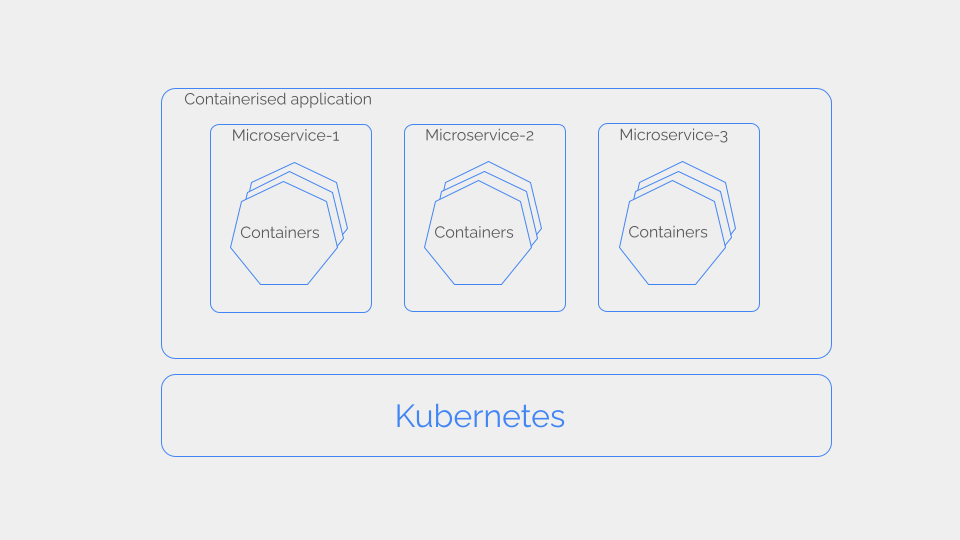
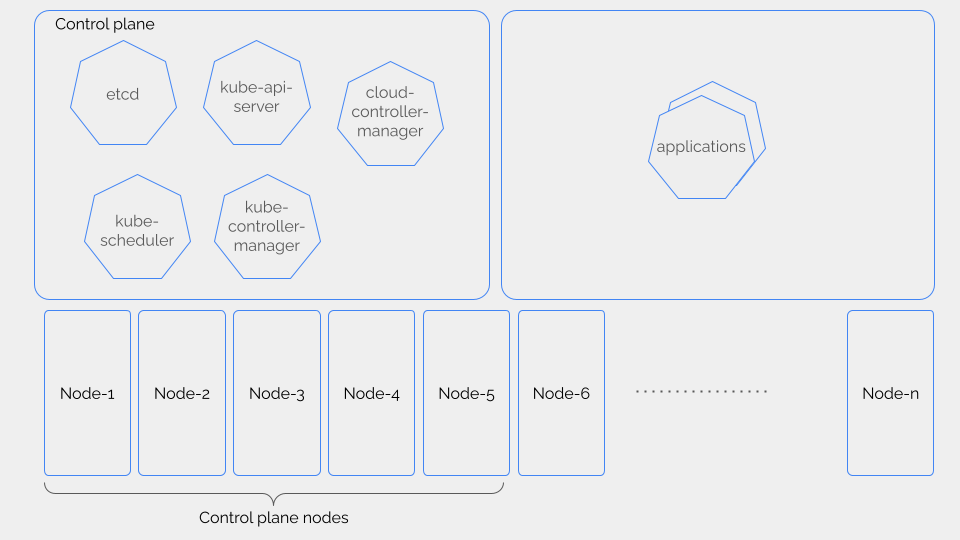
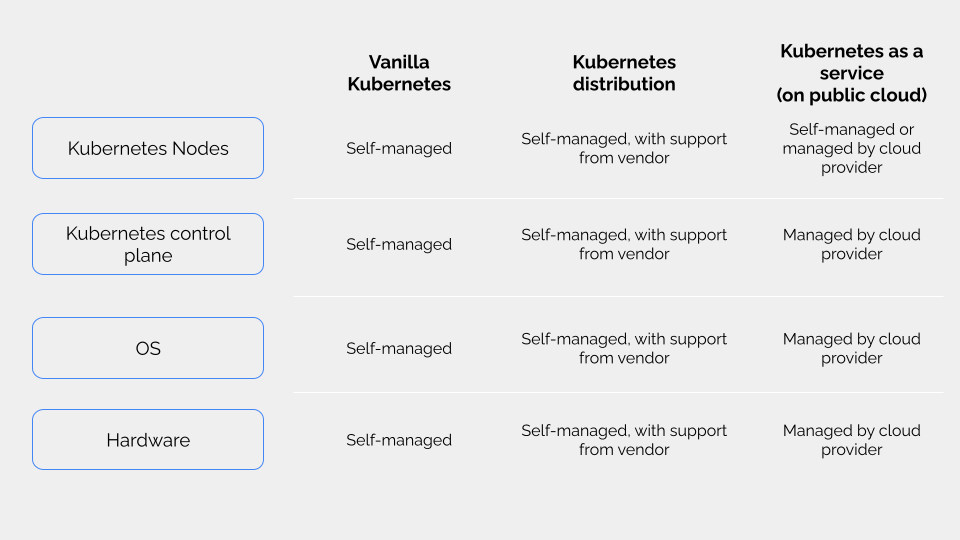
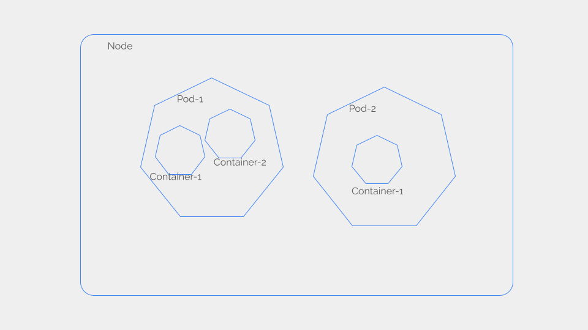

  This article explains the fundamentals of Kubernetes. It will help you on the first steps of your journey to master Kubernetes and DevOps.

*This article was originally written in 2022 and updated in 2024.* 

## Outline

1. What is Kubernetes
2. The components of a Kubernetes cluster
3. How to run a Kubernetes cluster
4. Kubernetes workloads
5. Kubernetes API Objects
6. Next step - get your hands on a Kubernetes cluster

# What is Kubernetes

Kubernetes is a platform for running containerized applications.

A containerized application consists of microservices running in containers.

A containerized application is highly scalable.
You can scale out any microservice by adding more containers with no impact on the other microservices in the application.

This flexibility is a blessing. But it comes at a cost.

Someone should be responsible for distributing the containers across a pool of computing nodes. If any container crashes while in operation, it must be quickly restored. This is too much work to be done manually.

Kubernetes solves this problem by taking care of the life cycle of containers:

* Scheduling containers onto computing nodes
* Restoring failed or crashed containers
* Scaling up/down a microservice by adding/removing containers

# The components of a Kubernetes cluster 

A Kubernetes cluster consists of the control plane and a pool of nodes that run the containers.

In a production Kubernetes cluster, the control plane components are installed on dedicated nodes. The application containers are not scheduled on these control plane nodes to ensure that the control plane components are not affected by misbehaving applications.

## Control plane components

Kubernetes control plane consists of five main components.

* **etcd** is a key-value database. Kubernetes stores in `etcd` all the persistent data handled by the control plane components.

* **kube-apiserver** is an API frontend to the Kubernetes control plane. All external communications with the cluster are handled by the `kube-apiserver`.

* **kube-scheduler** is responsible for assigning containers to nodes based on computing resource availability in the nodes. 

* **kube-controller-manager** is responsible for running controller processes in Kubernetes. A controller process manages a specific Kubernetes resource like nodes, containers, etc. Kubernetes has multiple such controllers.

* **cloud-controller-manager** is an optional part of a Kubernetes cluster. Public cloud providers integrate the Kubernetes cluster into their services APIs via the `cloud-controller-manager`. It's not required in an on-premise Kubernetes cluster.

## Nodes

A node in a Kubernetes cluster is responsible for running containers.

A node runs three software components.

* **Container runtime** is software that is responsible for running the containers. [Containered](https://containerd.io/) is a popular container runtime used by most cloud providers. There are several container runtime implementations as well.

* **kubelet** is an agent running in each worker node. The `kubelet` registers the node with the Kubernetes control plane. The control plane instructs the `kubelet` about the pods and containers that should be run on the node. Then, `kubelet` ensures those containers are running and healthy.

* **kube-proxy** is a network proxy that runs on each node and implements packet forwarding to facilitate communication to and from the containers running on the node. The `kube-proxy` can forward packets. But, if available the `kube-proxy` will use a more efficient mechanism like `iptables`.

# How to run a Kubernetes cluster in production

You have three options to run a Kubernetes cluster in production.

* **Vanilla Kubernetes** - Kubernetes is an [open-source project](https://kubernetes.io/). You can download and install it in your data center without any involvement of a third party. This is called vanilla Kubernetes or **self-managed** Kubernetes as the Kubernetes clusters must be managed by yourself. Self-managing a Kubernetes cluster requires lots of effort and expertise.

* **Kubernetes distribution** - Software vendors like [RedHat](https://www.redhat.com/en/technologies/cloud-computing/openshift), [Canonical](https://ubuntu.com/kubernetes), etc., offer **bundled Kubernetes distributions** and support you to deploy and operate Kubernetes in your data center. The vendor takes care of the heavy-lifting work in operating Kubernetes so you can focus more on your software applications.

* **Kubernetes as a service** - If you don't mind deploying Kubernetes clusters outside your private data centers, you can use a Kubernetes service from a cloud provider like [AWS](https://aws.amazon.com/eks/), [Azure](https://azure.microsoft.com/en-us/products/kubernetes-service), or [GCP](https://cloud.google.com/kubernetes-engine?hl=en). You can deploy the cluster via the cloud provider portal (or API) and the cloud provider takes care of all operational work in your Kubernetes clusters. Some cloud providers give you an option to self-manage the nodes for flexibility reasons.

# Kubernetes Workloads

A workload is an application running on a Kubernetes cluster.

A workload is composed of containers. When you deploy a workload, Kubernetes schedules the containers into Pods on nodes.

## Pod

A Pod is a logical deployment unit in Kubernetes. When you deploy a workload on Kubernetes, the containers in the workload are deployed in Pods on the nodes. A Pod defines the storage resources (volumes or persistent volumes) and networking resources (IP address) for the containers inside the Pod.

One Pod can include one or more containers. The containers inside the same Pod share the storage and networking resources of the Pod.

A compute node can host multiple pods.

# Kubernetes API Objects

All persistent data handled by the Kubernetes control plane are stored as API objects in the `etcd` database in the cluster. Nodes, workloads, Pods, etc., are all Kubernetes API objects.

You can create, delete, and view the API objects in a cluster via `kubectl` - the Kubernetes CLI tool. The `kubectl` tool interacts with the Kubernetes via the Kubernetes API. 

You can also programmatically mange the API objects via one of the Kubernetes SDKs.

# Next step - get your hands on a Kubernetes cluster

Working hands-on is how you learn Kubernetes. Running a production-grade Kubernetes cluster requires a considerable amount of computing resources.

But, you can install a Kubernetes cluster on your laptop for learning purposes.

[Check out this tutorial](/blog/three-kubernetes-test-labs-on-your-laptop/) to find out three ways to run a Kubernetes cluster on your laptop.

