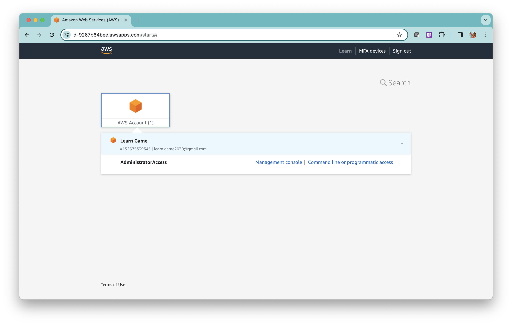
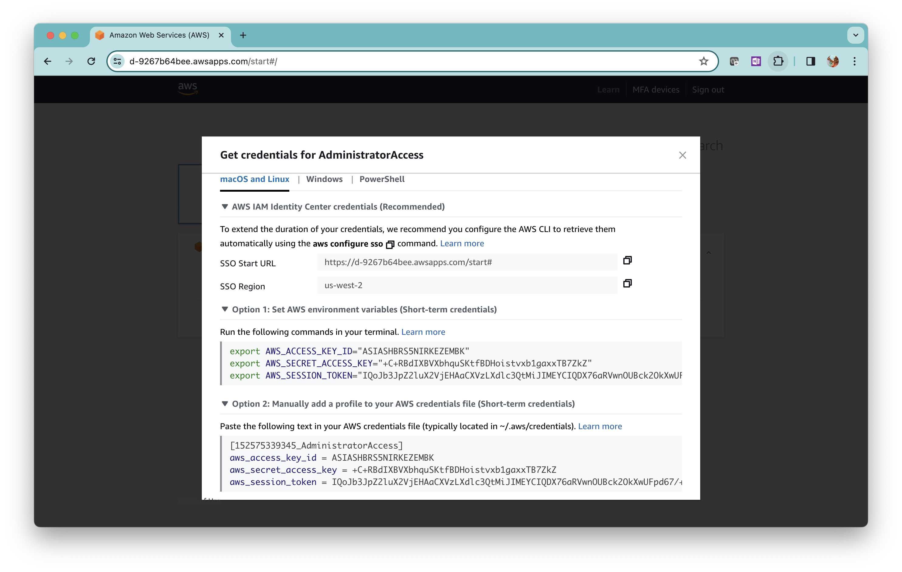
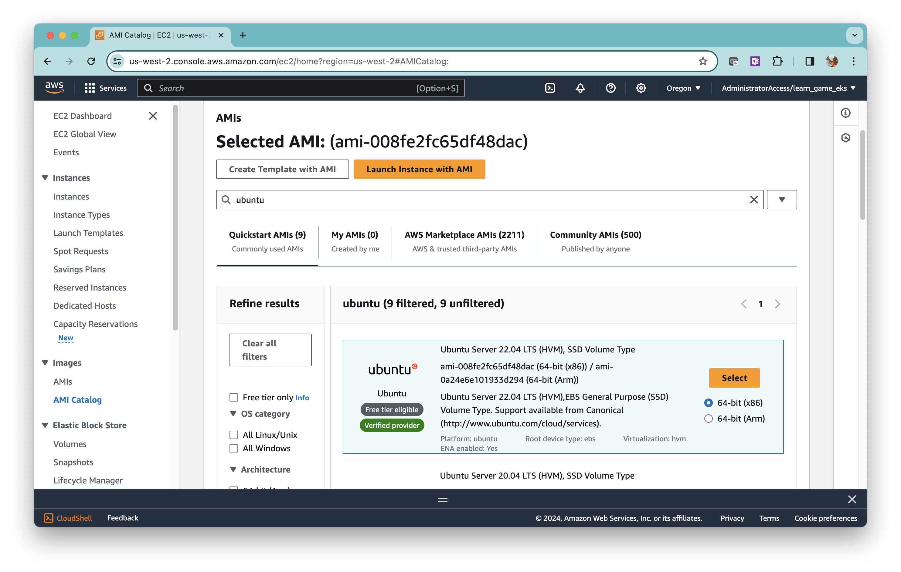

In this tutorial, we will launch an EC2 instance on AWS using Terraform.

## Prerequisites

1. AWS Identity Center user account with `AdministratorAccess` permission set.
2. Linux, Mac, or Windows computer to install Terraform.

<div class="warning">
**Warning**:
We will be creating an EC2 instance that is eligible for the free tier. You will be charged if your free tier has expired. Make sure to delete all cloud resources you create, by the end of this tutorial.
</div>


## Outline

1. What is Terraform
2. How to set up Terraform CLI for AWS
3. How to write Terraform configuration to launch an EC2
4. How to provision cloud infrastructure with Terraform CLI

# What is Terraform

Terraform is an Infrastructure as Code (IaC) tool developed by [HashiCorp](https://www.hashicorp.com/).

An IaC tool automates cloud infrastructure provisioning. Without an IaC tool, you will be creating cloud resources manually via CLI or the cloud provider’s GUI. Manual provisioning is not scalable. Imagine creating hundreds of EC2 instances manually.

An IaC tool allows you to describe cloud infrastructure as human-readable text. The tool will interpret the text and provision the required resources in the cloud. 

Terraform is one of the many IaC tools in the market. 

You can either install Terraform on your computer or use the [Terraform SAAS solution](https://developer.hashicorp.com/terraform/cloud-docs).

In this tutorial, we are going to use the locally installed version of Terraform.

# How to set up Terraform CLI for AWS

Install Terraform by following the [installation instructions](https://developer.hashicorp.com/terraform/install) for your platform.

Verify the installation. 

```shell{outputLines: 2-10}
terraform version
Terraform v1.7.1
on linux_arm64
```

Note that your version could be newer than this.

## Configure AWS credentials for Terraform

Terraform requires that you have the AWS CLI locally installed and configured. Follow these instructions to set up the AWS CLI, if you have not already done so.

1. [Install AWS CLI](https://docs.aws.amazon.com/cli/latest/userguide/getting-started-install.html)
2. [Set up AWS CLI](https://docs.aws.amazon.com/cli/latest/userguide/getting-started-quickstart.html)

After you have configured the AWS CLI, you must set the AWS credentials in the environment variables for Terraform to authenticate with AWS.

Log in to your AWS Access Portal URL you get in the AWS IAM Identity Center. Click on the AWS Account and click on the `Command line or programmatic access` link.



You will get this dialog box.



Set the environment variables (Option-1) `AWS_ACCESS_KEY_ID`, `AWS_SECRET_ACCESS_KEY`, and `AWS_SESSION_TOKEN` according to the instructions for your platform.


# How to write Terraform configuration to launch an EC2

A Terraform configuration is a definition of cloud resources written in Terraform language. Terraform language is based on HCL ([HashiCorp Configuration Language](https://github.com/hashicorp/hcl/blob/main/hclsyntax/spec.md)). The Terraform language syntax resembles JSON but is not exactly equal to JSON. 

This is a sample of a Terraform configuration that describes a subnet on AWS.

```json
resource "aws_subnet" "subnet-1" {
  cidr_block        = "10.10.0.0/24"
  vpc_id            = "xxx"
  availability_zone = "us-west-2a"
}
```

Terraform configuration is declarative. It does not specify the instructions for provisioning cloud resources but defines the final state of the resources to be provisioned.

## Create a new Terraform configuration

In the working directory create file `main.tf` with the following content.

```json
terraform {
  required_providers {
    aws = {
      source  = "hashicorp/aws"
      version = "~> 4.16"
    }
  }

  required_version = ">= 1.2.0"
}

provider "aws" {
  region = "us-west-2"
}
```

The name `main` is just a convention. You can use any name you like.

Terraform language has two main types of syntax.

* **Blocks** enclosed by a pair of curly braces. A block is a container for other blocks and arguments. A block has an optional type and a set of labels.

* **Arguments** that assign a values to a names.

Our `main.tf` has two blocks; `terraform` and `provider`. 

The `terraform` block has one argument and one block. 

The `provider` block has one argument that configures the AWS `region`. 

Terraform uses `providers` for provisioning resources on different cloud services. We use the `aws` provider in this tutorial. Terraform has [providers](https://registry.terraform.io/browse/providers) for many cloud infrastructure and cloud services.

Let’s add these three `resource` blocks to the `main.tf` to define an AWS VPC, a subnet, and an EC2 instance.

```json
resource "aws_vpc" "vpc-1" {
  cidr_block = "10.10.0.0/16"
}

resource "aws_subnet" "subnet-1" {
  cidr_block        = "10.10.0.0/24"
  vpc_id            = aws_vpc.vpc-1.id
  availability_zone = "us-west-2a"
}

resource "aws_instance" "my_server" {
  ami           = "ami-008fe2fc65df48dac"
  instance_type = "t2.micro"
  subnet_id     = aws_subnet.subnet-1.id
}
```

A `resource` block has a type that defines the type of AWS resource and a label that specifies the name. 

Most of the arguments inside these three blocks explain themselves. But, two deserve attention.

* `vpc_id` - The `vpc_id` in the `aws_subnet` block refers to the ID of the VPC created in the `aws_vpc` resource block. We refer to this ID as `resource_type.name.id`. Similarly, we refer to the Subnet ID inside the `aws_instance` resource block.

* `ami` - The `ami` in the `aws_instance` block refers to an Amazon Machine Image (AMI) ID which is a binary image of an OS for launching an EC2 instance. AWS maintains AMIs for popular operating systems like RedHat, Ubuntu, and Windows. For this tutorial, we’ll use an Ubuntu AMI. 

## Finding an AMI ID

You need an AMI ID that’s available in the region where you are launching the EC2.

Log in to the AWS console and choose the region. Select EC2 from the Services menu. From the left navigation menu select `AMI Catalog` in `Images`.  Enter `ubuntu` in the search box to find the Ubuntu AMIs. 



Copy the AMI ID in the latest Ubuntu OS version and use it as the value in the `ami` argument.

Now, we have a complete Terraform configuration for launching an EC2.

```json
terraform {
  required_providers {
    aws = {
      source  = "hashicorp/aws"
      version = "~> 4.16"
    }
  }

  required_version = ">= 1.2.0"
}

provider "aws" {
  region = "us-west-2"
}

resource "aws_vpc" "vpc-1" {
  cidr_block = "10.10.0.0/16"
}

resource "aws_subnet" "subnet-1" {
  cidr_block        = "10.10.0.0/24"
  vpc_id            = aws_vpc.vpc-1.id
  availability_zone = "us-west-2a"
}

resource "aws_instance" "my_server" {
  ami           = "ami-008fe2fc65df48dac"
  instance_type = "t2.micro"
  subnet_id     = aws_subnet.subnet-1.id
}
```

This configuration is in a single file. But, Terraform configurations can span across multiple files.

# How to provision cloud infrastructure with Terraform CLI

## Initialize

The `init` command installs the providers defined in the Terraform configuration. 

```shell{outputLines: 2-10}
terraform init
```

Terraform installs the providers inside the `.terraform` directory in the current path. So you must run the `init` command again when working on a new path.

## Format the configuration file

Formatting is not mandatory but highly recommended for readability.

```shell{outputLines: 2-10}
terraform fmt
```

After running `fmt`, open the file in a text editor to see how Terraform has improved readability.

## Validate the configuration file

Validate the configuration file for syntax errors.

```shell{outputLines: 2-10}
terraform validate
Success! The configuration is valid.
```

Terraform will prompt syntax errors if there are any. Correct them and validate, until you get the success message.

## Apply the configuration

The `apply` command provisions the cloud resources.

```shell{outputLines: 2-10}
terraform apply
```

Terraform identifies the resources to be created or deleted and prompts a confirmation before making the changes.

Type `yes` and Terraform will continue to create or delete the resources.

If the AWS credentials are not properly configured, or if you do not have the privilege to provision specific cloud resources, you will get an error at this stage.

<div class="info">
**Note:** If your computer’s timestamp is wrong, `terraform` could report an error due to the mismatch in the session token timestamps. Check and correct the system time.
</div>

## Check the state

When you run the `apply` command Terraform creates the file `terraform.tfstate` in the working directory to store the status of the resources created. 

<div class="warning">
**Warning:** Do not modify or delete `terraform.tfstate` file. If you do so, Terraform will not be able to update/delete the resources it created.
</div>

The `state` CLI command uses this file to query the status of the cloud resources.

List all resources created.

```shell{outputLines: 2-10}
terraform state list
```

Check the parameters of a specific resource.

```shell{outputLines: 2-10}
terraform state show aws_instance.my_server
```

## Update cloud resources

To update the provisioned cloud resources we just have to update the configuration file and rerun the `apply`  command. Terraform takes care of adding or deleting the cloud resources according to the updated configuration files.

Let’s update `main.tf` to create a new subnet `subnet-2` and change the EC2 instance to attach to `subnet-2` instead of `subnet-1`. 

```json
resource "aws_subnet" "subnet-2" {
  cidr_block        = "10.10.1.0/24"
  vpc_id            = aws_vpc.vpc-1.id
  availability_zone = "us-west-2a"
}

resource "aws_instance" "my_server" {
  ami           = "ami-008fe2fc65df48dac"
  instance_type = "t2.micro"
  subnet_id     = aws_subnet.subnet-2.id
}
```

Here’s the updated `main.tf` file.

```json
terraform {
  required_providers {
    aws = {
      source  = "hashicorp/aws"
      version = "~> 4.16"
    }
  }

  required_version = ">= 1.2.0"
}

provider "aws" {
  region = "us-west-2"
}

resource "aws_vpc" "vpc-1" {
  cidr_block = "10.10.0.0/16"
}

resource "aws_subnet" "subnet-1" {
  cidr_block        = "10.10.0.0/24"
  vpc_id            = aws_vpc.vpc-1.id
  availability_zone = "us-west-2a"
}

resource "aws_subnet" "subnet-2" {
  cidr_block        = "10.10.1.0/24"
  vpc_id            = aws_vpc.vpc-1.id
  availability_zone = "us-west-2a"
}

resource "aws_instance" "my_server" {
  ami           = "ami-008fe2fc65df48dac"
  instance_type = "t2.micro"
  subnet_id     = aws_subnet.subnet-2.id
}
```

Apply the configuration.

```shell{outputLines: 2-10}
terraform apply
```

Terraform considers the cloud resource as immutable. So, instead of changing the EC2 instance, Terraform deletes the existing EC2 instance and launches a new instance connected to the subnet `subnet-2`. 

## Delete the cloud resources

Use the `destroy` command to delete the cloud resources.

```shell{outputLines: 2-10}
terraform destroy
```

Type in `yes` to confirm and Terraform will delete all the resources created from this configuration file. Terraform will use the `terraform.tfstate` file to find the resource IDs that need to be deleted.

Check the state again.

```shell{outputLines: 2-10}
terraform state list
```

The output should be blank.

# Wrapping up

In this tutorial, we used Terraform to provision a simple cloud setup on AWS.

You will appreciate that the IaC approach with Terraform is much faster and easier than provisioning resources via GUI when you have to create a large number of cloud resources.

When updating a cloud setup, Terraform treats the EC2 instances as immutable. For any change in an EC2 instance, Terraform deletes and recreates a new EC2. Make note of this behavior as your application needs to be stateless to take advantage of IaC.

Stay tuned as we bring more tutorials on AWS.