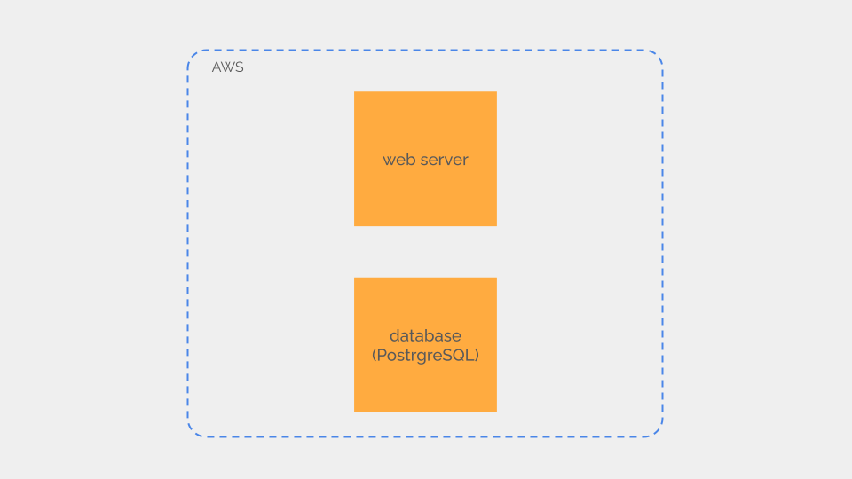
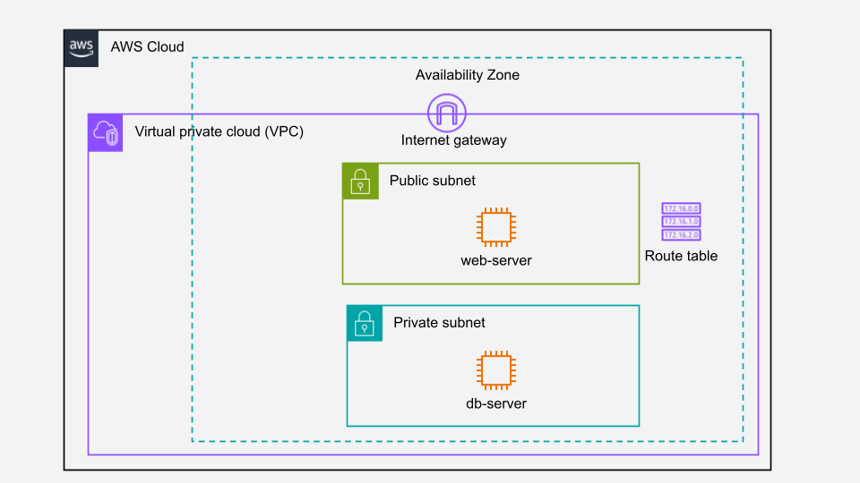
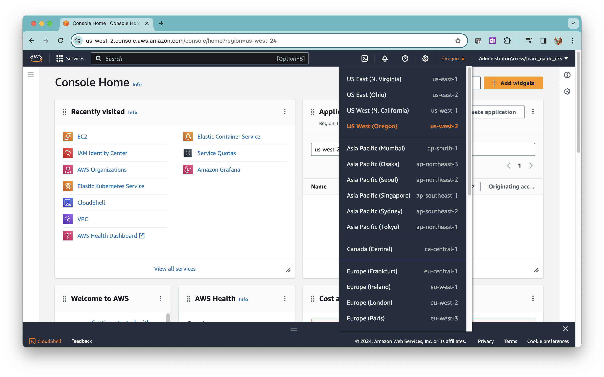
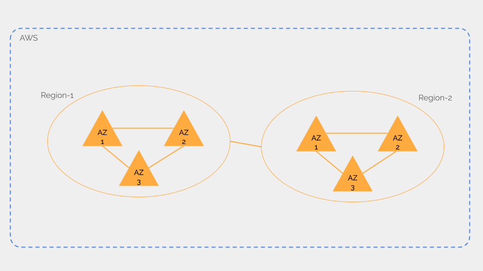
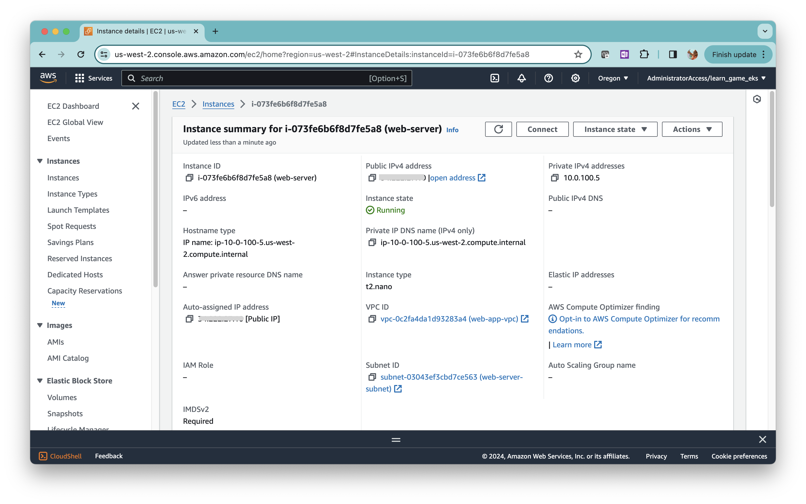
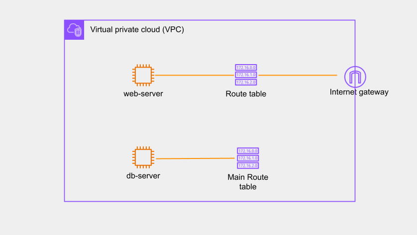
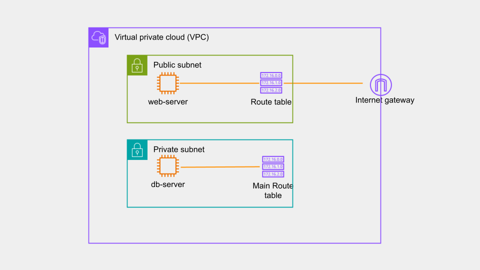

In this tutorial, we introduce the networking concepts on AWS by building cloud infrastructure for hosting a simple web application.



<div class="info">
**Note:** We will not be deploying the actual web application here. That would be a separate tutorial because a web application deployment method varies on the language or framework you use. 
</div>

AWS cloud architecture for our web application looks like this.



<div class="warning">
**Warning**: We will be using EC2 instances compatible for the free tier. Your AWS account will be billed if the free tier has expired. Make sure to delete all AWS resources you created after completing the tutorial.
</div>

## Prerequisites

To complete this tutorial, you need to have an AWS account and must be familiar with using the AWS web console.

## Outline

1. Networking concepts on AWS
2. Create a virtual private cloud
3. Launch EC2 instances
4. Connect EC2 to the Internet
5. Allow and restrict traffic to EC2 with security groups
6. Restrict traffic with ACLs
7. Log in to an EC2 with SSH


# Networking concepts on AWS

Networking on AWS is implemented in software. 

Unlike in an on-premises data center, you don’t have to worry about managing physical devices like switches, routers, or firewalls on AWS. Instead, you just build network connectivity on AWS using services like VPC (Virtual Private Cloud), subnets, route tables, internet gateway, etc. These services are software components and do not correspond to any hardware devices on AWS.

## AWS Regions and Availability zones

AWS cloud infrastructure is distributed in multiple regions across the globe. An AWS region is a geographic area where AWS cloud infrastructure is deployed. A big country can have multiple AWS regions.

Log in to the AWS Console and click on the regions menu left to your username. A drop-down list will appear with all the regions.



Each region has at least three availability zones (AZ). An availability zone is one or more data centers located close to each other. Any two AZs are geographically separated to ensure that both availability zones are not affected by fire, tornado, floods, etc at the same time.



All availability zones in a region are connected via high high-bandwidth dedicated network so that you can distribute an application across multiple availability zones without impact on latency or network performance.

# Create a virtual private cloud

The Amazon virtual private cloud (VPC) is a fundamental building block on AWS. 

A VPC creates a logical boundary for your cloud resources like EC2 on AWS.

A VPC is located inside a region but can span across multiple availability zones in the region. When you create an AWS account a default VPC is created in each of the regions. You can create new VPCs based on your requirements. A region can have multiple VPCs.

A VPC must have a private IP CIDR and can have an IPv6 CIDR block too. The private IP CIDR of a VPC must be between /16 and /28. If you exhaust this IP CIDR, you can add more CIDR blocks to the same VPC.

## Create new VPC

We are going to build our cloud setup in the Oregon region.

Log in to the AWS console and select Oregon as the region from the regions menu.

Select VPC from the Services menu to go to the VPC console.

Click on the `Create VPC` button on the top right.

Type in the name as `web-app-vpc`. In the IPv4 CIDR enter `10.0.100.0/24` and click on `Create VPC` at the bottom of the screen.

## Create subnets

Our cloud setup consists of two EC2 instances in separate subnets. So, let’s create two subnets now.

Select VPC from the Services menu(if you are not already on the VPC service console).

Click on `Subnets` in the left navigation menu. Click on the `Create subnets` button in the top right.

Select `web-app-vpc` for the VPC ID.

Type in `web-server-subnet` for Subnet name. 

Select the `us-west-2a` availability zone. 

Fill in `10.0.100.0/28` as the subnet CIDR. 

Click on the `Create subnet` button at the bottom.

Repeat the same steps and create the second subnet `db-server-subnet` with `10.0.100.16/28` as the subnet CIDR.

<div class="info">
**Note:** Subnets in the same VPC cannot have overlapping IP addresses.
</div>

We chose to create both the subnets in the `us-west-2a` availability zone. You can create the two subnets in different availability zones also. But a subnet cannot span across multiple availability zones.

# Launch EC2 instances

We need two EC2 instances for the web and the database servers. Before creating the EC2, let's create the SSH keys.

## Create a Key Pair

Select EC2 from the Services menu to go to the EC2 console.

Click on the `Key Pairs` in the `Network & security` section in the left navigation menu. 

Click on `Create key pair` on the upper right. Type in a name, leave the other parameters as defaults, and click on the `Create key pair` button at the bottom.

You will be prompted to download the private key. Save the private key in a secure location on your computer. We will be using this private key to SSH into the EC2.

## Launch EC2 instances

Select EC2 from the services menu.

Click on the `Instances` in the left navigation menu.

Click on `Launch instance` in the upper right. Type in the name as `web-server`.  Select Ubuntu as the image. Select `t2.micro` as the instance type. Select the Key pair `ssh-key` we just created. 

Click `Edit` in `Network settings`. 

Select `web-app-vpc` as the VPC. 

Select subnet `web-server-subnet`. 

Select `Enable` for `Auto assign public IP` since the web server needs a public IP address.

Click on the `Create security group` option and type in `web-server-sg` as the name.

Leave out all other parameters in their default values.

Click on `Launch instance` on the lower bottom.

An EC2 takes several minutes to boot up. Click on the `Instances` in the left navigation menu in the EC2 console to check the status of the EC2 instance we just created.

Launch the second EC2 `db-server` following the same steps except two.

1. Select `db-server-subnet` as the subnet.

2. Set `Auto assign public IP` as `Disable` since we do not want the `db-server` to be accessible from the Internet.

# Connect EC2 to the Internet

Click on the `web-server` instance and check the public IP address assigned to it.



The users of our web application must be able to reach this public IP address from the Internet,

Ping the public IP address from the terminal on your computer. 

```bash
ping a.b.c.d
```

Ping will not be successful. Though we have provisioned a public IP address to the EC2, we have not set up an **internet gateway** to route traffic from the Internet to this IP address.

## Create Internet Gateway

Select VPC from the Services menu to go to the VPC console.

Click on `Internet gateways` in the left navigation menu. Click on the `Create internet gateway` button on the top right.

Type in the name as `web-app-internet-gateway` and click on the `Create internet gateway` button at the bottom.

Our newly created internet gateway is still not attached to a VPC. 

Click on `Internet gateways` on the left navigation menu in the VPC console. Select the `web-app-internet-gateway` by clicking on the check box. Click on the `Actions` drop-down menu and click on `Attach to VPC`.  From the available VPCs, select the `web-app-vpc` and click `Attach internet gateway`. 

## Route traffic from EC2 to the internet gateway

Routing inside a VPC is handled by route tables. A route table defines rules for routing traffic between the resources in the VPC.

When you create a new VPC, a route table known as the main route table is also created in it. Any new subnet is associated with this main route table by default.

### Check the subnet association with the main route table

Go to VPC in the Services menu and click on `route tables` in the left navigation menu. Click on the route table attached to the VPC `web-app-vpc`. 

Click on the `Subnet associations` tab. Both the `web-server-subnet` and the `db-server-subnet` are associated with the main route table. Click on the `Routes` tab. The route table has one entry for the IP CIDR of the VPC with the target `local`. This is the route for all resources inside the VPC. 

We can add a route to the Internet in this route table. But we want Internet access only for the `web-server`. We do not want to expose the `db-server` to the Internet. 

So let’s create a new route table for the `web-server`.



### Create a new route table

Click on `Route tables` in the left-side menu and click on the `Create route table` button in the upper right. Type in the name as `web-server-route-table` and select VPC `web-app-vpc` from the drop-down list. Click on the `Create route table` button at the bottom.

### Add a route to the Internet

In the VPC console click on `route tables` in the left navigation menu.
Click on the `web-server-route-table`. Under the `Routes` section click on `Edit routes`. 

Click on `Add route`. 

Type in `0.0.0.0/0` in the `Destination` field. In the `Target` field, select `Internet Gateway` and then select `web-app-internet-gateway` from the drop-down list.

Click on `Save changes` at the lower right.

### Associate a subnet with a route table

In the VPC dashboard click on `Subnets` in the left navigation menu.

Click on the `web-server-subnet`. Click on the `Route table` tab below the subnet details. Click on `Edit route table association` Select `web-server-route-table` from the drop-down list and click on `Save`.

## Public vs private subnet



A subnet associated with a = route table that has a route to an internet gateway is called a public subnet on AWS. The `web-server-subnet` is a public subnet now. The IP CIDR of the `web-server-subnet` is `10.0.100.0/28` which is a private IP address range. The `web-server-subnet` is a public subnet because an EC2 in the subnet can connect to the Internet via the internet gateway. 

<div class="info">
**Note:** An EC2 in a public subnet needs to have a public IP address to connect to the Internet via the internet gateway. If the EC2 does not have a public IP address it cannot reach the Internet even though it's in a public subnet.
</div>

Let’s try to `ping` the public IP of `web-server` EC2 from our computer. 

```bash
ping a.b.c.d
```

Still, you will not be able to ping.

# Allow and restrict traffic to EC2 with security groups

We cannot Ping the public IP of our EC2 because we have not allowed ICMP in the security groups.

A **security group** is a stateful packet filtering firewall for EC2. 

### Allow ICMP traffic to EC2

When creating `web-server` EC2 we created a new security group `web-server-sg`. A security group blocks all traffic by default. You must define rules to allow specific traffic. Let's allow ICMP in this security group.

In the EC2 console click on the `Security groups` in the left-navigation menu and click on the `web-server-sg` security group. 

In the `Inbound rules` tab inside the `web-server-sg` click on `Edit inbound rules`. Click on the `Add rule` button to add a new rule. Select `All ICMP - IPv4`  in the `Type` field and in the `source` field select `Anywhere-IPv4`. Click on `Save rules`. Since security groups are stateful we do not need to add a separate outbound rule. 

From the terminal in your computer try to Ping the public IP address of the `web-server` again. The `ping` will be successful now.

### Allow HTTPS traffic to the EC2

The `web-server` EC2 must be allowed to receive HTTPS traffic. 

So follow the same procedure above and add a new rule. Use `HTTPS` in the `Type` field to allow HTTPS traffic.

### Allow PostgreSQL port to db-server

The `db-server` does not need to receive traffic from the Internet. But our `web-server` will be talking to the `db-server` over the PostgreSQL port `5432`. 

Similar to the `web-server-sg` update the rules in the `db-server-sg` to allow this communication. 

# Restrict traffic with network ACLs

A **network ACL** is a stateless packet filtering mechanism in subnets. When creating the subnets we did not explicitly create a new ACL. So our subnets are associated with the default ACL in the VPC.

Let’s check the filtering rules in this default ACL. 

In the Services menu, select VPC. Click on the `Network ACLs` in the left navigation menu. Click on the network ACL belonging to the `web-server-vpc`. Check the tabs `Inbound rules` and `Outbound rules`. 

An ACL has two default rules that block all inbound and outbound traffic respectively. These rules are numbered as `*`. 

The default ACL is configured with two higher-priority rules to allow all inbound and outbound traffic. 

The rules in an ACL are ordered by `Rule number`. The rules with higher numbers have lower priority and `*` has the lowest priority. When a rule is matched, the ACL applies the rule and ignores all lower-priority rules.

### Create a new ACL for web-server

Let’s create a new ACL `web-server` and allow only the SSH, HTTPS, and ICMP traffic to EC2 in the `web-server` subnet.

Select `Network ACLs` from the left navigation menu.

Click on `Create network ACL`. Type in `web-server-acl` for the name and select `web-app-vpc` from the drop-down list. Click on `Create network ACL` at the bottom. An ACL blocks all traffic both ways by default. So, let’s add specific rules to allow HTTPS, SSH, and ICMP traffic.

Click `Edit inbound rules` in the Inbound rules tab.

Click on `Add new rule`. Type in the rule number `100`. Select HTTPS for `type`. Type in `0.0.0.0/0` for the source. Select `Allow` for the `Allow/Deny`. 

Add two more rules to allow SSH and ICMP, and click on `Save changes`.

Since an ACL is stateless we need to add explicit outbound rules.

Edit the outbound rules and add a rule that allows all traffic to `0.0.0.0/0`.

### Associate the ACL with the subnet

Click on `Network ACLs` in the left navigation menu and click on `web-server` ACL. Click on `Subnet association` Currently this ACL is not associated with any subnet.

Click on `Edit subnet association`. Check the `web-server-subnet` from the list of subnets. A subnet can be associated with only one ACL. So, the previous association would be removed when we create the new association. 

### Create a new ACL for db-server

Follow the same procedure above and create `db-server-acl` for the `db-server` subnet and update the rules to allow traffic as below.

* Inbound - Allow PostgreSQL port, SSH, and ICMP from the `web-server-subnet`. 

* Outbound - Allow all traffic to the `web-server-subnet`. 

# Log in to an EC2 with SSH

We should be able to log in to all our EC2 with SSH.

## Log in to the EC2 in public subnet

With the SSH port allowed in both the security group and the network ACL, we can now connect to `web-server` from the Internet because the `web-server` EC2 is in a public subnet. Open a terminal (PowerShell if you are on Windows) in your computer and SSH into the public IP address of `web-server`. Use the private key you downloaded when creating the key pair.

```bash
ssh ubuntu@a.b.c.d -i path/to/key/aws-ssh-key.cer
```

<div class="info">
If you are on Linux or Mac, make sure to adjust the file permission to `600`.
</div>

## Log in to the EC2 in private subnet

Since `db-server` EC2 is in a private subnet, we cannot directly SSH to `db-server` from our computer. But we can reach `db-server` via the `web-server` EC2.

Copy the SSH key from your computer to `web-server` via SCP.

```bash
scp -i path/to/key/aws-ssh-key.cer ./aws-ssh-key.cer ubuntu@a.b.c.d:
```

SSH into the `web-server` and the SSH to the `db-server` from there.

```bash
ssh ubuntu@a.b.c.d -i path/to/key/aws-ssh-key.cer
ssh -i aws-ssh-key.cer ubuntu@e.f.g.h
```

If you cannot log in to the `db-server` from the `web-server` something should be wrong in your security groups or network ACLs.

# Wrapping up

In this tutorial, we built a cloud setup for hosting a web application on AWS. To keep things simple, we ignored some architectural aspects of web applications.

1. We did not build redundancy. If either the `web-server` or `db-server` fails, our web application will go down.
2. We exposed the `web-server` directly to the Internet without using any firewall.

In an upcoming tutorial, we will architect a cloud setup addressing these aspects as well.