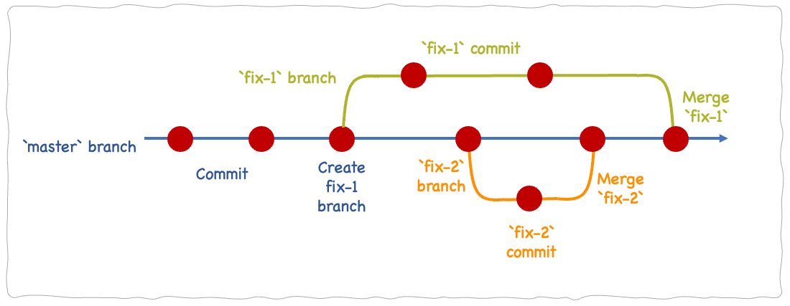
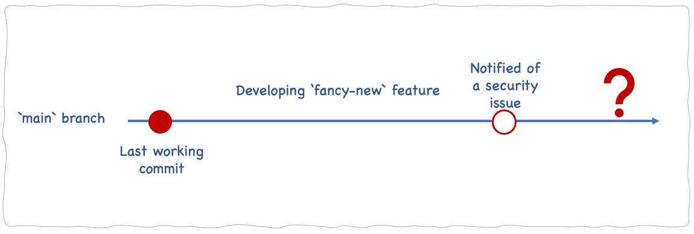
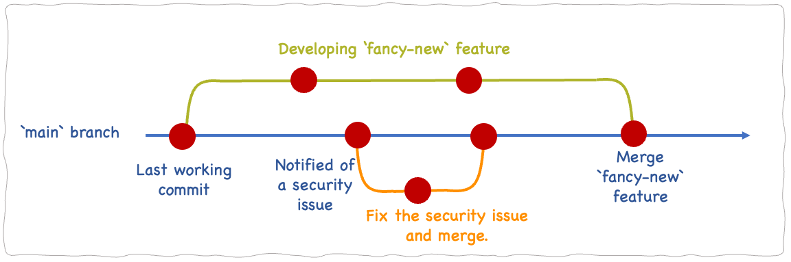

<div class="header-highlight">
A follow-along tutorial on Git branching for beginners.
</div>

Git branching allows you to work with separate versions of your codebase in parallel, and merge those different versions at any desired point.



Branching is useful when you have to work with multiple independent features at the same time. Which you have to do in all practical situations.

If you are new to git branching, this is a follow-along tutorial for you. By the end of this tutorial, you will be able to comfortably incorporate branching into your development workflows.

You just need a computer with `git` installed and a [GitHub] account to complete this tutorial. So, let’s get started.


# Creating a git repository

Create a folder `qube_app`.
```shell
mkdir qube_app
cd qube_app 
```

Create a file, initialize a new `git` repository, and commit.

```shell
echo "qube_1" > qube_1
git init
git add .
git commit -m "version 1.0"
```

Add a second file `qube_2` and commit again.
```shell
echo "qube_2" > qube_2
 git add .
git commit -m "v 2.0"
```

Add a third file and commit again.
```shell
 echo "qube_3" > qube_3
git add .
git commit -m "v 3.0"
```

Check the commit history.

```shell
git log --oneline
```

```shell
767e002 (HEAD -> master) v 3.0
4601ca6 v 2.0
ba41cb0 v 1.0
```

We are in the `master` branch, as indicated by `HEAD`.

# Branching

Create and switch to a branch named `fix-1`.
```shell
git switch -c fix-1
```

The `-c` flag creates a new branch. If `fix-1` is an existing branch, use `git switch` without the `-c` flag.
```shell
git switch fix-1
```
The  `git switch` command is available on `git` versions newer than `2.23`. 
Use `git –version` to check the version you are using.

If it’s older than `2.23`, update `git` to the latest version so you can use `git switch`.
If not, use the below alternative commands to create and switch to a branch.

Create new branch named `fix-1`.
```shell
git branch fix-1
```

Switch to `fix-1` branch.
```shell
git checkout fix-1
```
We will continue to use `git switch` in the rest of the tutorial. If your git version is older than 2.23, remember to use `git branch` to create a new branch and `git checkout` to change to a branch.

Check the commit history.

```shell
git log --oneline
```

```shell
767e002 (HEAD -> fix-1, master) v 3.0
4601ca6 v 2.0
ba41cb0 v 1.0
```

The HEAD is now pointing to the branch `fix-1` and `master` since we have not done any modifications to the `fix-1` branch.

Make a modification in the `fix-1` branch and commit.
```shell
echo "fix_1" > fix_1
git commit -m "fix-1 v1"
```

Check the commit log.
```shell
git log --oneline
```

```shell
8dcec48 (HEAD -> fix-1) fix-1 v1
767e002 (master) v 3.0
4601ca6 v 2.0
ba41cb0 v 1.0
```

`HEAD` is now pointing to the `fix-1` and it is ahead of the master branch.

Switch back to `master`
```shell
git switch master
```

Check the contents.
```shell
ls -l
```

```shell
total 12
-rw-r--r-- 1 cloud cloud 7 Aug 22 11:43 qube_1
-rw-r--r-- 1 cloud cloud 7 Aug 22 11:44 qube_2
-rw-r--r-- 1 cloud cloud 7 Aug 22 11:45 qube_3
```

The newly created file `fix_1` is not in the list as it is in branch `fix-1`.

Check the commit history. Add the `--all` flag to print data for all branches.

```shell
git log --oneline --all
```

```shell
8dcec48 (fix-1) fix-1 v1
767e002 (HEAD -> master) v 3.0
4601ca6 v 2.0
ba41cb0 v 1.0
```

Make some modifications in the master branch.

```shell
echo "qube_4" > qube_4
git add .
git commit -m "v4.0"
```

Check the commit history.

```shell
git log --oneline --all
```

```shell
e98b3be (HEAD -> master) v4.0
8dcec48 (fix-1) fix-1 v1
767e002 v 3.0
4601ca6 v 2.0
ba41cb0 v 1.0
```
The `HEAD` has moved ahead of the branch `fix-1`.

Merge`fix-1` branch with `master` branch.

```shell
git merge fix-1 -m "mege fix-1"
```

The file `fix_1` is available in the master branch now.

```shell
ls -l
```

```shell
-rw-r--r-- 1 cloud cloud 6 Aug 22 13:12 fix_1
-rw-r--r-- 1 cloud cloud 7 Aug 22 11:43 qube_1
-rw-r--r-- 1 cloud cloud 7 Aug 22 11:44 qube_2
-rw-r--r-- 1 cloud cloud 7 Aug 22 11:45 qube_3
-rw-r--r-- 1 cloud cloud 7 Aug 22 12:21 qube_4

```

After merging we no longer need the branch `fix-1`. So, let’s delete it.

```shell
git branch -d fix-1
```
We have successfully created a new branch, updated the code in the new branch and merged back to `master`.

# Merging conflicting changes

Now, we will see how `git` manages conflicting changes.
Create a new branch `fix-2` and update the file `fix_1`.
```shell
git switch -c fix-2
echo "fix_2" >> fix_1
git add .
git commit -m "fix2"
```

Check the commit log.

```shell
git log --oneline --all
```

```shell
99e3908 (HEAD -> fix-2) fix2
6f58013 (master) test:Merge branch 'fix-1'
e98b3be v4.0
8dcec48 fix-1 v1
767e002 v 3.0
4601ca6 v 2.0
ba41cb0 v 1.0
```

`HEAD` is now ahead of the `master` branch.

Switch back to `master` and update the same file`fix_1`.

```shell
git switch master
echo "fix_3" >> fix_1
git add .
git commit -m "v 5.0"
```

Check the commit history.
```shell
git log --oneline --all
```

Now, the `HEAD` will be at the `master` branch which is ahead of the `fix-2`.

Merge `fix-2` branch with `master`.

```shell
git merge fix-2
```

Git cannot merge because of the conflicting changes in the file `fix_1`.
```shell
Auto-merging fix_1
CONFLICT (content): Merge conflict in fix_1
Automatic merge failed; fix conflicts and then commit the result.
```
Git says there are merge conflicts in file `fix_1` so that we must manually resolve the conflicts. Let’s check the content in the `fix_1` file using the `cat` command.

```shell
fix_1
<<<<<<< HEAD
fix_3
=======
fix_2
>>>>>>> fix-2
```
Git adds conflict resolution markers for our convenience. The part between `<<<<<<< HEAD` and `=======` is what is in the `HEAD` or master branch. The part below `=======` is what is in the `fix-2` branch.
So, let’s remove the line `fix_3` which we added in the `master` branch.

```shell
fix_1
fix_2
```

Now, this file is identical to the file in the `fix-2` branch. 

```shell
git merge hotfix
```
Since `master` and `fix-2` branches are identical, `git` says there’s nothing to commit.
```shell
Already up to date.
```

# Master branch
When you create a new repository, git creates a branch named `master`. This `master` branch is not any special branch and is similar to any other branch. If you wish, you can rename it.

Change the branch name.
```shell
git branch -m main
```
The newer versions of git, recommend renaming `master` branch to `main`. SAAS git platforms like [GitHub] also use `main` as the default branch, so it’s recommended to rename `master` to `main` in all git repositories you create.

# Working with remote branches

All this time we have been working with branches in our local git repository. To update our remote repository, we must `push` each branch separately.

Go to [GitHub] and create a repository named `qube_app`. 

Rename `master` branch to `main` and push to the newly created repository. You must replace the URL in the `git remote add origin` with the URL of the repository you just created.

```shell
git branch -m main
git commit -m "v4.0"
git remote add origin https:github.com/cloudqubes/qube_app.git
git push -u origin main
```

Switch to the `quick-fix` branch and push it also to the remote repository.

```shell
git switch -c quick-fix
git commit -m "quick-fix"
git push -u origin quick-fix
```

Deleting a branch will only delete the branch in the local repository.

```shell
git branch -d quick-fix
```

Use `git push` to delete the remote branch.
```shell
git push origin -d quick-fix
```

# Using branching
Branching is not only for big teams. Even if you are a solo developer you can benefit by incorporating branching into your daily workflows. 

Assume you are working on developing a new feature. While in the middle of the development, you find a security problem that needs to be fixed immediately. 

If you’ve been developing the `fancy-new` feature in `main` branch, you are in trouble.



You cannot fix the security issue and push the code to production now because your half-working `fancy-new` feature will also be pushed to production.

If you’ve been using branching, you can just fix the security issue and push `main` branch to production.


You can complete the `fancy-new` feature later on and merge with `main` branch.

It’s a good practice to use branching so that your `main` branch is always production ready.

# Branching in Git
Unlike other version control systems, branching is an inexpensive operation in Git. Git does not create a copy of the entire repository when creating a new branch. So, you can create and switch between multiple branches instantly.

## Wrapping up

We have covered the basics of git branching in this tutorial. 

So, use it in all your workflows.

Tell us how things turn out by commenting here or reaching us via [@cloudqubes](https://twitter.com/cloudqubes).

[GitHub]: https://github.com/


